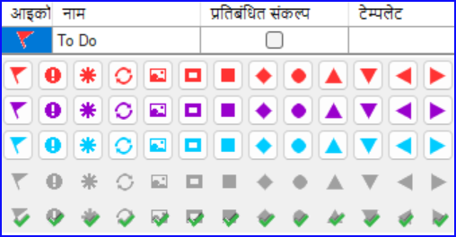
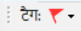
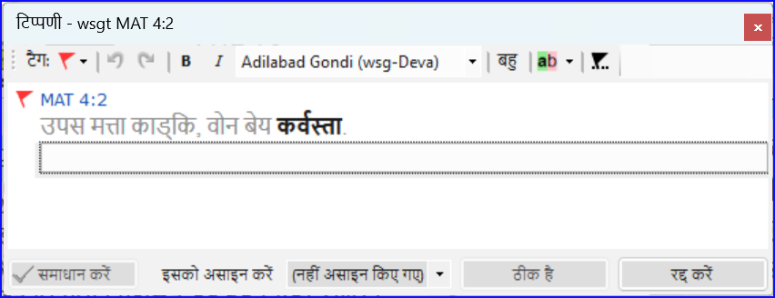
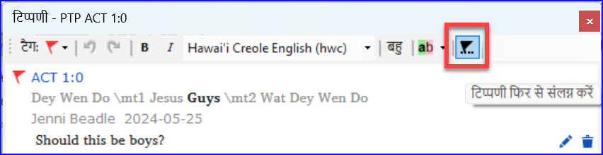
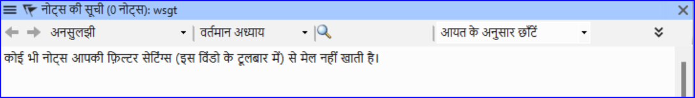
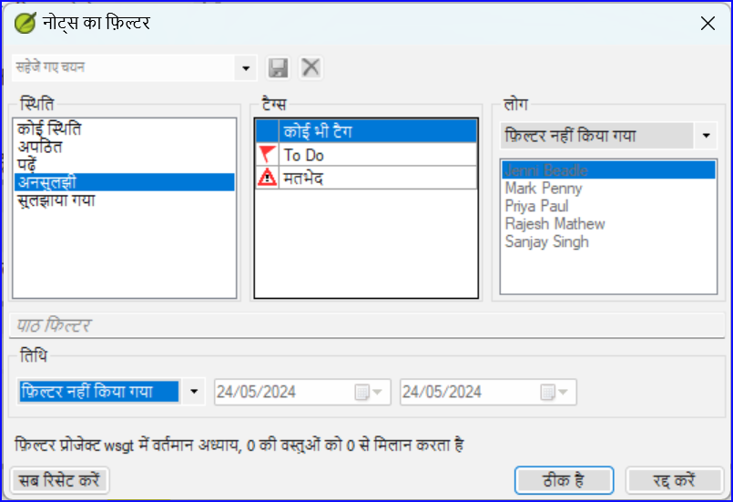
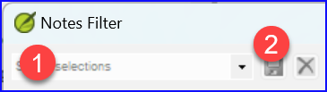
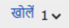
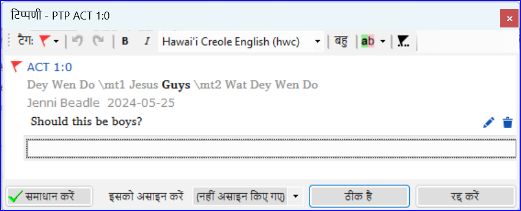

**परिचय** जब आप अनुवाद और जाँच कर रहे हैं, तो आप विभिन्न त्रुटियों या समस्याओं पर टिप्पणी करना चाह सकते हैं। आप प्रमुख शब्दों और वर्तनी समस्याओं पर अपनी चर्चाएँ भी रिकॉर्ड करना चाह सकते हैं। पैराटेक्स्ट 9 आपको इन टिप्पणियों को या तो पाठ में, बाइबिल सम्बन्धी शब्दावली में या शब्द सूची में रिकॉर्ड करने की अनुमति देता है।

**शुरू करने से पहले** आप अपने पाठ, शब्दावली या बाइबिल शब्दों को टाइप या संशोधित कर रहे हैं और देखी गई समस्या पर टिप्पणी करने की आवश्यकता है।

:::caution

नोट्स और फुटनोट्स बहुत अलग होते हैं। फुटनोट्स नए नियम में मुद्रित होते हैं जबकि नोट्स प्रश्नों और टिप्पणियों के लिए होते हैं और नए नियम में मुद्रित नहीं होते।

:::

**आप क्या करने जा रहे हैं**
आप:

- अधिक नोट प्रकार जोड़ें (केवल प्रशासक)
- विभिन्न आइकनों का उपयोग करके पाठ में नोट्स बनाएं,
- नोट्स खोलें, संपादित करें और सुलझाएं
- नोट्स सूची खोलें
- सूची को फ़िल्टर करें
- नोट्स की सूची प्रिंट करें

:::info अपग्रेड

पैराटेक्स्ट 9.4 में **प्रोजेक्ट नोट्स दिखाने/छुपाने** का विकल्प है।

- **≡ प्रोजेक्ट** के तहत **वीयू > प्रोजेक्ट नोट्स दिखाएं**।
  - _नोट आइकन या तो दिखाए जाएंगे या छुपाए जाएंगे।_

:::

## 15.1 विभिन्न प्रकार के प्रोजेक्ट नोट्स {#fe71e7bac96d4755bb40630bd0c2b1c0}

आप पैराटेक्स्ट 9 में अपने प्रोजेक्ट नोट्स के लिए कई विभिन्न आइकनों में से चुन सकते हैं:

:::tip

बहुत अधिक आइकन न रखें!

:::

**एक आइकन के चार विभिन्न रंग या आकार हो सकते हैं**

| विवरण                                                | अर्थ, मतलब                                                                                                    |
| ---------------------------------------------------- | ------------------------------------------------------------------------------------------------------------- |
| आइकन में **बॉर्डर** और **पीला पृष्ठभूमि रंग** है।    | नोट में कम से कम एक अपठित टिप्पणी है।                                                                         |
| आइकन **लाल, बैंगनी,** या **हल्का नीला** है।          | आपको, पूरी टीम को, या असाइन न किए गए प्रोजेक्ट नोट।                                                           |
| आइकन **धूसर** है।                                    | किसी और को असाइन किया गया प्रोजेक्ट नोट।                                                                      |
| आइकन **हरे टिक सहित धूसर** है।                       | सुलझी हुई स्थिति वाला प्रोजेक्ट नोट। (यह पाठ में नहीं दिखेगा, केवल नोट्स सूची में।)        |
| आइकन **किताब के कवर पर सफेद प्रश्न चिह्न** है।       | इस शब्द के लिए एक वर्तनी चर्चा नोट है। (केवल शब्दावली।)                                    |
| आइकन **किताब के कवर पर प्रश्न चिह्न सहित धूसर** है।  | इस शब्द के लिए कोई वर्तनी चर्चा नोट नहीं है। (केवल शब्दावली।)                              |
| आइकन **हल्का नीला प्लस** + है।                       | एक सलाहकार नोट।                                                                                               |
| आइकन **हल्का नीला ग्लोब** है।                        | एक वैश्विक सलाहकार नोट।                                                                                       |
| आइकन **लाल त्रिकोण के अंदर काला उद्गार बिंदु !** है। | एक भेजें/प्राप्त करें विलय संघर्ष है क्योंकि दो उपयोगकर्ताओं ने एक ही छंद में विभिन्न परिवर्तन किए हैं।       |
| आइकन **नीली पृष्ठभूमि पर सफेद तीर** है।              | इस बाइबिल शब्द के लिए एक रेंडरिंग चर्चा नोट है। (केवल बाइबिल शब्दों की विंडो या टूल)       |
| आइकन **किताब के कवर पर तीर सहित धूसर** है।           | इस बाइबिल शब्द के लिए कोई रेंडरिंग चर्चा नोट नहीं है। (केवल बाइबिल शब्दों की विंडो या टूल) |

### **अतिरिक्त नोट टैग सेटअप करें** {#04231dff267d4df992012fdcfb7f5b49}

:::caution

एक प्रशासक होना चाहिए

:::

1. **≡ टैब**, के तहत > **प्रोजेक्ट** > **प्रोजेक्ट सेटिंग्स** > **प्रोजेक्ट गुण**
2. **नोट्स** टैब पर क्लिक करें
3. **ऐड** टैब बटन पर क्लिक करें
   - _एक नई पंक्ति जोड़ी गई है।_
4. नए टैग लाइन पर आइकन पर क्लिक करें
5. वांछित आइकन चुनें
6. नए नोट प्रकार के लिए एक नाम टाइप करें
7. किसी भी अन्य नए नोट्स के लिए जारी रखें।

## 15.2 नोट्स का उपयोग करना {#c8c21c6181cc4529a478dba32d984ba5}

**एक प्रोजेक्ट नोट डालना**

1. पाठ में उस स्थान पर क्लिक करें जहां आप नोट चाहते हैं (और कोई भी उपयुक्त पाठ चुनें)।

2. **≡ टैब**, के तहत **डालें** > **नोट**

3. सूची से नोट के लिए वांछित टैग चुनें

4. नोट के लिए पाठ टाइप करें

5. **ओके** पर क्लिक करें.
   - _पाठ के बगल में एक आइकन प्रदर्शित होता है।_

.

### **मौजूदा नोट में टिप्पणियां जोड़ें** {#958963568fb4491bb7fedc24d80585bb}

- पाठ में आइकन पर क्लिक करें
  - _नोट खुलता है_।

    

- एक नोट टाइप करें
- **ओके** पर क्लिक करें।

### **किसी को एक नोट असाइन करें** {#9a602aedc3974606bf478a02d0e2015a}

1. पाठ में आइकन पर क्लिक करें।

1. अपनी टिप्पणियां टाइप करें
2. **इसको असाइन करें** पर क्लिक करें
3. इच्छित के रूप में चुनें
4. **ओके** पर क्लिक करें।

### **एकाधिक प्रोजेक्टों पर नोट्स लागू करें** {#6536405a9e4842f29a1f267c60b4337d}

1. पाठ से नोट खोलें
2. **एकाधिक** बटन पर क्लिक करें।
3. प्रोजेक्ट चुनें
4. **ओके** पर क्लिक करें।
5. डायलॉग बॉक्स बंद करने के लिए फिर से **ओके** पर क्लिक करें।

### **नोट् पुनः लगाएं** {#fe4f817bb1724ed6889d543fb3f4bbc8}

- नोट खोलने के लिए पाठ में नोट आइकन पर क्लिक करें।

  

- टिप्पणी फिर से संलग्न करें बटन पर क्लिक करें (टूलबार पर)

- इसे संलग्न करने के लिए शब्द(शब्दों) का चयन करें।
- **ओके** पर क्लिक करें.
  - _नोट शब्द(शब्दों) से संलग्न है।_

### **एक नोट हल करें** {#3f7599da36934413b855ecb7e595d63a}

1. पाठ में आइकन पर क्लिक करें

2. आवश्यक होने पर एक और टिप्पणी टाइप करें।

3. **सुलझाएं** बटन पर क्लिक करें

4. **ओके** पर क्लिक करें।

.

### **नोट्स हटाएं** {#2f83955761a8491fb260cae2b8a7515e}

1. नोट आइकन पर क्लिक करें

2. छोटे कचरे के डिब्बे पर क्लिक करें

3. अपनी टिप्पणी को स्थायी रूप से हटाने के लिए **हां** पर क्लिक करें।

4. यदि और टिप्पणियाँ हैं, तो अगली टिप्पणी को हटाने के लिए जारी रखें।

.

:::tip

आप केवल अपनी टिप्पणियाँ ही हटा सकते हैं यदि वे सूची में सबसे अंतिम हैं।

:::

## 15.3 नोट्स सूची खोले {#c87dc9e1b95e46919469ec3681242fb0}

नोट्स की समीक्षा करते समय, उन्हें एक सूची में देखना अक्सर सहायक होता है।

1. **≡ टैब**, के तहत **उपकरण** > **नोट्स सूची**

2. अपना प्रोजेक्ट चुनें।

3. **ओके** पर क्लिक करें.
   - _एक नोट सूची विंडो खुलती है (नीचे देखें)।_

4. आवश्यकतानुसार फ़िल्टर समायोजित करें।

   :::tip

   यदि विंडो खाली है, तो टूलबार पर फ़िल्टर बटनों का उपयोग करके फ़िल्टर बदलें (नीचे देखें)।

   :::

### **नोट्स सूची टूलबार** {#16ec056e5f1a44c18f715698dcfd0baa}

टूलबार पर चार ड्रॉपडाउन बॉक्स हैं

1. नोट फ़िल्टर
2. छंद फ़िल्टर
3. खोजें
4. [छंद, तिथि, असाइन किया गया] द्वारा क्रमबद्ध करें

### **नोट्स सूची फ़िल्टर** {#58384e92b3154b6d87c93ea6b7fc5073}

- पहले बटन/सूची पर क्लिक करें
- उपयुक्त के रूप में एक मौजूदा फ़िल्टर चुनें

### **नया फ़िल्टर परिभाषित करें** {#ae915757c45d40c79820d8588c7173c9}

- पहले बटन/सूची पर क्लिक करें

- **नया फ़िल्टर** चुनें

- वांछित के रूप में स्थिति, टैग, व्यक्ति और तिथि चुनें।

- **ओके** पर क्लिक करें।

### **एक फ़िल्टर सहेजें** {#c943f2ad210e4b65b07b60a324e4331b}

1. आवश्यकतानुसार फ़िल्टर परिभाषित करें।

2. ऊपरी बाएँ कोने में टेक्स्टबॉक्स (1) पर क्लिक करें।

3. फ़िल्टर के लिए एक नाम टाइप करें

4. सहेजें आइकन (2) पर क्लिक करें।

## 15.4 नोट्स सूची में टिप्पणियाँ जोड़ें {#229174addf7e4280a3da1b08d9b11d7c}

- नोट को विस्तृत करने के लिए तीर पर क्लिक करें
  - _नोट खुलता है_।

- टेक्स्टबॉक्स में अपनी टिप्पणियाँ टाइप करें।

  

- आवश्यकतानुसार नोट को सुलझाएं या असाइन करें।

- नोट को संक्षिप्त करने के लिए तीर पर क्लिक करें।

:::tip

आप नोट विंडो को खोलने के लिए **खोलें** लिंक पर भी क्लिक कर सकते हैं।

:::

## 15.5 नोट्स रिपोर्ट प्रिंट करें {#a6ef1b8b74ec4e569f5211f8384d8c8e}

1. एक नोट्स सूची विंडो में क्लिक करें।
2. वांछित के रूप में सूची को फ़िल्टर करें।
3. **≡ टैब**, प्रोजेक्ट के तहत > **प्रिंट**
4. प्रिंटर और कोई भी विकल्प चुनें।
5. **ओके** पर क्लिक करें.
6. विंडो को बंद करें।
