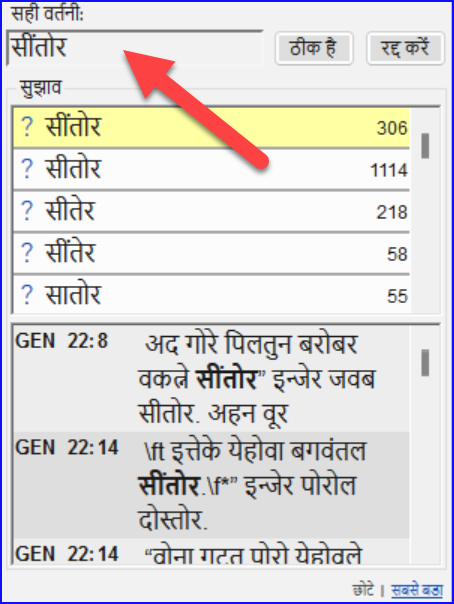
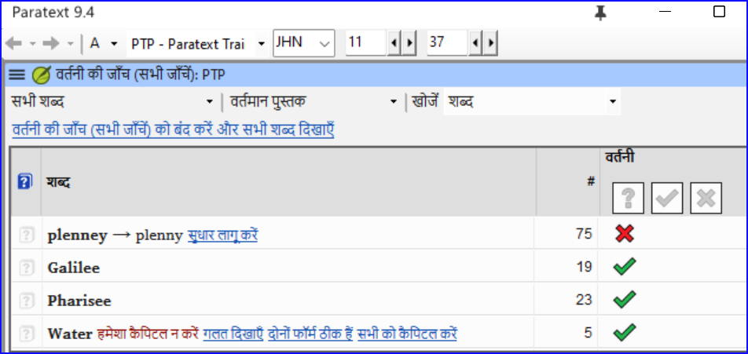
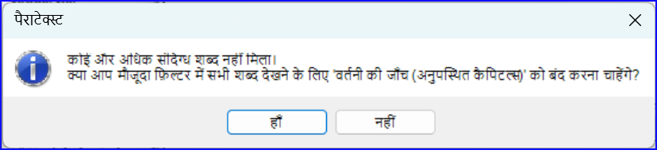
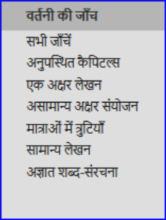
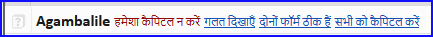
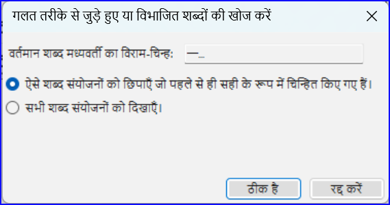
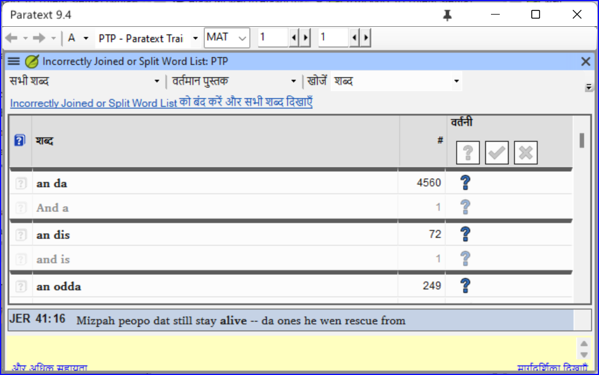
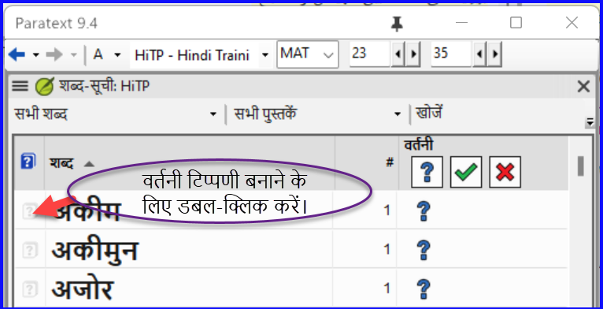

**परिचय**  इस मॉड्यूल में आपको यह समझाया जाएगा कि कैसे आप पराटेक्स्ट 9 में अपनी परियोजना में टाइप किए गए पाठ में वर्तनी की गलतियों की जाँच कर सकते हैं।

**शुरू करने से पहले**  आपने पराटेक्स्ट 9 में अपना पाठ टाइप किया होगा और कुछ जाँच भी की होगी, लेकिन फिर भी वर्तनी की गलतियाँ हो सकती हैं।

**यह महत्वपूर्ण क्यों है?**  यह महत्वपूर्ण है कि किसी भी वर्तनी की गलती को सही किया जाए ताकि आपका पाठ स्पष्ट रूप से संवाद स्थापित कर सके।

**आप क्या करने वाले हैं**  शब्द-सूची को कॉन्फ़िगर करें ताकि सही शब्दों का आधार बन सके।

- पराटेक्स्ट द्वारा सही नहीं माने गए शब्दों पर लाल घुमावदार रेखाओं के साथ अपने पाठ पर काम करें।
- शब्द-सूची में जाकर, गलतियों को सही करें या पराटेक्स्ट 9 को बताएं कि शब्द सही हैं।
- शब्द-सूची से विभिन्न प्रकार की जाँच का उपयोग करें।
- उन शब्दों के लिए एक वर्तनी चर्चा नोट जोड़ें, जिन्हें सही वर्तनी पर निर्णय लेने से पहले और चर्चा की आवश्यकता है।

## 8.1 शब्द-सूची को कॉन्फ़िगर करें {#7490cb4639dc4f2d9eb8ac343d7e79c2}

:::tip

वर्तनी की जाँच करने से पहले, यह महत्वपूर्ण है कि आपके पास उन शब्दों का आधार हो जिन्हें आप सही जानते हैं।  इसके लिए हम तीन काम कर सकते हैं:

:::

### सामान्य शब्दों की वर्तनी को स्वीकृति दें {#c86b35e4794640e980a0796316c04f29}

पैराटेक्स्ट में

- **≡ टैब**, अंतर्गत **टूल्स** > **शब्द-सूची**

शब्द-सूची में

1. **≡ टैब**, **टूल्स** > **सामान्य शब्दों की वर्तनी की स्वीकृति दें**

2. एक संख्या दर्ज करें

   :::tip

   संख्या वह होती है जिसके उतनी बार आने पर शब्दों को स्वतः ही सही माना जाता है। डिफ़ॉल्ट 100 होती है, लेकिन आप अधिक चुन सकते हैं (यदि आपको पाठ पर संदेह हो) या कम (यदि आप टाइपिस्ट की सटीकता के प्रति आश्वस्त हों)।

   :::

3. **ओके** पर क्लिक करें।

4. **हाँ** पर क्लिक करें (यह पुष्टि करने के लिए कि आप पूर्ववत नहीं कर सकते)

### पराटेक्स्ट द्वारा गलत माने गए शब्दों की जाँच करें {#bf5578928c41416f955b0ffa478e72af}

- सुनिश्चित करें कि आप शब्द-सूची में हैं।
  - _यदि आप पैराटेक्स्ट विंडो में वापस हैं, तो शब्द-सूची में जाएँ (__**≡ टैब**_ _के अंतर्गत_ _**टूल्स**_ _>_ _**शब्द-सूची**__)_
- **≡ टैब**, **टूल्स** > **वर्तमान पुस्तक की वर्तनी जाँच करें > सारा जांचें**
  - _शब्दों की सूची प्रदर्शित की जाती है।_

- ऊपरी पैन में एक शब्द पर क्लिक करें।
  1. यदि शब्द **सही** है – स्तंभ के ऊपरी भाग में हरे चिह्न पर क्लिक करें
  2. यदि शब्द **गलत** है, लेकिन पराटेक्स्ट 9 ने सही शब्द **सुझाया** है, तो सही शब्द के लिए **नीले लिंक** पर क्लिक करें।
  3. यदि शब्द **गलत** है, और पराटेक्स्ट 9 ने सही शब्द **सुझाया नहीं** है, तो लाल चेकबॉक्स पर क्लिक करें और शब्द को सही करें।  (देखें 8.1)

### मिलते-जुलते शब्दों की खोज करें {#1fdc348be8334ff6841f08689c4aaae5}

शब्द-सूची में

1. **≡ टैब**, **टूल्स** &gt; **मिलते-जुलते शब्दों की खोज करें**

2. ऐसे अक्षर दर्ज करें जो एक जैसे लगते हों, उन्हें / से अलग करें (उदाहरण के लिए s/sh/z)

   :::tip

   आपकी भाषा के आधार पर, "सभी विराम चिह्नों को शब्दों की तुलना करते समय नजरअंदाज करें" पर टिक करें या हटाएं।

   :::

3. **ओके** पर क्लिक करें।
   - _शब्दों की सूची प्रदर्शित की जाती है।_

4. ऊपर वर्णित के अनुसार शब्दों को सही करें।

## 8.2 पाठ से वर्तनी की जाँच {#66602cff1c654a81ae88a1f8b7e7842f}

पैराटेक्स्ट में

- **≡ टैब**, अंतर्गत **देखें** > **वर्तनी संबंधी त्रुटियाँ प्रदर्शित करें**

:::tip

प्रारंभ में एक प्रगति मीटर प्रदर्शित किया जाता है, फिर उसके बाद सभी शब्द जो अज्ञात या गलत हैं, उनके नीचे लाल घुमावदार रेखाएँ होती हैं।

:::

### सुधार करना {#a468ce2f5f594dcbbd8446fd4225814b}

:::tip

पराटेक्स्ट 9 उन शब्दों के नीचे लाल रेखा खींचेगा जिन्हें आपने शब्द-सूची में मंजूरी नहीं दी है। इसका मतलब यह होता है कि या तो शब्द गलत है या अज्ञात है।

:::

1. एक शब्द पर दाएं क्लिक करें जिसे लाल या स्लेटी रंग में रेखांकित किया गया हो
   - _एक संवाद बॉक्स प्रदर्शित होता है।_

2. या तो बॉक्स में सुधार टाइप करें या सूची से सही शब्द चुनें

3. **ओके** पर क्लिक करें।

:::tip

जब भी संभव हो, मामूली सुधार करते समय भी वर्तनी जाँच का उपयोग करना बेहतर होता है क्योंकि पराटेक्स्ट 9 सुधार को याद रखेगा, और यदि वही गलती फिर से होती है तो आप सुधार लागू कर सकते हैं।

:::

जब एक से अधिक सुधार होते हैं, तो एक संवाद बॉक्स प्रदर्शित होता है।

उपयुक्त के रूप में चुनें:

- **हाँ** = इस पद को बदलता है और अगले की तलाश करता है
- **नहीं** = इस पद को छोड़ता है और अगले की तलाश करता ह
- सभी को हाँ – **खतरनाक है**, सावधानी से प्रयोग करें
- **रद्द करें** = आगे के बदलावों को रोकता है

## 8.3 वर्तमान पुस्तक की वर्तनी जाँच {#8e6b30ac29584b0a89ef0fee37d20f8f}

1. **≡ टैब**, **टूल्स** &gt; **वर्तमान पुस्तक की वर्तनी जाँच करें**
   - _वर्तमान पुस्तक में कुछ शब्दों की सूची के साथ एक विंडो प्रकट होती है।_

2. ऊपर वर्णित [8.2](/8.SP#66602cff1c654a81ae88a1f8b7e7842f) के अनुसार सुधार करें

3. अधिक शब्द देखने के लिए **अधिक वस्तुएँ उपलब्ध** पर क्लिक करें।

4. आवश्यकतानुसार जारी रखें।

## 8.4 शब्द-सूची से वर्तनी की जाँच {#5de76f0b6fe1460ea6c8a341b2fff194}

### जाँचों का उपयोग {#a440e07d85cf494eb7a3263ba280aa60}

शब्द-सूची में

1. **≡ टैब**, **टूल्स**> **वर्तनी की जाँच >**

2. वांछित जाँच चुनें (नीचे विवरण देखें)
   - _शब्दों की सूची प्रदर्शित की जाती है।_

3. आवश्यकतानुसार सुधार करें।

4. अधिक शब्द देखने के लिए **अधिक वस्तुएँ उपलब्ध** पर क्लिक करें।

5. आवश्यकतानुसार जारी रखें।

6. जब आप सूची को परिष्करण कर लेते हैं, तो एक संदेश प्रदर्शित होता है

   

7. **हाँ** पर क्लिक करें।

### सभी जाँच {#039b8b6f676f4a8fbe3e75ec8918ecb6}

यह सभी जाँच चलाती है। यह बहुत उपयोगी होती है क्योंकि यह सभी प्रकार की गलतियों का पता लगाएगी, खासकर उन शब्दों का जिनमें एक से अधिक प्रकार की गलतियाँ होती हैं।

### अनुपस्थित कैपिटल {#cfe2c818fa2249c0bcb5d219ae76e8eb}

1. एक सूची प्रदर्शित होती है जिनमें वे शब्द होते हैं जिनके कैपिटलाइज्ड रूप होते हैं, लेकिन हमेशा कैपिटलाइज्ड नहीं होते हैं (यानी दोनों रूपों का उपयोग होता है)। सूची में निचले मामले में शब्द दिखता है, फिर उसके नीचे कैपिटलाइज्ड रूप ब्लू लिंक के साथ होता है, जो शब्द के लिए ब्लू लिंक है

   

2. कैपिटलाइज्ड रूप के लिए ब्लू लिंक पर क्लिक करें

   

3. उपयुक्त ब्लू लिंक पर क्लिक करें।

4. _गलत दिखाएँ_ (आयतों को देखने के लिए)

5. _दोनों रूप स्वीकार्य हैं_ (दोनों रूपों को स्वीकार करने के लिए)

6. _सभी को कैपिटलाइज करें_ (सभी शब्दों को सही करने के लिए)

### एकल अक्षर की टाइपो गलतियाँ {#92974e1cd65443aeb4191d34b42a0468}

ऐसी शब्दों की सूची प्रदर्शित की जाती है जो अन्य शब्दों के समान होती हैं, लेकिन केवल एक अक्षर में अंतर होता है।

### असामान्य अक्षर संयोजन {#d8cc2055dd494b7ab955c85deb277795}

ऐसे शब्दों की सूची प्रदर्शित की जाती है जिसमें असामान्य अक्षर संयोजन होते हैं (जैसे कि व्यंजन या स्वर समूह...)।

### डायाक्रिटिक त्रुटियों {#a802e37a792c4d63b2eb3c041d251e7d}

ऐसे शब्दों की सूची प्रदर्शित की जाती है जिनमें अंतर के लिए अन्य शब्दों के साथ लिंक होते हैं जो एक ही समान होते हैं लेकिन डायाक्रिटिक्स के अलावा।

### सामान्य टाइपो गलतियाँ {#718eac9af3e8429da63cb91677bc90fd}

ऐसे शब्दों की सूची प्रदर्शित की जाती है जिसमें समान प्रकार की समस्या होती है जो पहले से ही अन्य शब्दों में सुधार की जा चुकी है। विनिर्देशन. उदाहरण के लिए, यदि आप पहले 'teh' को 'the' के रूप में सुधार चुके हैं, और यह 'tehm' पाता है तो यह 'them' का सुझाव देगा।

### अज्ञात मॉर्फोलॉजी {#bfac7ce2ba6a48449f1af20604181ae6}

ऐसे शब्दों की सूची प्रदर्शित की जाती है जिसे कंप्यूटर अन्य शब्दों के आधार पर मॉर्फोलॉजी का अनुमान नहीं लगा पाया है।

### गलत तरीके से जुड़े हुए या विभाजित शब्दों की खोज करें {#2f1d11a1518a454d8cc4d33c9c70ef3f}

शब्द-सूची में (**≡ टैब**, **टूल्स** – शब्द-सूची के अंतर्गत)

- **≡ टैब**, **टूल्स**&gt; **गलत तरीके से जुड़े हुए या विभाजित शब्दों की खोज करें**

  

- उस पंक्चुएशन को टाइप करें जो किसी शब्द के बीच में हो सकता है जैसे - '

- **ओके** पर क्लिक करें।
  - _ऐसे शब्दों की सूची प्रदर्शित होती है जिनमें समान शब्दों को एक साथ समूहित किया गया है।_

    

### एक शब्द जिसे गलती से गलत चिह्नित किया गया था {#db3081f9aaa14b6299225b8af9fb3be0}

1. सूची में शब्द ढूँढें (आवश्यकता होने पर फ़िल्टर का उपयोग करके)
2. शब्द को संदर्भ में देखने के लिए पंक्ति पर क्लिक करें
3. सही वर्तनी की स्थिति पर क्लिक करें।

## 8.5 वर्तनी चर्चा नोट {#0fc290656fb540eda14989e1ad48876b}

:::tip

यदि आपने वर्तनी पर अंतिम निर्णय नहीं लिया है, तो आप एक वर्तनी चर्चा नोट जोड़ सकते हैं।

:::

1. पहले कॉलम में नोट आइकॉन पर डबल-क्लिक करें

   

2. नोट टाइप करें

3. आवश्यकतानुसार नोट को असाइन करें, और **ठीक है** पर क्लिक करें।
