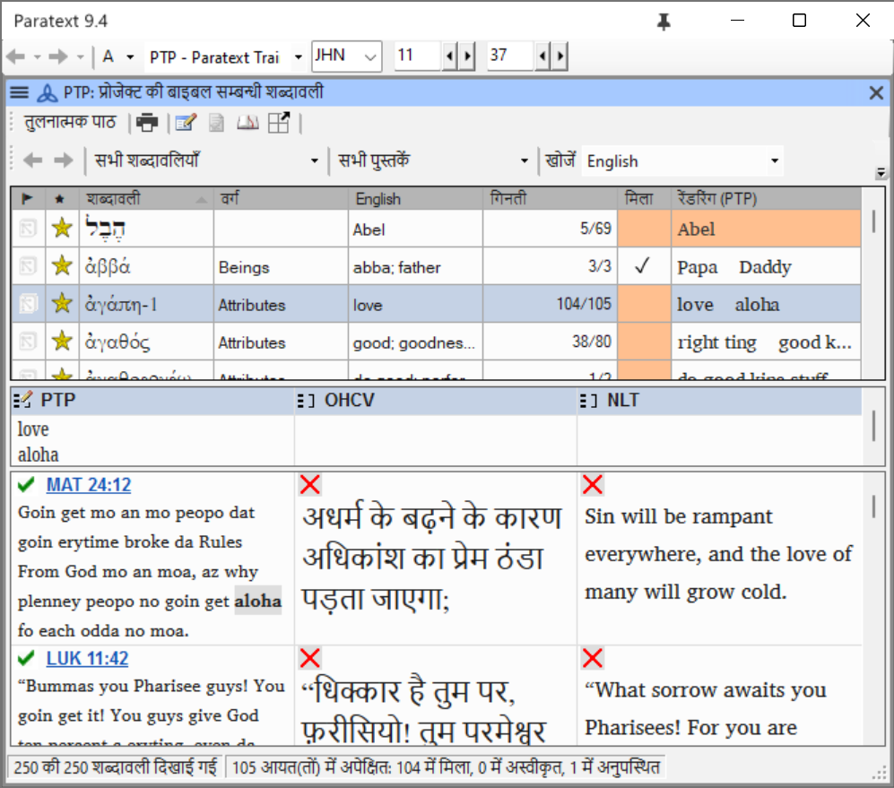
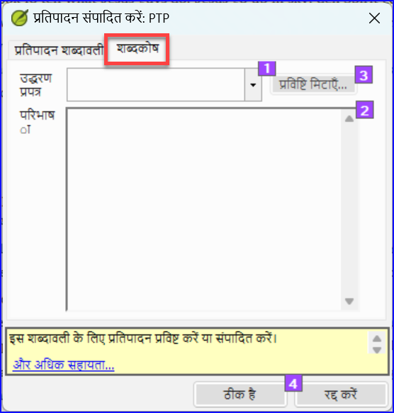
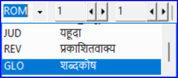

**परिचय**  यह मॉड्यूल आपको समझाता है कि बाइबल के शब्द उपकरण का उपयोग करके शब्दकोश में प्रविष्टियाँ कैसे जोड़ें।

**शुरू करने से पहले**  आपने Paratext 9 में अपना पाठ तैयार और दर्ज कर लिया है। अब आप कुछ शब्दों की शब्द-सूची में प्रविष्टियाँ जोड़ने जा रहे हैं।

**यह क्यों महत्वपूर्ण है**  महत्वपूर्ण शब्दों और उनकी व्याख्याओं की सूची होना अच्छा है ताकि पाठक पाठ को अच्छी तरह समझ सकें। शब्दकोश में सीधे टाइप करने की बजाय, **बाइबल के शब्दों** के उपकरण का उपयोग करना बेहतर है क्योंकि यह शब्दकोश को वर्णानुक्रम में रखता है। यह टूल शब्द-सूची में परिवर्तनों का भी ध्यान रखता है।

**आप क्या करने जा रहे हैं**  आप बाइबल के शब्द उपकरण का उपयोग करके शब्द के लिए एक अनुवाद जोड़ेंगे और फिर शब्दकोश टैब का उपयोग करके उद्धरण स्वरूप और परिभाषा दर्ज करेंगे।

[जोड़ने](https://vimeo.com/manage/videos/451195974), [लिंकिंग](https://vimeo.com/manage/videos/499553868) [और [संपादन](https://vimeo.com/manage/videos/503489533) [और [संपादन की अनुमति प्राप्त करने](https://vimeo.com/manage/videos/476293601) पर चार प्रशिक्षण वीडियो उपलब्ध हैं। (P9 1A.4a-d).

## 9.1 बाइबल के शब्द उपकरण खोलें {#137d8af8c8314fdba16891790c49c178}

1. पैराटेक्स्ट के भीतर, उस वचन पर जाएँ जिसमें वह शब्द होता है जिसे आप शब्द-सूची में जोड़ना चाहते हैं।

2. दाएँ क्लिक करें और **बाइबल के शब्द देखें** चुनें, फिर **वर्तमान श्लोक** चुनें।

3. जांचें कि आपके पास सही सूची खुली है (उदा. आपकी परियोजना की सूची या NT की महत्वपूर्ण बाइबिलिकल टर्म्स [SIL])

   

4. सूची बदलने के लिए, **≡ टैब** में, **बाइबल के शब्द** मेनू के तहत **बाइबल के शब्दों की सूची चुनें** चुनें।

:::info

यदि बाइबिलिकल टर्म दोनों सूचियों में से किसी में नहीं है, तो अपने प्रशासक से पूछें कि वह बाइबिलिकल टर्म को आपकी परियोजना की सूची में जोड़ें।

:::

## 9.2 एक प्रविष्टि जोड़ें {#99fd9ee0be454494b0e01a773eee6f96}

1. शीर्ष पैन में सूची में शब्द पर डबल क्लिक करें।

2. **शब्दकोश** टैब पर क्लिक करें।

3. शब्द का उद्धरण स्वरूप टाइप करें (यानी जिस प्रकार आप इसे शब्दकोश में चाहते हैं) [1]

4. परिभाषा टाइप करें [2]

5. **ओके** पर क्लिक करें।
   - _शब्द(यों) और परिभाषा को वर्णानुक्रम में शब्दकोश में जोड़ा जाएगा।_

## 9.3 मौजूदा प्रविष्टि लिंक करें {#b9f4ff025225434cbba15665f0894328}

:::tip

यदि शब्द पहले से शब्द-सूची में है, तो आप बाइबिलिकल टर्म को शब्द-सूची में मौजूदा प्रविष्टि से लिंक कर सकते हैं। बाद में चरण 6 में आप बाइबिलिकल टर्म को पाठ से लिंक करेंगे ताकि मुद्रित पाठ में \* या इलेक्ट्रॉनिक ऐप में लिंक जोड़ सकें।

:::

### बाइबल का शब्द खोजें {#120bd663b5ff4b7a840f4ef3c26b06d8}"

1. **बाइबल के शब्दों** के उपकरण से
2. जांचें कि आपके पास सही सूची खुली है (उदा. आपकी परियोजना की सूची या NT की महत्वपूर्ण बाइबिलिकल टर्म्स [SIL])
3. ऊपरी पैन में सूची में शब्द पर दोहरा क्लिक करें

### शब्दकोश प्रविष्टि से लिंक करें {#dd6a347260a34a9ab7c52f8b91f9b165}

1. **शब्दकोश** टैब पर क्लिक करें।
2. संदर्भ रूप के पास नीचे के तीर पर क्लिक करें [1]
3. शब्द-सूची से प्रविष्टि चुनें
4. **ओके** पर क्लिक करें।

## 9.4 शब्दकोश देखें {#ebf2c2a15ff946199b5764dfe7af56a8}

पराटेक्स्ट में

1. पुस्तक बदलने के लिए नेविगेशन बार का उपयोग करें।

2. **GLO** पुस्तक चुनें

## 9.5 एक प्रविष्टि संपादित करें – जीएलओ पुस्तक में {#059626f045a34c24bcdd466553c8e18a}

पराटेक्स्ट में

:::tip

शब्द-सूची प्रविष्टियों पर काम करने के लिए बाइबिलिकल टर्म्स टूल का उपयोग करने की सलाह दी जाती है। हालांकि, GLO पुस्तक से परिभाषा संपादित करना उपयोगी हो सकता है।

:::

1. **जीएलओ** पुस्तक खोलें।
2. सामान्य रूप से पाठ संपादित करें।

## 9.6 एक प्रविष्टि संपादित करें – बाइबल के शब्दों में {#b1ea5eaaee78499bbffe70a892a4ce81}

1. **≡ टैब**, **उपकरणों** के तहत > **बाइबल के शब्द…**
2. ऊपरी पैन में सूची में शब्द पर दोहरा क्लिक करें
3. **शब्दकोश** टैब पर क्लिक करें।
4. परिभाषा संपादित करें
5. **ओके** पर क्लिक करें.

:::info पैराटेक्स्ट 9.3
अब आप इस टैब में उद्धरण रूप को संपादित कर सकते हैं बिना प्रविष्टि से लिंक तोड़े।
:::

## 9.7 एक बाइबिल शब्द जोड़ें {#717471a3fbf3477fbab8e730af1b1ad7}

- खंड देखें [**10.7 एक शब्द जोड़ें – संदर्भ पाठ से खोजें**](10.BT#f683ccf4cdcf45f09c516c09c78ab277)

## 9.8 पुनः स्मरण {#2843edbecf5e4950944e24a78538bc99}

- आप बाइबल के शब्द उपकरण को _**__**_ मेनू से खोल सकते हैं।
- **शब्दकोश** टैब _____ संवाद पर है। इस डायलॉग को खोलने के लिए आप ___-क्लिक करें ऊपरी पैन में शब्द पर।
- शब्द-सूची देखने के लिए, आप प्रकाशन के बाद _______ पुस्तक में बदलते हैं।

:::info

[उत्तर: दायाँ-क्लिक, रेंडरिंग संपादित करें, दोहरा, ऊपरी, GLO]

:::
