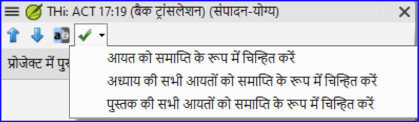
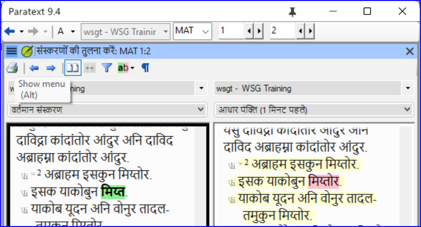
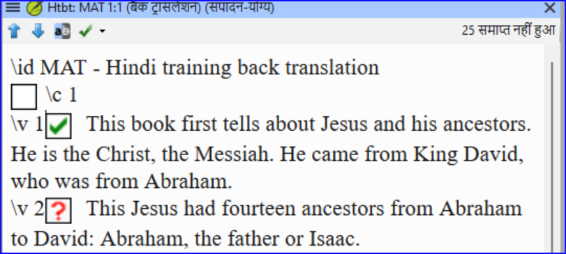
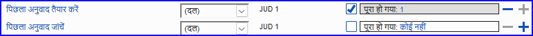

**परिचय** एक सलाहकार जांच के लिए तैयारी करते समय, सलाहकार को एक या अधिक संस्करणों की आवश्यकता होगी जो वह समझे। इसे अक्सर वापसी-अनुवाद कहा जाता है। बैक ट्रांसलेशन के दो प्रकार होते हैं। यह मॉड्यूल बताता है कि एक मुफ्त बैक-ट्रांसलेशन कैसे करें और इसे अद्यतित रखें। अगला मॉड्यूल बताता है कि प्रोजेक्ट इंटरलाइनियराइज़र का उपयोग करके शब्द-दर-शब्द बैक-ट्रांसलेशन कैसे करें।

\*\* आपके शुरू करने से पहले \*\* आपने पैराटेक्स्ट में अपनी अनुवाद को टाइप किया, जाँचा और संशोधित किया है और अब एक सलाहकार जाँच के लिए तैयारी कर रहे हैं। आप शुरू करने से पहले, आपके व्यवस्थापक को आपके बैक ट्रांसलेशन के लिए एक अलग प्रोजेक्ट बनाना होगा।

**यह क्यों महत्वपूर्ण है?** आपको अपने पाठ की जांच एक सलाहकार से करानी होगी। लेकिन क्योंकि सलाहकार आपकी भाषा नहीं जानते, आपको अपने पाठ को उस भाषा में अनुवाद करने की आवश्यकता होगी जो वे समझ सकें। यहां से ही 'बैक ट्रांसलेशन' शब्द आता है। सलाहकार इस अनुवाद का उपयोग आपकी टीम की पाठ में व्याख्यात्मक विकल्पों को सुधारने में मदद के लिए करेंगे।

यह अच्छा होगा कि कोई व्यक्ति जो आपके अनुवाद में शामिल नहीं है, इसे चेक करे। इस तरह वह टाइप कर सकेगी कि पाठ क्या कहता है न कि आप उसे क्या कहना चाहते थे। उन्हें किसी भी सहायता या अन्य बाइबिल नहीं देखनी चाहिए।

**तुम क्या करोगे?**

- अपने प्रोजेक्ट और बैक ट्रांसलेशन प्रोजेक्ट खोलें
- अपने पाठ को स्क्रीन पर व्यवस्थित करें।
- अपना बैक ट्रांसलेशन ड्राफ्ट करें
- जब आप एक अध्याय पूरा कर लें, तो स्थिति को समाप्त के रूप में चिह्नित करें।
- यह सुनिश्चित करें कि आपका पाठ अद्यतित है (या समकालीन), उचित हो तो अगले परिवर्तन पर जाकर किसी भी अंतर को देख सकते हैं।

:::info अपग्रेड

आपका प्रोजेक्ट आपके बैक ट्रांसलेशन प्रोजेक्ट का बुनियादी प्रोजेक्ट है। 9.4 में, आप अब अपने प्रोजेक्ट को यहाँ से बैक ट्रांसलेशन प्रोजेक्ट खोलें (**≡ प्रोजेक्ट** चुनें **खुला मूल, आधार प्रोजेक्ट …**)।

:::

## 16.1 बैक ट्रांसलेशन के लिए एक नया प्रोजेक्ट बनाएं {#44530c9822fc4c2d9677cc06c747491c}

:::caution

प्रोजेक्ट को केवल एक बार व्यवस्थापक द्वारा बनाया जाता है। यदि कोई प्रोजेक्ट है तो [नीचे 16.2 देखें](/16.BT1#e6cb21ddb31146938d0576ea7f4f3b06)।

:::

- **≡ पैराटेक्स्ट** के अंतर्गत **पैराटेक्स्ट** > **नया प्रोजेक्ट**

### **प्रोजेक्ट के नाम दर्ज करें** {#c929f129f8d848d890d32d1ed85ed86a}

- **संपादित करें** पर क्लिक करें
- प्रोजेक्ट के लिए पूरा नाम और एक संक्षिप्त नाम टाइप करें
- **ओके** पर क्लिक करें।

### **प्रोजेक्ट के सेटिंग्स चुनें** **{#2db659565b714589be113884683c1f1f}**

1. अपने बैक ट्रांसलेशन के लिए भाषा चुनें (जैसे अंग्रेजी)
2. वर्सीफिकेशन को छोड़ दें
3. प्रोजेक्ट के प्रकार के लिए **बैक ट्रांसलेशन** चुनें
4. **Based on** के लिए अपने प्रोजेक्ट को चुनें
   - _यदि आवश्यक हो, Paratext आपके प्रोजेक्ट से मेल खाने के लिए वर्सीफिकेशन को बदल देगा।_
5. **ओके** पर क्लिक करें।
   - _नया प्रोजेक्ट किताबें बनाने या आयात करने के लिंक के साथ खुलता है।_

:::info

इस प्रोजेक्ट को पंजीकृत करने की आवश्यकता नहीं है, क्योंकि यह आपके प्रोजेक्ट से पंजीकरण प्राप्त करता है।

:::

### **पुस्तकें बनाएं** {#53659e0ab6c34a939d0e69dcdfd786e4}

- **पुस्तक(कें) बनाएँ** लिंक पर क्लिक करें
- आवश्यकतानुसार पुस्तकें बनाएं।

:::caution

विकल्प **पर आधारित बनाएँ** [आपका प्रोजेक्ट] का उपयोग करें। ताकि आपके प्रोजेक्ट से मेल खाने के लिए सभी मार्कर्स जोड़ दिए जाएं।

:::

## 16.2 अपना बैक ट्रांसलेशन ड्राफ्ट करें {#e6cb21ddb31146938d0576ea7f4f3b06}

1. अपना प्रोजेक्ट खोलें
2. अपना बैक ट्रांसलेशन प्रोजेक्ट खोलें
3. विंडोज को इस तरह व्यवस्थित करें कि आप आसानी से दोनों विंडोज देख सकें।
4. बैक ट्रांसलेशन विंडो में क्लिक करें, (आपके प्रोजेक्ट में पद को हाइलाइट किया गया है)।
5. प्रत्येक पद में अपना बैक ट्रांसलेशन टाइप करें (चेक बॉक्स के बाद)।
6. अध्याय में प्रत्येक पद के लिए जारी रखें।

## 16.3 अध्याय को समाप्त के रूप में चिह्नित करें {#a1bc8a251f9148009ea57dd4fbd96e44}

जब आप अध्याय समाप्त कर लें

- अपनी बैक ट्रांसलेशन विंडो के शीर्ष पर टूलबार पर, चेक मार्क के बगल में वाले तीर पर क्लिक करें।

  

- **अध्याय में सभी पदों को समाप्त के रूप में चिह्नित करें** चुनें।
  - _अध्याय के सभी चेकबॉक्स हरे चेक मार्क से चिह्नित हैं।_

## 16.4 जब आप अपने प्रोजेक्ट में बदलाव करते हैं {#0f230b5f95404967a3537e86379eaf33}

Paratext आपके पाठ में किसी भी सहेजे गए बदलाव का पता लगाएगा और बैक ट्रांसलेशन चेकबॉक्स को लाल प्रश्न चिह्न में बदल देगा और असाइनमेंट्स और प्रगति में बैक ट्रांसलेशन की स्थिति में समस्याएं जोड़ देगा।

1. लाल प्रश्न चिह्न वाले एक पद में क्लिक करें।

2. बैक ट्रांसलेशन की समीक्षा करें और उसे सही करें।
   - _यदि परिवर्तन स्पष्ट नहीं हैं, तो नीचे 'अप्रचलित पदों के लिए अंतर देखें' देखें।_

3. जब यह सही हो, तो लाल प्रश्न चिह्न पर क्लिक करें

   - _यह हरे चेक मार्क में बदल जाता है_

   :::info

   व्युत्पन्न प्रोजेक्ट आधार प्रोजेक्ट खोल सकते हैं।

   :::

### **अप्रचलित पदों के लिए अंतर देखें** {#fe5fdc6b632b4f3cbafe2f390961a391}

- अंतर देखने के लिए टूलबार पर आइकन पर क्लिक करें।
  - _एक तुलना विंडो प्रदर्शित होती है_।

    

### **अगले अंतर पर जाएं** {#b59e604df6cc42b7b68abda3173fde99}

- पिछले या अगले अंतर पर जाने के लिए ऊपर और नीचे तीरों पर क्लिक करें।

  

## 16.5 अपने **असाइनमेंट्स और प्रगति** की जांच करें {#860fd280ce5d4bb2bed1d1e4fb5d878c}

- असाइनमेंट्स और प्रगति आइकन पर क्लिक करें

- चरण 3 का विस्तार करें, बैक ट्रांसलेशन जांच अंत में है
  - _अप्रमाणित या बदले गए पदों की संख्या (यदि कोई हो) समस्याओं के रूप में सूचीबद्ध हैं_

    

### 16.6 असाइनमेंट्स और प्रगति में बैक ट्रांसलेशन पद की जांच {#e861e8ecf8a142e99d31c5630c1f21a4}

- समस्याओं लिंक पर क्लिक करें
  - _एक परिणाम सूची विंडो किसी भी त्रुटियों को सूचीबद्ध करती है।_
  - _और बैक ट्रांसलेशन विंडो भी प्रदर्शित होती है, पहला समस्या पद में कर्सर के साथ।_
- समस्या को सही करें और टूलबार पर तीरों पर क्लिक करके अगले अप्रचलित पद पर जाएं।

### 16.7 कार्य एवं प्रगति में बैक ट्रांसलेशन की स्थिति पूरा हो गया {#631313ddd7ac4707adba5762ef16b842}

- बैक ट्रांसलेशन की स्थिति तब पूरा होती है जब कोई समस्या नहीं होती हैं।

### 16.8 सीखने का कार्य {#639f58c0e08342e390afddee7236d11f}

एक बैक ट्रांसलेशन में चेकबॉक्स में कई अलग-अलग प्रतीक हो सकते हैं।

| 1 | असंगत आयत संख्या |
| - | ---------------- |
| 2 | कोई पाठ/आयत नहीं |
| 3 | Not finished     |
| 4 | समाप्त           |
| 5 | समय सीमा समाप्त  |

:::info

[उत्तर: A3, B4, C5, D1, E2]

:::
