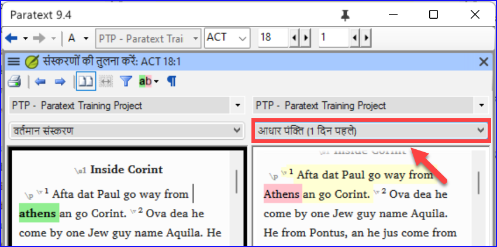
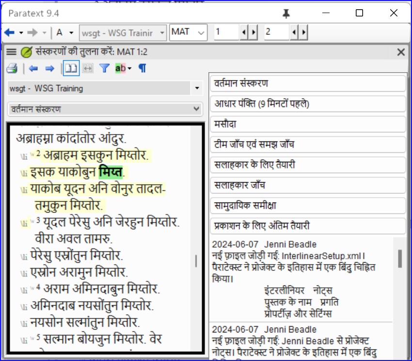
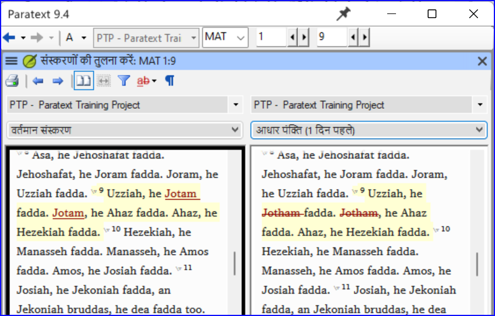

**परिचय** इस मॉड्यूल में, आप सीखेंगे कि अपने पाठ को विभिन्न बिंदुओं पर कैसे सहेजें और बाद में उनकी समीक्षा करें।

**शुरू करने से पहले** आपने अपने पाठ पर काम किया है और अपने परियोजना के एक महत्वपूर्ण चरण पर पहुँच गए हैं।

**यह क्यों महत्वपूर्ण है?** जैसे-जैसे आप अपने अनुवाद पर काम करते हैं, आप लगातार परिवर्तन करेंगे। टेक्स्ट की एक प्रति होना अच्छा है जैसा कि यह किसी विशेष बिंदु पर था, उदाहरण के लिए जैसा कि यह सलाहकार जाँच से पहले था।

**आप क्या करेंगे?**  आप परियोजना के इतिहास में एक बिंदु को चिह्नित करेंगे। बाद में आप विभिन्न बिंदुओं पर पाठ की तुलना कर सकते हैं।

### 18.1 इतिहास में बिंदु चिह्नित करें {#6bc0d79911234870b4fe00d7193f8414}

1. अपने प्रोजेक्ट विंडो में क्लिक करें ताकि यह सक्रिय हो जाए (Paratext में)।
2. **≡ टैब** के अंतर्गत **प्रोजेक्ट** > **प्रोजेक्ट इतिहास में एक बिंदु चिह्नित करें**
3. बिंदु को वर्णित करने के लिए एक टिप्पणी लिखें।
4. **OK** पर क्लिक करें

:::tip

टिप्पणी की शुरुआत कुछ प्रतीकों से करना अच्छा होता है, जैसे कि **##**, ताकि आप Paratext द्वारा निर्मित लंबी सूची के स्वचालित बिंदुओं में आसानी से अपने जोड़े बिंदुओं को पहचान सकें।

:::

### 18.2 दो संस्करणों की तुलना करें {#b1533bd8ac644603a394e939685a6d4a}

:::tip

किसी भी हटाए गए पाठ को काट दिया जाता है। किसी भी जोड़े गए पाठ को लाल या रेखांकित किया जाता है।

:::

- **≡ टैब** मेनू का विस्तार करें फिर **प्रोजेक्ट** > **संस्करणों की तुलना करें** के अंतर्गत

- आधार संस्करण ड्रॉपडाउन सूची पर क्लिक करें
    - _संस्करणों की एक सूची प्रदर्शित होती है।_

- इतिहास में इच्छित बिंदु चुनें
    - _स्क्रीन अंतर दिखाती है।_

