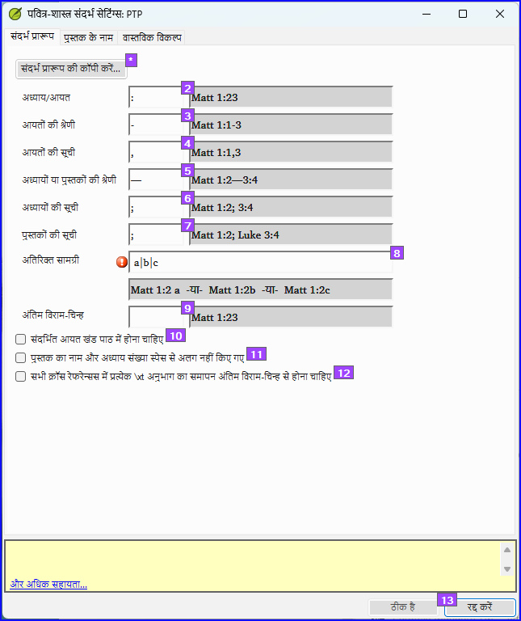
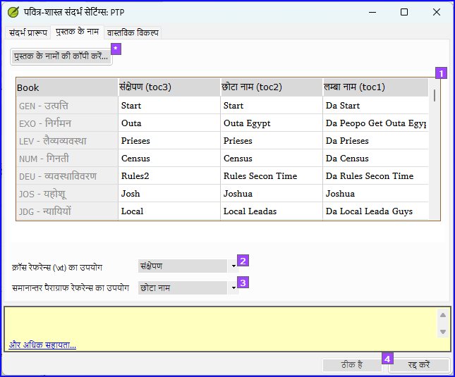
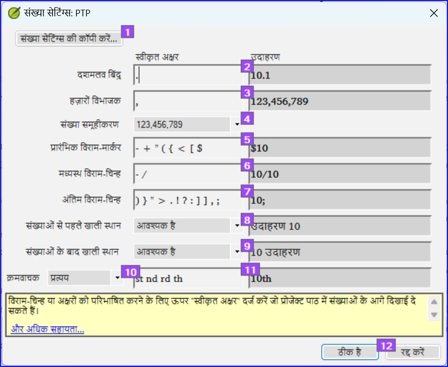

**परिचय**  इस मॉड्यूल में आप शेष बुनियादी चेक (संदर्भ, उद्धृत पाठ, संख्याएँ, युगल चिन्ह और उद्धरण) कैसे चलाना है, यह सीखेंगे। जैसे पहले दो बुनियादी चेक मॉड्यूल में था, असाइनमेंट और प्रगति से चेक चलाना आसान है। हालांकि, यदि आप एक से अधिक किताबों की जांच करना चाहते हैं, तो आपको जांच मेनू से चेक चलाने की आवश्यकता है।

**शुरू करने से पहले**  आपने अपना अनुवाद Paratext में टाइप कर लिया है। Make sure you have done the checks described in modules [BC1](/5.BC1) before continuing. और यह कि या तो आपके प्रशासक ने चेक के लिए सेटअप कर लिया है या सेटअप करने के लिए उपलब्ध हैं।

**यह क्यों महत्वपूर्ण है**  पैराटेक्स्ट में ग्यारह बुनियादी चेक होते हैं। आप पहले ही पहले छह चेक देख चुके हैं। यह आखिरी सेट आपको अन्य किताबों के संदर्भित सामग्री से संबंधित त्रुटियाँ खोजने में मदद करता है। आप यह सुनिश्चित करना चाहते हैं कि संदर्भ सटीक हों ताकि पाठक इन अंशों को खोज सके।

**आप क्या करने जा रहे हैं**  पहले की तरह, अधिकांश चेक के लिए आपके प्रशासक को कुछ सेटअप करना अनिवार्य है। इस मॉड्यूल में आप:

- सुनिश्चित करें कि सेटअप पूरा हो गया है
- बुनियादी जांच चलाएँ
- कोई भी त्रुटियाँ सही करें।

## 19.1 अजोड़ा विराम चिह्न जोड़ियाँ {#37c2805933944d69852bddc3b8b8c520}

:::tip

यह चेक उन विराम चिह्नों को देखता है जो जोड़ियों में होते हैं (खुलने और बंद होने वाले) और उन त्रुटियों को सूचीबद्ध करता है जहाँ जोड़ी के अन्य आधे से मेल नहीं होता है। यह जानबूझकर हो सकता है लेकिन अधिक संभावना है कि यह एक त्रुटि हो, जैसे ( ), [ ], आदि।

:::

**सेटअप - सूची**

1. **≡ टैब**, **साधन** > **जाँच सूची** > **अजोड़ा विराम चिह्न जोड़ियाँ** के तहत:
   - _यदि सूची खाली है, तो कोई त्रुटि नहीं है।_
2. यदि आवश्यक हो, तो अन्य जोड़ियों को जोड़ने के लिए **विकल्प...** क्लिक करें।
3. **ओके** पर क्लिक करें.

**जांच करें**

1. **≡ टैब**, **साधन** > **बुनियादी जाँच चलाएँ** के तहत
2. “**अजोड़ा विराम चिह्न जोड़ियाँ**” जांचें
3. **ओके** पर क्लिक करें।
   - _त्रुटियों की एक सूची प्रदर्शित होती है।_
4. आवश्यकतानुसार सुधार करें।

## 19.2 संदर्भ {#03533bb10f7a4a0a9d600b3684876edf}

### सेटिंग्स {#13450fc38203431a8a92bfadc41599a8}

:::caution

आप संदर्भ जांच चला सकें, इसके पहले आपका **प्रशासक** विभिन्न सेटिंग्स को परिभाषित करेगा।

:::

1. **≡ टैब**, **प्रोजेक्ट** > **धर्मग्रंथ संदर्भ सेटिंग्स** के तहत

2. प्रत्येक सेटिंग के लिए, बॉक्स में विराम चिन्ह टाइप करें
   - _दाईं ओर नमूना अपडेट किया जाएगा।_

पुस्तक के नाम

1. **किताब के नाम** टैब पर क्लिक करें

2. तीन कॉलम [1] को संक्षेपण, छोटे नाम और लंबे नाम के साथ भरें।

3. क्रॉस-संदर्भ और संदर्भ दोनों के लिए **संक्षेपण** [2] और [3] चुनें

4. **ठीक** पर क्लिक करें।
   - _पैराटेक्स्ट टेक्स्ट में \toc क्षेत्रों को अपडेट करेगा।_

:::caution

पैराटेक्स्ट आपको सूचित करेगा यदि इन किताब के नाम की सेटिंग्स और \toc लाइनों के बीच कोई असंगतता है और आपको संघर्षों को हल करने की सलाह देगा। यह प्रशासक द्वारा किया जाना चाहिए।

:::

### जाँच {#fb34163adfba4da4980a20476539efe8}

1. **≡ टैब**, अंतर्गत **टूल्स** > **मूल जांचें चलाएं**
2. **संदर्भ** पर क्लिक करें
3. **ओके** पर क्लिक करें।
4. कोई भी त्रुटियाँ सही करें।

## 19.3 संख्याएँ जाँच {#038fe67d3fd342c591ee4004ab5d4819}

### सेटिंग्स {#e3ccf79de0524459a0cb1c6860b1c22c}

:::caution

संख्याओं की जाँच चलाने से पहले, आपके प्रशासक को विभिन्न नंबर सेटिंग्स को परिभाषित करना होगा।

:::

1. **≡ टैब**, **प्रोजेक्ट सेटिंग्स** > **नंबर सेटिंग्स** के तहत

2. संवाद बॉक्स में सही जानकारी भरें।

3. **ठीक** पर क्लिक करें।

:::caution

आपको गैर-जरूरी वस्तुओं को हटाने की आवश्यकता हो सकती है।

:::

### जाँच {#6bc0906c4efa4d44bc49ef74f42c53b5}

1. **≡ टैब**, **साधन** > **बुनियादी जाँच चलाएँ** के तहत
2. **संख्याएँ** पर क्लिक करें
3. **ओके** पर क्लिक करें।

## 19.4 उद्धरण {#9764347cc21744099fe2122e180c5cd2}

उद्धरण जांच यह सुनिश्चित करती है कि आपने प्रत्यक्ष भाषण को सही तरीके से चिह्नित किया है। यह केवल उन उद्धरणों की जांच करता है जिन्हें आपने चिह्नित किया है।

:::info अपडेट करें

नया "उद्धरण प्रकार" बुनियादी जांच पाठ में उद्धरण कहाँ होने चाहिए, इसे Glyssen (ऑडियो स्क्रिप्ट) डाटा के आधार पर जानता है और यह सुनिश्चित कर सकता है कि वे सभी उचित रूप से चिह्नित हों। यह इस पाठ्यक्रम से अधिक उन्नत है। लेकिन यदि आप और अधिक विवरण चाहते हैं, तो [पैराटेक्स्ट 9.4 में उद्धरण प्रकार](https://vimeo.com/859138745) पर वीडियो देखें।

:::

### सेटिंग्स {#22033012b57b40c7a8e2a901cd735140}

:::caution

आप उद्धरण जांच चला सकें, इसके पहले, आपके प्रशासक को आपके उद्धरणों के लिए नियमों को परिभाषित करना होगा।

:::

1. **≡ टैब**, **प्रोजेक्ट सेटिंग्स** > **उद्धरण नियमों** के तहत
2. प्रत्येक स्तर [1] - [9] के लिए उद्धरण चिह्नों को भरें।
3. **अन्य त्रुटियों के पास सभी उद्धरणों को चिह्नित करें [12]**
4. **ठीक है** पर क्लिक करें।

### उद्धरण जांच {#62f2574a47824607bcca515faed0a6da}

1. **≡ टैब**, **साधन** > **बुनियादी जांच चलाएँ** के तहत
2. **उद्धरण**
3. **ठीक है** पर क्लिक करें।
   - _एक त्रुटियों की सूची प्रदर्शित होती है।_ इसमें संभावित त्रुटि से पहले और बाद में चार सही उद्धरण भी शामिल हैं।_
4. पहले आइटम पर डबल-क्लिक करें जो … से शुरू नहीं होता है।
5. आवश्यकतानुसार सुधार करें।
6. त्रुटि को ठीक किया है, यह सुनिश्चित करने के लिए **फिर से चलाएं** बटन पर क्लिक करें।

## 19.5 फुटनोट उद्धरण {#dba28acec0d943519d752763b6afa537}

:::caution

फुटनोट उद्धरण जाँच (पहले उद्धृत पाठ) फुटनोट में पाठ (\fk या \fq मार्कर के बाद) या क्रॉस-संदर्भ में पाठ (\xk या \xq मार्कर के बाद) को देखती है ताकि यह सुनिश्चित किया जा सके कि यह उस पद्य में पाठ से मेल खाता है जहाँ फुटनोट या क्रॉस-संदर्भ स्थित है।

:::

1. **≡ टैब**, **साधन** > **बुनियादी जाँच चलाएँ** के तहत
2. **फुटनोट उद्धरण**
3. **ओके** पर क्लिक करें.
   - _एक त्रुटियों की सूची प्रदर्शित होती है।_
4. आवश्यकतानुसार सुधार करें।
