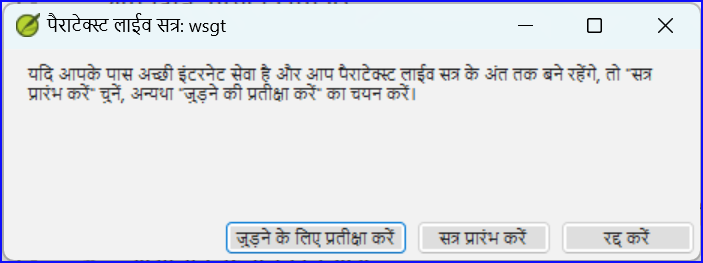
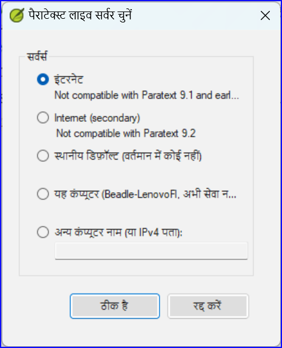
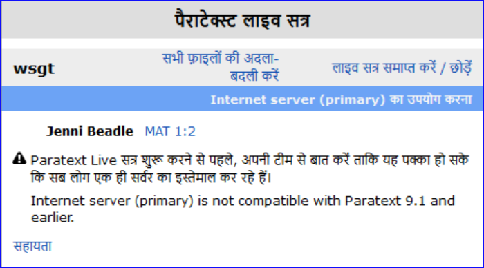

:::caution

पैराटेक्स्ट लाइव पैराटेक्स्ट 9.3 में बदल गया।

:::

**परिचय**  इस मॉड्यूल में आप पैराटेक्स्ट लाइव का उपयोग करेंगे ताकि टीम एक साथ सहयोग कर सके और सभी लोग अपने कंप्यूटर पर टेक्स्ट में परिवर्तन देख सकें।

**शुरू करने से पहले** हमने पहले ही देखा है कि कैसे भेजें/प्राप्त करें के साथ सहयोग किया जा सकता है। ऐसे समय होते हैं, जैसे कि एक सलाहकार जांच के दौरान, जब कई लोगों को एक ही टेक्स्ट को देखना होता है, और शायद इसे एक साथ संपादित करना होता है। Paratext Live सभी को अपने कंप्यूटर पर टेक्स्ट को देखने और वास्तविक समय में बदलाव देखने की अनुमति देता है।

**यह महत्वपूर्ण क्यों है**  ऐसे कई अन्य तरीके हैं जिनसे सभी एक ही टेक्स्ट को देख सकते हैं। लेकिन पैराटेक्स्ट लाइव न केवल सभी को पाठ देखने की अनुमति देता है, बल्कि यह एक से अधिक व्यक्ति को पाठ को संपादित करने की भी अनुमति देता है।

**आप क्या करने वाले हैं?**

- सभी उपयोगकर्ताओं को एक ही नेटवर्क से जोड़ें।
- भेजें/प्राप्त करें।
- Paratext Live प्रारंभ करें और एक सत्र में शामिल हों
- दस्तावेज़ संपादित करें
- सभी फाइलों की अदला-बदली करें
- पैराटेक्स्ट लाइव से बाहर निकलें
- आदान/प्रदान करें

:::info

[4.1 सहयोग उपकरण](https://vimeo.com/641947293)  वीडियो को पैराटेक्स्ट 9.3 के लिए संशोधित किया गया है।

:::

:::tip

आप हो सकता है कि स्क्रीन साझा करने (Skype या Zoom जैसे उपकरण का उपयोग करके) पर स्विच करने का प्रयास करें जब वर्तनी, बाइबल के शब्दों आदि पर काम करते हुए, ताकि सभी लोग परिवर्तन देख सकें। और फिर कम बैंडविड्थ की आवश्यकता के कारण पैराटेक्स्ट लाइवका उपयोग करने पर वापस लौटें।

:::

:::caution अपग्रेड

पैराटेक्स्ट 9.3 आपको एक सर्वर चुनने की अनुमति देता है। किसी विशेष लाइव सत्र में सभी को अभी भी एक ही सर्वर (या तो प्राथमिक या द्वितीयक) का उपयोग करने की आवश्यकता है, बस 9.3 से आप 9.1 पर किसी के साथ या 9.2 पर किसी अन्य के साथ काम कर सकते हैं (**बस एक ही समय में नहीं।**)

:::

## 20.1 पैराटेक्स्ट लाइव {#cfbebfcb20e14db89426a01336737f92}

:::tip

सभी उपयोगकर्ताओं को प्रारंभ करने से पहले **आदान/प्रदान** करने की आवश्यकता नहीं है, लेकिन यदि पैराटेक्स्ट बहुत अधिक परिवर्तन का पता लगाता है तो यह आपको आदान/प्रदान करने की सलाह देगा। सभी को समान नेटवर्क से जुड़ा होना चाहिए।

:::

### समान नेटवर्क से कनेक्ट करें {#8778ba22200442839f4c522b484c84a0}

पैराटेक्स्ट लाइव उपयोग कर सकता है

- इंटरनेट
- एक स्थानीय नेटवर्क
- ऑफलाइन वाईफाई राउटर
- मोबाइल डेटा अक्षम के साथ हॉटस्पॉट।

## पैराटेक्स्ट लाइव आरम्भ करें {#2e0fa70f644940e48f58e61cd2d84e22}

1. प्रोजेक्ट के लिए मेन्यू खोलें।
2. टूल्स के तहत, **पैराटेक्स्ट लाइव** पर क्लिक करें।
3. या उपकरण पट्टी पर आइकन का उपयोग करें।
   - _दो विकल्प प्रदर्शित किए गए हैं_

## सर्वर चुनें {#b0daa071fd094d97ae558c23c7708d56}

यदि सभी उपयोगकर्ता 9.2 या उससे ऊपर का उपयोग कर रहे हैं

- इंटरनेट से कनेक्ट करने के लिए आप पहला विकल्प **इंटरनेट (प्राथमिक)** चुन सकते हैं।
  - _एक संवाद बॉक्स प्रदर्शित होता है_

    

- "शामिल होने के लिए प्रतीक्षा करें" या "सत्र प्रारंभ करें" (मेजबान बनने के लिए) में से किसी एक पर क्लिक करें जैसा उचित हो।
  - _एक संवाद बॉक्स प्रदर्शित किया जा सकता है_
  - _यदि पैराटेक्स्ट सेटिंग्स में ऑटोसहेव चालू नहीं है, तो सत्र की अवधि के लिए लाइव सत्र इसे चालू कर देगा।_

यदि नहीं,

- दूसरा विकल्प **अलग सर्वर चुनें** का चयन करें।
  - _एक संवाद बॉक्स प्रदर्शित होता है जिसमें पाँच विकल्प दिखते हैं।_

    

**आप किसे चुनेंगे?**

- यदि सभी उपयोगकर्ताओं के पास पैराटेक्स्ट 9.2 या उससे ऊपर का संस्करण है तो पहला विकल्प इंटरनेट (प्राथमिक) चुनें।
- यदि किसी उपयोगकर्ता के पास पैराटेक्स्ट 9.0 या 9.1 है, तो दूसरा विकल्प इंटरनेट (माध्यमिक) चुनें।
- यदि आप सभी स्थानीय क्षेत्र नेटवर्क से जुड़े हैं और उस LAN का उपयोग कर कनेक्ट करना चाहते हैं, तो तीसरा विकल्प चुनें।
- **ओके** पर क्लिक करें.

**प्रारंभ करें या प्रतीक्षा करें**

- **सत्र शुरू / शामिल हों** पर क्लिक करें।
  - _फिर पैराटेक्स्ट पूछता है कि क्या आप मेज़बान हैं (यानी आप अंत तक बने रहेंगे)_
- यदि आप प्राथमिक संपादक/मेज़बान नहीं हैं, तो **प्रतीक्षा करें** पर क्लिक करें, रद्द न करें क्योंकि इससे आपका लाइव सत्र में शामिल होना रद्द हो जाएगा।
- यदि आप मेज़बान हैं तो **सत्र प्रारंभ करें** पर क्लिक करें।
  - _सत्र सक्रिय होते ही पैराटेक्स्ट लाइव बटन हरा हो जाता है_

## उपकरणों से परिवर्तन साझा करना {#33584bd1b18248b3bc576745a8aba544}

सारी धर्मग्रंथ पाठ पैराटेक्स्ट लाइव में साझा की जाती है। हालांकि, विभिन्न उपकरणों के साथ किए गए बदलाव स्वचालित रूप से साझा नहीं किए जाते हैं। इन साझा न किए गए बदलावों के उदाहरण हैं वर्तनी स्थिति, समानांतर मार्ग स्थिति, बाइबिल शर्तें और उनकी पहचानी गई प्रस्तुतियाँ, और नोट्स। इन बदलावों को साझा करने के लिए:

- टूलबार पर पैराटेक्स्ट लाइव बटन पर क्लिक करें,

- **सभी फाइलें बदलें** पर क्लिक करें
  - _फिर सभी उपयोगकर्ताओं को इन फाइलों के अपडेट मिलते हैं।_

:::caution

सभी उपयोगकर्ताओं द्वारा किए गए बदलाव साझा किए जाते हैं, लेकिन यदि दो लोगों ने एक ही आइटम को अलग तरीके से बदला है, तो केवल एक व्यक्ति का बदलाव ही सहेजा जाएगा।

:::

## पैराटेक्स्ट लाइव सत्र समाप्त करें {#092ea72d954c4c68a6f1c1fc61a7f15e}

- पैराटेक्स्ट लाइव आइकन पर क्लिक करें।
- **सत्र समाप्त / छोड़ें** का चयन करें।
- यदि आप मुख्य संपादक (मेज़बान) हैं, तो आपको एक संदेश दिखाई देगा।
- **सत्र को सामान्य रूप से समाप्त करें** पर क्लिक करें।
- सेंड / रिसीव।

:::info

**अधिक सहायता के लिए**, शीर्षक पट्टी पर खोज बॉक्स में **लाइव** खोजें। पैराटेक्स्ट लाइव पर कई उपयोगी विषय हैं।

:::
