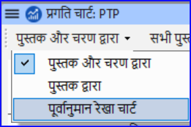

**परिचय**
इस मॉड्यूल में आप एक प्रगति रिपोर्ट बनाएंगे।

**शुरू करने से पहले**
जैसे-जैसे आप अपने अनुवाद पर काम कर रहे हैं, आप अपने असाइनमेंट और प्रगति को पूरी की गई अध्याय और पुस्तकों की प्रगति के साथ अपडेट कर रहे हैं। अब आप एक प्रोजेक्ट रिपोर्ट तैयार करेंगे।

**यह क्यों महत्वपूर्ण है**
आपके प्रशासकों और फंडर को आपकी प्रगति की सही रिपोर्ट की आवश्यकता होती है।

**तुम क्या करने वाले हो?**

- यह जांचें कि आपके असाइनमेंट और प्रगति अपडेटेड हैं।
- कई रिपोर्ट तैयार करें।

## २१.१ अपने असाइनमेंट और प्रगति की जांच करें {#6e6096ccce1e431a9cd5997eeed7e123}

1. अपना प्रोजेक्ट खोलें
2. **असाइनमेंट और प्रगति** आइकन पर क्लिक करें
3. आवश्यकतानुसार अपनी प्रगति को अपडेट करें।

## २१.२ टीम प्रगति चार्ट तैयार करें {#92fecf537c1b45be9afc57099f361f65}

1. **टैब** मेनू से, **प्रोजेक्ट** के अंतर्गत **प्रगति चार्ट** चुनें

2. ऊपरी बाएं में ड्रॉपडाउन सूची पर क्लिक करें।

   

3. उपयुक्त चयन करें (जैसे, पूर्वानुमान लाइन चार्ट)।
   - _एक विंडो ग्राफिक के साथ प्रकट होती है_

4. प्रिंट आइकन पर क्लिक करें
   - _एक विंडो खुलती है_

5. **प्रिंट** बटन पर क्लिक करें
   - _प्रिंट संवाद प्रदर्शित होता है।_

6. अपने प्रिंटर (या पीडीएफ प्रिंटर) का चयन करें

7. **ओके** पर क्लिक करें।
