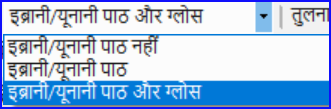
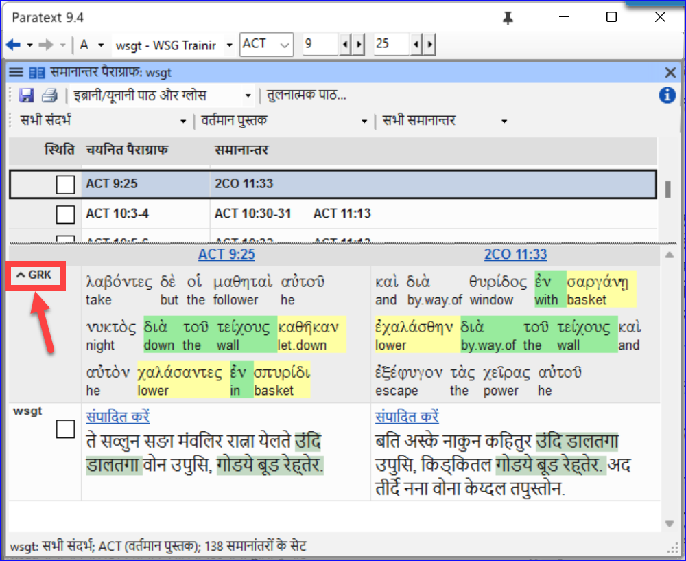
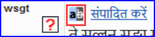
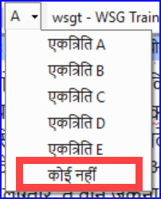

**परिचय**
एनटी में हजारों अंश हैं जहाँ या तो एक ही घटना का विवरण दिया गया है या पुराने या नए नियम से एक और श्लोक का उद्धरण दिया गया है। इन श्लोकों की तुलना करने की आवश्यकता है ताकि यह सुनिश्चित हो सके कि वे संगत हैं।

**शुरू करने से पहले**
आम तौर पर आप दोनों पुस्तकों के पाठ का अनुवाद और जाँच एक सलाहकार के साथ पहले ही कर चुके होंगे, इससे पहले कि आप पाठों की तुलना करें। हालाँकि ऐसे समय भी होते हैं जब आप दूसरे अंश का अनुवाद करने से पहले अन्य श्लोकों की तुलना करना चाहेंगे।

**यह क्यों महत्वपूर्ण है**
समानांतर अंशों को संगत होना चाहिए लेकिन वे हमेशा बिल्कुल समान नहीं होने चाहिए। समानांतर अंश टूल विभिन्न अंशों को प्रदर्शित करता है और उसी पाठ को हाइलाइट करता है। लेकिन महत्वपूर्ण अर्थ है (आवश्यक रूप से रूप नहीं)।

आमतौर पर आप अंश का अनुवाद करने के बाद तुलना करेंगे क्योंकि आप यह नहीं चाहते कि पहले के गलत अनुवाद का आप पर प्रभाव पड़े। लेकिन ऐसे समय भी होते हैं जब आप अनुवाद करते समय दूसरे अंश को देख सकेंगे।

**आप क्या करने जा रहे हैं**

- श्लोकों की तुलना करने के लिए समानांतर अंश टूल का उपयोग करें।
- पात्रों की जाँच कर चुके हैं, यह बताने के लिए चेकबॉक्स का उपयोग करें
- किसी भी बदले श्लोक के लिए फ़िल्टर करें
- अनुवाद करते समय दूसरे अंश को देखने के लिए परातेक्स्ट में एक त्वरित संदर्भ विंडो खोलें।
- एक विंडो में तीसरा अंश खोलें।

### 23.1 समानांतर अंश विंडो खोलें {#925421753cc849dbb0b0e5c29c6f549c}

1. इच्छित अध्याय और श्लोक पर नेविगेट करें।
2. **≡ टैब**, **उपकरण** के अंतर्गत > **समानांतर अंश**
   - _एक विंडो प्रदर्शित होती है जिसमें एक सूची और समानांतर अंश होते हैं_.

### 23.2 स्रोत पाठ प्रदर्शित करें {#63b7d3882a4f4eb7845d2ed8e45ca813}

1. स्रोत पाठ विकल्पों के बगल में ड्रॉपडाउन तीर पर क्लिक करें

   

2. उचित विकल्प चुनें
   - _प्रदर्शन तालिका के शीर्ष पर स्रोत भाषा पाठ को प्रदर्शित करने के लिए बदल जाता है।_

:::tip

परातेक्स्ट 9.3 में आप छोटे तीर पर क्लिक करके ग्रीक / हिब्रू को घटा या बढ़ा सकते हैं।

:::

### 23.3 तुलनात्मक पाठों का चयन करें {#2341540c08b34e67b22aa556a7a3d12d}

1. **तुलनात्मक पाठ** बटन पर क्लिक करें
2. एक संसाधन पर क्लिक करें (बाईं ओर)
3. दायें तीर पर क्लिक करें
4. आवश्यकतानुसार दोहराएं
5. **ओके** पर क्लिक करें।

### 23.4 फिल्टर {#bddd1bb153c84ee9bca3bc97ffb62b3b}

- इच्छा अनुसार फिल्टर चुनें: [जैसे कि सभी संदर्भ, वर्तमान पुस्तक, समगोपिक सुसमाचार]

### 23.5 अंशों की तुलना करें {#15c4aeb5a832426887603cefb4fe4e37}

- शीर्ष पैन में संदर्भ की एक पंक्ति पर क्लिक करें।
  - _पाठ निचले पैन में प्रदर्शित किए जाते हैं।_

:::info

- पाठ एक परियोजना में **धूसर** (या स्रोत पाठों में **हरे रंग का**) दिखाया जाता है जब पाठ दूसरे अंश के समान होता है।
- पाठ को **पीला** (स्रोत पाठों में) दिखाया जाता है जब इसका अर्थ (या विचार) समान होता है, भले ही वह दूसरे अंश के बिल्कुल समान न हो।
- बहुत से लोगों के लिए धूसर देखना बहुत कठिन होता है। आप मुख्य परातेक्स्ट सेटिंग्स में जाकर और हाइलाइट को **उज्जवल** में बदलकर इसे गहरा बना सकते हैं। यह पाठ और मेनू में हाइलाइट्स को भी प्रभावित करेगा।

:::

:::tip

यदि पाठ ग्रीक में **हरा** है, तो **आपका पाठ** भी समान होना चाहिए (लेकिन **गहरे हरे** रंग का)।
सामान्यतः, यदि पाठ ग्रीक में भिन्न है तो यह आपके पाठ में भी भिन्न होना चाहिए, लेकिन हमेशा नहीं।

:::

### 23.6 पाठ को सुधारने के लिए {#7337f71cd3c44034befaf9a302214031}

1. नीले लिंक **संपादित करें** पर क्लिक करें
2. सुधार करें।
3. **ओके** पर क्लिक करें.

### 23.7 पाठ की प्रतिलिपि बनाना {#f792366370e34edaa04a467ba812183e}

:::tip

यदि दो अंश समान होने की आवश्यकता है, तो आपको एक चुनना चाहिए (आमतौर पर आपका बाद का अनुवाद) और इसे दूसरे पर प्रतिलिपि बनाना चाहिए।

:::

**प्रतिलिपि**

1. नीले लिंक **संपादित करें** पर क्लिक करें
2. पाठ का चयन करें
3. कॉपी (Ctrl + C)
4. **ओके** पर क्लिक करें.

**पेस्ट करें**

1. अन्य पाठ के लिए नीले लिंक पर क्लिक करें
2. पाठ का चयन करें
3. पेस्ट (Ctrl+V)
4. **ओके** पर क्लिक करें.

:::caution

सावधान रहें जब एक से अधिक श्लोक हों। आप \v चिपकाना नहीं चाहेंगे।

:::

### 23.8 अंश को जाँच के रूप में चिह्नित करें {#d2196130c2104131b84a2bea4a95ad68}

- संदर्भ के बगल में चेक बॉक्स पर क्लिक करें।
  - _सन्दर्भ सेट स्वीकृत होते हैं।_

### स्वीकृति के लिए तीन तरीके {#08445ce9fc804dc1afac9e744e6025c0}

परातेक्स्ट के इस संस्करण में स्वीकृति के लिए तीन तरीके हैं।

1. विंडो के लिए **मेनू** खोलें।
2. **देखें** के अंतर्गत आप चुन सकते हैं
   - **समानांतर सेटों को स्वीकृत करें** - जो डिफ़ॉल्ट है
   - **अंशों को व्यक्तिगत रूप से स्वीकृत करें** व्यक्तिगत चेकबॉक्स
   - **सेट या व्यक्तिगत रूप से स्वीकृत करें**, जो आपको तरीकों के बीच आगे और पीछे स्विच करने की अनुमति देता है।

### सेट से व्यक्तिगत रूप में बदलने के लिए {#d8817e289b6245e385115906581f599b}

1. विंडो के लिए मेनू खोलें।
2. देखें के अंतर्गत, सेट या व्यक्तिगत रूप से स्वीकृत करने का चयन करें।
   - _प्रारंभ में, पूरे सेट के लिए एक चेकबॉक्स स्थिति कॉलम में दिखाया गया है।_
3. सेट के लिए निचले चेकबॉक्स पर माउस घुमाएं
4. _एक पेंसिल आइकन दिखाया गया है।_
5. **पेंसिल** पर क्लिक करें
   - _चेकबॉक्स दूसरे मोड में चले जाते हैं, लेकिन केवल इस अंश सेट के लिए।_

### 23.9 अंश जो बदल गए हैं {#e989e64519384fff9e358789ba19411e}

उन अंशों की पहचान करें जो समाप्त चिह्नित होने के बाद से बदल गए हैं

1. समानांतर अंश टूल में
2. अंश फ़िल्टर को **बदले हुए पाठ** में बदलें
3. अंश संदर्भ के तहत **ab** आइकन पर क्लिक करें।

   

   - _एक तुलना विंडो परातेक्स्ट में दिखाई जाती है।_
4. आवश्यकतानुसार पाठ बदलें।
5. समानांतर अंश
6. खत्म करने के लिए चेक बॉक्स पर क्लिक करें।

### 23.10 अनुवाद करते समय पाठ की तुलना करें {#ff56ce1d6f24468a8b5c84e7eedbf652}

1. अपने प्रोजेक्ट में क्लिक करें।
2. **≡ टैब**, **टूल्स** के तहत > **शीघ्र-संदर्भ** (Ctrl+q)
   - _एक तैरती हुई_ _विंडो_ _खुलती है जिसमें स्क्रॉल समूह कोई नहीं पर सेट होता है।_
3. अन्य अनुच्छेद के संदर्भ को बदलें।

### 23.11 तीसरा अनुच्छेद देखने के लिए {#c0a5d24f77314597a326fd75e4fbc55c}

1. अपने प्रोजेक्ट को दोबारा खोलें [**≡ पैराटेक्स्ट** > **पैराटेक्स्ट** > **खोलें** और अपने प्रोजेक्ट पर डबल-क्लिक करें]

2. स्क्रॉल समूह को **[A]** से **कोई नहीं** में परिवर्तन करें।

3. अन्य अनुच्छेद के संदर्भ को बदलें।

