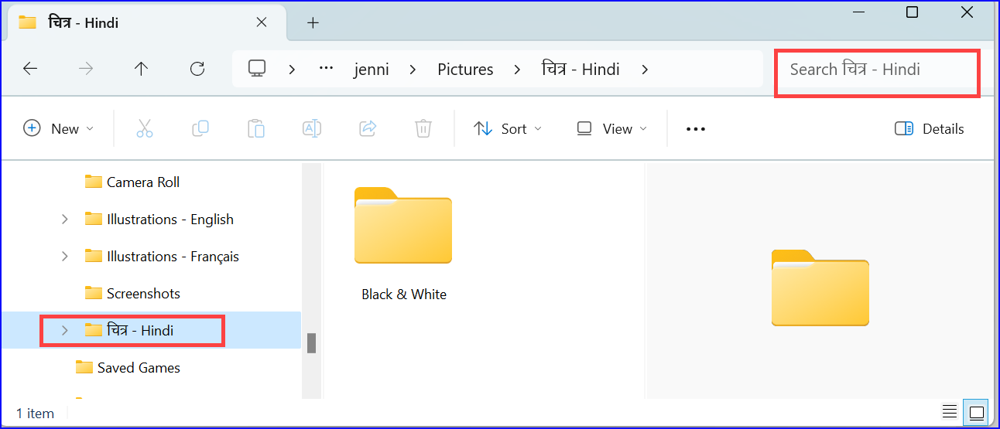
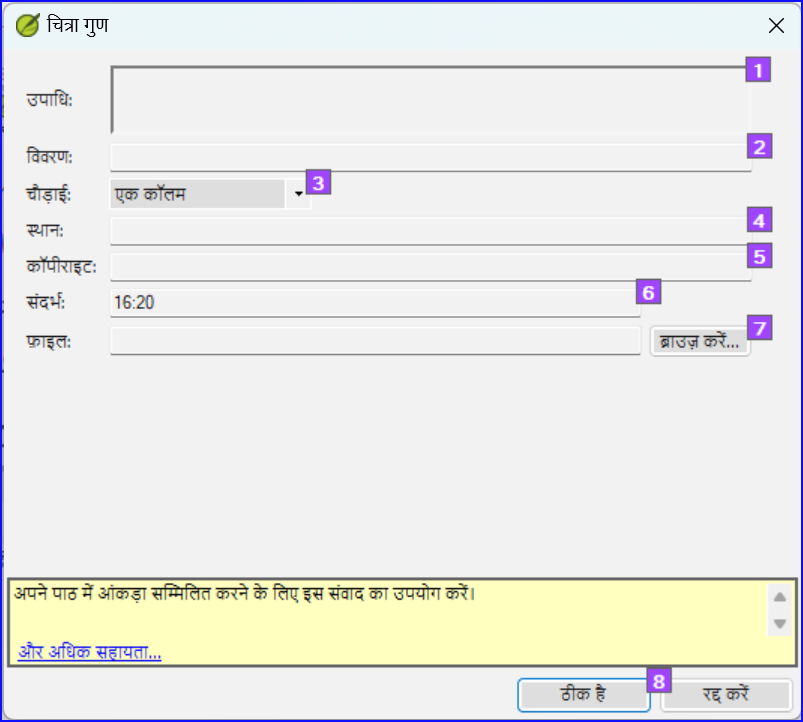
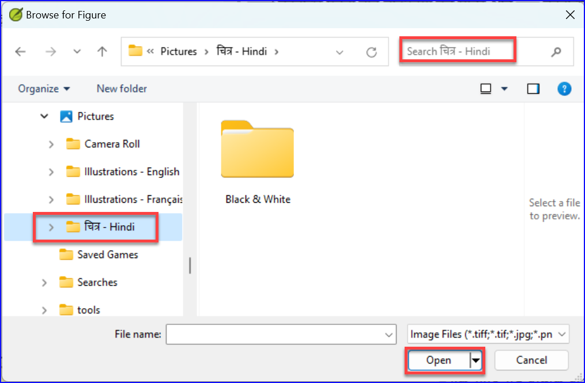
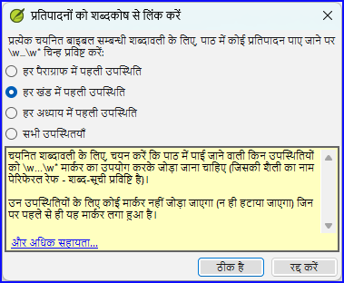

**परिचय**
यह मॉड्यूल उन विभिन्न कार्यों की जांच करता है जो पाठ को प्रकाशन के लिए अंतिम रूप देने के लिए आवश्यक हैं।

**आप क्या करेंगे**

- **चित्रण** और कैप्शन जोड़ें
- नक्शों के लिए नाम पहचानें
- एनटी/बाइबिल के लिए परिपत्र का मसौदा तैयार करें
- समानांतर अंशों की जांच करें
- सुनिश्चित करें कि सभी जांच पूरी हो गई हैं
- सही नामों की अंतिम जांच
- संख्याएँ, पैसा, भार और माप की जांच
- स्वरूपण जांचें।
- पाठ में शब्दकोष सामग्री को चिह्नित करें।

## 24.1 चित्रण और कैप्शन चुनना {#f380fb1fc81e4cbbb72d511558a49bb6}

2800 से अधिक चित्र उपलब्ध हैं, इसलिए चित्रण चुनना मुश्किल हो सकता है। सौभाग्य से, अब अध्याय संदर्भ और अंग्रेजी में कीवर्ड द्वारा चित्रों की खोज करना संभव है। ध्यान दें कि आप जो भी चित्रण Paratext में डालेंगे, उससे आपके प्रोजेक्ट का आकार बढ़ जाएगा। केवल ये छोटे jpg फ़ाइलें जोड़ें (या वैकल्पिक रूप से केवल फ़ाइल का नाम)। रचना के दौरान, उन्हें बड़े, उच्च-रिज़ॉल्यूशन चित्रों से बदल दिया जाएगा।

**खोजने के लिए छवियों का एक फ़ोल्डर बनाएं**

पहली बार:

1. इंटरनेट पर लिंक https://tiny.cc/sampleimages खोलें
2. फ़ोल्डर **चित्र - Hindi** पर राइट-क्लिक करें,
3. **डाउनलोड** चुनें
    - _यह लगभग 121MB डाउनलोड करेगा_.
4. डाउनलोड की गई **ज़िप फ़ाइल** को खोजें और खोलें।
5. आर्काइव में से एक फ़ोल्डर निकालें: **चित्र - Hindi** और उसे अपने **Pictures** फ़ोल्डर में रखें
    - _(विंडोज़ छवियों की सामग्रियों का अनुक्रमण शुरू करता है...)_

**विभिन्न खोजें आज़माएं**

जब आपकी छवियाँ अनुक्रमित हो जाएँगी, तो आप विभिन्न खोजें आज़माने में सक्षम होंगे।

1. इस नए फ़ोल्डर को **फ़ाइल एक्सप्लोरर** में खोलें।

    

2. खोज क्षेत्र में टाइप करें:

3. **एक खोज शब्द**, जैसे क्रॉस, भेड़, घर, आदि।

4. **एक बाइबिल संदर्भ**, जैसे MAT27, ACT03, आदि। (अध्याय के लिए कम से कम 2 अंकों का उपयोग करके)

5. केवल काले और सफेद चित्र प्रदर्शित करने के लिए **काला** या **रंग** जोड़ें।

## 24.2 चित्रण और कैप्शन जोड़ना {#b8896167ea3a4f46945fbab4670e0e58}

1. अपने प्रोजेक्ट में, इच्छित श्लोक पर नेविगेट करें।

2. **डालें** मेनू से, **आंकड़ा** चुनें

    

3. छवि के साथ मुद्रित करने के लिए एक **कैप्शन** दर्ज करें (आपकी भाषा में) [1]।

4. छवि के साथ मुद्रित करने के लिए एक **विवरण** दर्ज करें (आपकी भाषा में) [2]।

5. संकेत दें कि क्या छवि को एक कॉलम या एक पृष्ठ की चौड़ाई को भरना चाहिए। [3]

6. यदि लागू हो, तो एक स्वीकार्य स्थान के रूप में एक श्लोक रेंज टाइप करें। [\*] [वैकल्पिक]

7. छवि के बारे में आवश्यक कॉपीराइट जानकारी दर्ज करें [4]

8. Paratext छवि से संबंधित अध्याय और श्लोक संदर्भ को भर देगा। [5]

**चित्र फ़ाइल खोजने के लिए ब्राउज़ करें**

1. क्लिक करें **ब्राउज़ करें**… चित्र फ़ाइल को खोजने के लिए। [7]
    - _एक संवाद बॉक्स प्रदर्शित होता है_.

2. संवाद में, बाएँ तरफ **Pictures - Illustrations - English** फ़ोल्डर चुनें

    

3. **खोज** क्षेत्र (ऊपर दाएँ) में क्लिक करें और छवियों को फ़िल्टर करने के लिए टाइप करें (जैसा कि ऊपर)

4. इच्छित छवि पर क्लिक करें और **खोलें** बटन पर क्लिक करें।

5. **ठीक है** पर क्लिक करें।

:::caution

खोज को आसान बनाने के लिए, शीर्षक पट्टी पर डबल क्लिक करके **विंडो बड़ा करें**, **बहुत बड़े आइकन दिखाएँ** और **देखने का पैन छिपाएँ**।

:::

## 24.3 नक्शे के नाम {#e649bd9a447840cf8dcc7737ef3ba118}

:::info

नक्शे के नाम खोजने के लिए एक प्लग-इन जल्द ही उपलब्ध होगा (मैप लेबलर प्लगइन)। इस बीच, आप नीचे वर्णित पुरानी प्रणाली के साथ नक्शे के नामों की पहचान करना जारी रख सकते हैं।

:::

:::caution

संयुक्त एनटी नक्शे बाइबिल शब्द सूची Paratext 9 में एक मानक सूची नहीं है। यह [**यहां उपलब्ध है**](pathname:///img/CombinedNTMapBiblicalTerms.xml): और एक बार डाउनलोड हो जाने के बाद, फ़ाइल को "मेरे पैराटेक्स्ट 9 प्रोजेक्ट्स" में कॉपी करना चाहिए

:::

1. अपने प्रोजेक्ट में क्लिक करें।
2. Use the Biblical Terms tool
    **(≡ Tab**, under **Tools** &gt; **Biblical Terms)**
3. Open the liste
    **(≡ Tab**, under **Biblical Terms** &gt; **Select Biblical Terms List)**
4. Choose the list **CombinedNTMapBiblicalTerms**
5. Add renderings for all the names
6. Save the HTML file
    **(≡ Tab**, under **Biblical terms** &gt; **Export as HTML)**
7. फ़ाइल का एक नाम टाइप करें
8. **सहेजें** पर क्लिक करें।
9. Fill-in the Word document from the typesetter for the maps.

### 24.4 Draft Introduction to the NT/Bible and the Appendix {#8dbe5d1eded645b4b7399b7445e87c9b}

1. पुस्तक INT में परिवर्तन करें
2. Make sure there is an **\h** line
3. निम्नलिखित मार्करों का उपयोग करके अपना परिचय टाइप करें:
    - **\mt1**
    - **\is**
    - **\ip**
4. पुस्तक **INT** में बाइबिल/एनटी के समग्र परिचय को टाइप करें

### Appendix {#23a598a5fd4080bc92c8c3130afa40e0}

- The Appendix/Appendices can be typed in books XXA, XXB, XXC

या

- One of the specific books: Back Matter (**BAK**), Other Matter **OTH**, Topical Index (**TDX**), Names Index (**NDX**)…

:::tip

- Check with your typesetter.

:::

## 24.5 समानांतर अंशों की जांच करें {#41283e7f0e9e4ad0b0cc096515eaea02}

- मॉड्यूल देखें [पीपी समानान्तर अनुच्छेदों की तुलना करें](/23.PP)

## 24.6 सत्यापित करें कि सभी जांच पूर्ण हैं {#bad57bb5b1164152978a284244e46078}

**वर्तमान पुस्तक**

1. **असाइनमेंट और प्रगति** खोलें।
2. पुष्टि करें कि किसी भी जाँच पर कोई समस्या नहीं है।

**कई पुस्तकें**

1. भण्डार फिर से करें।
2. **≡ टैब** **टूल्स** > **मूलभूत जांचें चलाएँ** के अंतर्गत।
3. सुनिश्चित करें कि सभी जाँचें टिक की गई हैं।
4. सुनिश्चित करें कि सभी पुस्तकें जिन्हें प्रकाशित किया जाना है, चुनी गई हैं।
5. **ओके** पर क्लिक करें.
6. कोई भी त्रुटियाँ सही करें।

**शब्द सूची जांचें**

शब्द सूची से, निम्नलिखित जांच करें:

1. **≡ टैब**, **टूल्स** > **वर्तनी जांचें** > **सभी जांचें** के अंतर्गत
2. **≡ टैब**, **टूल्स** > **समान शब्द खोजें** के अंतर्गत
3. **≡ टैब**, **टूल्स** > **गलत तरीके से जुड़े या विभाजित शब्द खोजें** के अंतर्गत

## 24.7 उचित नामों की अंतिम जाँच {#9848258611574d89b055afe4eb493920}

1. **≡ टैब**, **टूल्स** > **बाइबल की शर्तें** के अंतर्गत
2. **≡ टैब**, **बाइबल सम्बन्धी शब्दावली** के अंतर्गत > **बाइबल सम्बन्धी शब्दावली सूची का चयन करें** और **मुख्य बाइबल सम्बन्धी शब्दों** की सूची चुनें
3. रेंडरिंग के साथ अनुपस्थित नामों पर फ़िल्टर लगाएँ
4. सभी नामों की जाँच करें कि क्या उनका रेंडरिंग है (यदि आवश्यक हो तो जोड़ें)।

## 24.8 संख्या, पैसा, वजन और माप {#1ab8c0f85ac14e36ba936d5d546c8dbd}

1. अपने प्रोजेक्ट में क्लिक करें।
2. **≡ टैब**, **टूल्स** > **बाइबिल शब्द** के अंतर्गत
3. **≡ टैब**, **बाइबल संबंधी शब्दावली** के अंतर्गत > **बाइबल संबंधी शब्दावली सूची का चयन करें**
4. उपयुक्त सूची को चुनें.
5. सामान्य रूप से रेंडरिंग जोड़ें।

## 24.9 स्वरूपण जाँचें {#6468aa6cc0bb4ed7bc531a2111ee63ee}

1. मॉड्यूल FC: प्रारूप फ़ॉर्मेट जांचें को पुन: करें।
2. **≡ टैब**, नीचे **टूल्स** > **जाँच-सूची** > **लंबी/छोटी आयतें**
3. **≡ टैब**, नीचे **टूल्स** > **जाँच-सूची** > **शब्द या वाक्यांश**
4. **≡ टैब**, **टूल्स** > **जाँच-सूची** > **अनुभाग शीर्षकें**
5. **≡ टैब**, नीचे **टूल्स** > **जाँच-सूची** > **पुस्तक के शीर्षक**
6. **≡ टैब**, नीचे **टूल्स** > **जाँच-सूची** > **रेफरेन्सस**
7. **≡ टैब**, **टूल्स** > **जाँच-सूची** > **फुटनोट्स**

## 24.10 पाठ में शब्दकोष शब्दों को चिह्नित (लिंक) करें {#53d0e7fe579147988b0f728b5c2c7b7d}

जब किसी शब्द/वाक्यांश के लिए शब्दकोष प्रविष्टि होती है, तो मुद्रित पाठ में शब्दों को एक तारक चिह्न के साथ चिह्नित करना या इलेक्ट्रॉनिक संस्करणों में एक लिंक जोड़ना आम बात है। त्रुटियों के कारण अनुपस्थित शब्दों से बचने के लिए इसे अंत तक छोड़ने की अनुशंसा की जाती है। आप बाइबल सम्बन्धी शब्दावली टूल में शब्दकोष से रेंडरिंग लिंक करने की आज्ञा का उपयोग करके इसे करते हैं।

शब्दकोष में जो प्रविष्टियाँ बाइबल सम्बन्धी शब्दावली सूची में नहीं हैं, उनका क्या? इसके लिए, आपको अपनी प्रोजेक्ट सूची में प्रविष्टियाँ जोड़नी होंगी। इसमें पाठ में शब्द/वाक्यांश को खोजना और अपनी प्रोजेक्ट बाइबल सम्बन्धी शब्दावली सूची में एक प्रविष्टि बनाना शामिल है। (देखें [10.7](/10.BT#f683ccf4cdcf45f09c516c09c78ab277)) अनुशंसा है कि आप एक बार में कुछ शब्दकोष प्रविष्टियों से प्रारंभ करें।

1. सुनिश्चित करें कि आपके पास सारा पुस्तक संपादित करने की अनुमति है।

2. बाइबल सम्बन्धी शब्दावली टूल में, कुछ शब्दकोष प्रविष्टियों का चयन करें।

3. **≡ टैब**, **संपादित करें** > **रेंडरिंग को शब्दकोष से लिंक करें** के अंतर्गत
    1. _एक संवाद बॉक्स प्रदर्शित होता है_.

        

4. हर खंड में पहली उपस्थिति चुनें।
    - _पैराटेक्स्ट पाठ में खोज करेगा और \w जोड़ देगा… \w\* मार्कर्स. फिर परिवर्तित आयतों की सूची प्रदर्शित करता है।_

5. परिणाम सूची में त्रुटियों के लिए ध्यानपूर्वक जाँच करें।

:::tip

यदि अनचाहे परिणाम ज़्यादा हैं, तो आप प्रविष्टियों का चयन करके और **रेंडरिंग को शब्दकोष से अलग करें** चुनकर पूर्ववत कर सकते हैं।

:::

:::tip

- यदि आपके पास एक वाक्यांश और एक शब्द दोनों हैं, तो पहले लंबे प्रविष्टि को लिंक करें।
- यदि आपके पास दो बहुत अलग-अलग रेंडरिंग हैं, तो बाइबल सम्बन्धी शब्दावली टूल में दूसरी शर्तें बनाने पर विचार करें।
- यदि आपने रेंडरिंग में "_" का उपयोग किया है, तो परिणामों की सावधानीपूर्वक समीक्षा करें और मैन्युअल रूप से \w को हटाएँ… \w_ आयत से।
- सावधान रहें यदि किसी बाइबल सम्बन्धी शब्दावली के प्रतिपादन में एक और बाइबल सम्बन्धी शब्दावली के प्रतिपादन की तरह ही कोई शब्द समान दिखता हो।

:::

