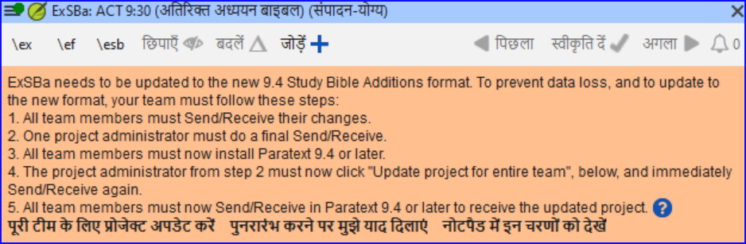

# Creating a Study Bible with Paratext 9.5 {#98137245ea6a44b79015596b67b3c634}

There are a number of Study Bible Additions (improvements in Paratext 9.5 listed below. These will be further documented in the next edition of the manual.

### Study Bible Additions (SBA) Improvements {#1b9598a5fd4080d687aee9efa3c83bfd}

- SBA now includes support for **Assignments and Progress** tracking!

- Adds support for displaying **figures in footnotes and sidebars**.

- **Scripture Reference Settings** within SBA projects can now override the settings of the base project.

- Improved **checking features**, ensuring more accurate and efficient review processes.

- It is now possible to add extended notes and sidebars for added or replaced content.

- Base project additional books (GLO, etc.) are incorporated in a SBA project.

- Handling of whitespace and invisible characters is supported in a SBA project.

- Adds an option for the default location of extended note callers.

- SBA-specific spelling discussion notes can be created in the Wordlist.

- Improvements to extracting a Legacy Study Bible into an SBA.

## Paratext 9.4 {#1b9598a5fd4080ac9c68e321981667bc}

The improvements in 9.5 has not yet been implemented here.

:::info

**स्टडी बाइबल एडिशंस (SBA)** फीचर्स जो **9.4 बीटा** में लागू किए गए हैं, डेटा फॉर्मेट में बदलाव के कारण SBA प्रोजेक्ट के माइग्रेट होने की आवश्यकता है। नया 9.4 SBA डेटा फॉर्मेट PT 9.3 वर्जन के साथ मेल नहीं खाता। नए SBA फीचर्स का उपयोग करने के लिए, सभी प्रोजेक्ट सदस्यों को PT 9.4 बीटा पर स्विच करना चाहिए और प्रोजेक्ट एडमिनिस्ट्रेटर को SBA प्रोजेक्ट माइग्रेट करना चाहिए।

:::

**परिचय**  पैराटेक्स्ट 9.2 (और उससे ऊपर) के साथ आप अपनी अनुवाद पर आधारित स्टडी बाइबल बना सकते हैं, जिसमें प्रारंभिक अनुच्छेद, साइडबार और विस्तृत फुटनोट्स और अतिरिक्त क्रॉस-रेफरेंस को जोड़ सकते हैं ताकि आपके उपयोगकर्ता को बाइबल पाठ को और गहराई से समझने में मदद मिल सके।

**आप प्रक्रिया में कहां हैं?** एक स्टडी बाइबल बनाने से पहले, आप अपने नये नियम (या उसके हिस्सों) का अनुवाद और सलाहकार जांच करना चाहेंगे। फिर आपका प्रशासक एक नया प्रोजेक्ट बना सकता है (नीचे देखें)।

**यह क्यों महत्वपूर्ण है?** स्टडी बाइबल जानकारी का निर्माण एक अलग प्रोजेक्ट में किया जाता है, जिसमें अनुवादित पाठ से लिंक होते हैं। अगर अनुवादित पाठ बदलता है तो लिंक टूट सकते हैं। लिंक को ठीक किया जा सकता है, लेकिन अगर पाठ स्थिर हो तो समस्या कम होने की संभावना होती है।

**आप क्या करेंगे?** आप (या आपका प्रशासक) **स्टडी बाइबल एडिशंस प्रोजेक्ट** बनाएंगे। जैसा कि नाम से पता चलता है, यहीं पर आप अध्ययन सामग्री जोड़ सकते हैं (अपने अनुवाद को प्रभावित किए बिना)।

इस अलग प्रोजेक्ट में आपकी अतिरिक्त सामग्री और आपके प्रोजेक्ट की केवल पढ़ने योग्य प्रतिलिपि शामिल होती है। जब आप तैयार हों, तो आप स्टडी बाइबल एडिशंस प्रोजेक्ट को अपने अनुवाद प्रोजेक्ट के साथ मिलाकर एक तीसरा प्रोजेक्ट बना सकते हैं।

- स्टडी बाइबल एडिशंस के पुराने संस्करण को माइग्रेट करें

या

- अपने अनुवाद के आधार पर स्टडी बाइबल एडिशंस का एक नया प्रोजेक्ट बनाएं
- नए प्रोजेक्ट को पंजीकृत करें
- अतिरिक्त सामग्री जोड़ें (परिचय, साइडबार, फुटनोट्स और क्रॉस-रेफरेंस)
- मूल अनुवाद में कोई भी गैर-बाइबिल पाठ छिपाएं (जैसे शीर्षक)
- प्रकाशन प्रोजेक्ट बनाने के लिए परियोजनाओं का विलय करें।

:::info अपग्रेड

पैराटेक्स्ट 9.4 आपको क्रॉस-रेफरेंस, फुटनोट्स और साइडबार को पुनः क्रमबद्ध करने की अनुमति देता है। अधिक विवरण के लिए, [9.4 में स्टडी बाइबल एडिशंस पर यह वीडियो देखें](https://vimeo.com/858761672)

:::

## स्टडी बाइबल एडिशंस के पुराने संस्करण को माइग्रेट करें {#0a743ded6dc24fc399975383664db289}

- अपना स्टडी बाइबल एडिशंस प्रोजेक्ट खोलें।
    - एक नोटिस प्रदर्शित की जाती है जो आपके प्रोजेक्ट को माइग्रेट करने का तरीका बताती है।

        

## एक नया स्टडी बाइबल एडिशंस प्रोजेक्ट बनाने के लिए {#7ed7e93951db49deaf2c5cf7d4d15d70}

1. **पैराटेक्स्ट मेनू** का उपयोग करके एक **नया प्रोजेक्ट** बनाएं।
2. प्रोजेक्ट के **प्रकार** को **स्टडी बाइबल एडिशंस** पर सेट करें।
3. **"आधारित" प्रोजेक्ट** के लिए अपने अनुवाद प्रोजेक्ट को चुनें।
4. आपको नए प्रोजेक्ट को **पंजीकृत** करना होगा।
    - _आपके प्रोजेक्ट की एक धुंधली केवल पढ़ने योग्य प्रति प्रदर्शित की जाती है, ऊपर एक टूलबार के साथ।_

## अतिरिक्त सामग्री जोड़ें {#e7a1b3e1b97b4eed9be5b9f1c2ed0dcd}

### प्रारंभिक सामग्री {#05a4f1d78d3549d9ac44235760b89873}

1. अपना कर्सर उस जगह पर पोजीशन करें जहाँ आप अतिरिक्त सामग्री जोड़ना चाहेंगे
2. टूलबार पर **जोड़ें +** क्लिक करें
3. एक नीला बॉक्स \ip के साथ जोड़ा जाता है।
4. पाठ टाइप करें।

### साइडबार पाठ {#ab2be09dfc0e4fdeb177091e89785b58}

1. अपना कर्सर उस जगह पर पोजीशन करें जहाँ आप अतिरिक्त सामग्री जोड़ना चाहेंगे
2. टूलबार पर **\esb** क्लिक करें
    - _एक साइडबार पैनल खुलता है जिसमें एक \ms मार्कर जोड़ा गया है_
3. \ms मार्कर के बाद शीर्षक टाइप करें
4. एंटर दबाएं
5. अगले पाठ के लिए एक मार्कर चुनें।
6. पाठ टाइप करें।
7. आवश्यकतानुसार जारी रखें।

### विस्तारित क्रॉस-रेफरेंस {#cbcab8e8c6a64e38bf737472fe26d8e9}

1. अपना कर्सर उस जगह पर पोजीशन करें जहाँ आप क्रॉस-रेफरेंस कॉलर जोड़ना चाहेंगे
2. टूलबार पर **\ex** क्लिक करें
    1. एक फुटनोट पैनल खुलता है जिसमें \ex मार्कर जोड़े गए हैं
3. क्रॉस-रेफरेंस टाइप करें।

### विस्तारित फुटनोट {#864c186270064955922ed758dc7d9fcf}

1. अपना कर्सर उस जगह पर पोजीशन करें जहाँ आप अतिरिक्त फुटनोट जोड़ना चाहेंगे
2. टूलबार पर **\ef** क्लिक करें
3. एक फुटनोट पैनल खुलता है जिसमें उपयुक्त \ef मार्कर जोड़े गए हैं
4. आवश्यकतानुसार फुटनोट जोड़ें।

### गैर-पवित्र सामग्री छिपाएं {#8fff7769e5ae4060b0f1ffef9a979a79}

आप अनुवाद में पवित्र नहीं सामग्री जैसे कि शीर्षक को छिपा सकते हैं

1. अपना कर्सर उस जगह पर पोजीशन करें जहाँ आप अतिरिक्त फुटनोट जोड़ना चाहेंगे
2. टूलबार पर **छिपाएं** क्लिक करें
    - _पाठ एक ग्रे-बॉक्स में प्रदर्शित किया जाता है।_

## प्रकाशन परियोजना बनाने के लिए परियोजनाओं का विलय करें {#23a03d9d683240a6a21290721a8dbb93}

स्टडी बाइबल प्रकाशित करने के लिए, आपको एक प्रकाशन परियोजना बनानी होगी।

1. स्टडी बाइबल एडिशंस परियोजना के प्रोजेक्ट मेनू पर क्लिक करें

2. "विलयित प्रकाशन परियोजना बनाएँ" चुनें

    

3. ड्रॉपडाउन सूची "**मर्ज्ड प्रकाशन परियोजना**" पर क्लिक करें।

4. एक नया परियोजना बनाएं या एक पिछला परियोजना चुनें

5. **बनाएं** पर क्लिक करें
    - _पैराटेक्स्ट अनुवाद परियोजना और स्टडी बाइबल एडिशंस परियोजना का विलय करता है और मर्ज्ड प्रकाशन परियोजना प्रदर्शित करता है।_

6. यदि आवश्यक हो, तो दृश्य को **पूर्वावलोकन** में बदलें।

### परिवर्तन करना {#9bd2afcdbf5946038a9b70561fcebc5d}

अब आपके पास तीन परियोजनाएँ हैं।

1. आपकी मूल अनुवाद परियोजना,
2. स्टडी बाइबल एडिशंस परियोजना और
3. विलयित प्रकाशन परियोजना।

- _अनुवाद में कोई भी सुधार_ _मूल अनुवाद परियोजना_ में किया जाना चाहिए।
    - ये सुधार तब स्टडी बाइबल एडिशंस
    - _अध्ययन बाइबल सामग्री में कोई भी सुधार_ _बाइबिल परिवर्धन परियोजना का अध्ययन करें_ में किया जाना चाहिए।
- _मर्ज किए गए प्रकाशन प्रोजेक्ट_ केवल-पढ़ने है और इसे बदला नहीं जा सकता।
    - परिवर्तन को अपडेट करने के लिए, मर्ज किए गए प्रकाशन प्रोजेक्ट को फिर से बनाएं।

## बाइबिल परिवर्धन परियोजना का अध्ययन करें - संस्करणों की तुलना करें{#7b7d078eecd44a71ae7fa6217ba07218}

पैराटेक्स्ट 9.3 (और उसके बाद के संस्करणों) में, आप अब संस्करणों की तुलना कर सकते हैं

1. अध्ययन बाइबल परिवर्धन परियोजना खोलें
2. **प्रोजेक्ट** मेन्यू से,
3. **प्रोजेक्ट** के तहत, **संस्करणों की तुलना करें** चुनें
    - _अतिरिक्त में होने वाले परिवर्तन प्रदर्शित होते हैं।_

## PTXPrint के साथ अध्ययन बाइबल को प्रिंट करना {#cfc9e16b905c4aa48c7aad34c7c5ef9a}

PTXPrint संस्करण 2.1.x (और ऊपर) मर्ज किए गए प्रकाशन प्रोजेक्ट को प्रिंट कर सकता है। विस्तृत निर्देशों के लिए, देखें [https://software.sil.org/ptxprint/how-to-study-bible-layout/](https://software.sil.org/ptxprint/how-to-study-bible-layout/)

