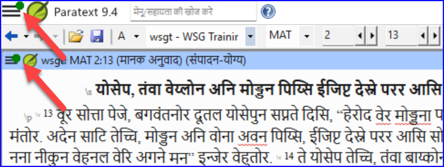
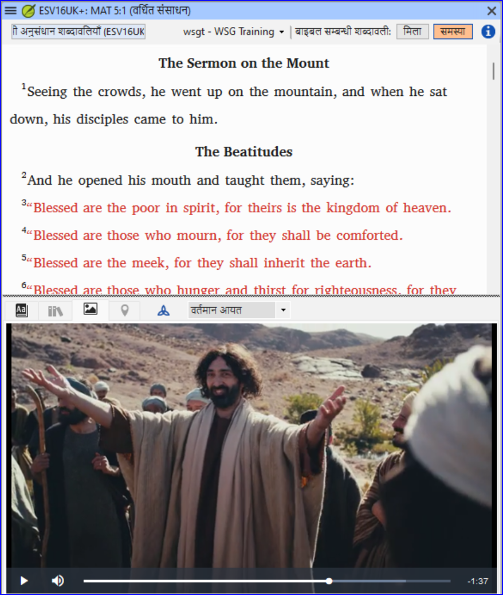

## **पैराटेक्स्ट 9.4 बीटा में नया क्या है** {#ef25a726728f449c90b3fdabf820eab6}

(यहाँ से लिया गया [https://paratext.org/features/whats-new/whats-new-in-paratext-9-4-beta/](https://paratext.org/features/whats-new/whats-new-in-paratext-9-4-beta/))

**कुछ मुख्य बिंदु**

- **उपयोगकर्ता के कंप्यूटर पर प्रोजेक्ट्स के अपडेट की सूचना:** अब, पैराटेक्स्ट यह जाँच सकता है कि किसी के कंप्यूटर पर प्रोजेक्ट्स को भेजें-प्राप्त सर्वर पर अपडेट किया गया है या नहीं। यदि प्रोजेक्ट को संपादित किया गया है, तो उपयोगकर्ता को हरे बिंदु के साथ मुख्य और प्रोजेक्ट मेन्यू दोनों में सूचित किया जाएगा (नीचे चित्रण देखें)। अपडेट के लिए जाँच की सेटिंग्स **प्रोजेक्ट का आदान/प्रदान करें** विंडो में उपलब्ध हैं। [मुख्य मेनू वीडियो डेमो](https://paratext.org/features/whats-new/whats-new-in-paratext-9-4-beta/?vimeography_gallery=157\&vimeography_video=857678678)

  

- **इंस्टॉल की गई संसाधनों के लिए अपडेट की अधिसूचना।** मुख्य मेनू में एक हरा बिंदु स्थानीय कंप्यूटर पर संसाधन पाठ के अपडेट को भी इंगित कर सकता है। इस विशेषता के लिए सेटिंग्स का उपयोग करने के लिए **डाउनलोड/इंस्टॉल रिसोर्सेस** विंडो में जाएं।

- **सुधारा हुआ दाएँ-से-बाएँ इंटरफेस।** पैराटेक्स्ट अब सही तरीके से दाएँ-से-बाएँ उपयोगकर्ता इंटरफेस (जैसे अरबी) को प्रदर्शित करता है। [आरटीएल वीडियो डेमो](https://paratext.org/features/whats-new/whats-new-in-paratext-9-4-beta/?vimeography_gallery=157\&vimeography_video=858761461)

  

- **प्रोजेक्ट नोट्स छिपाने का विकल्प।** पाठ में कई लाल झंडे आसानी से पढ़ने में बाधा बन सकते हैं। उपयोगकर्ता अब पाठ में प्रोजेक्ट नोट झंडे छिपाने या प्रदर्शित करने के लिए चुन सकते हैं। **देखें मेन्यू > प्रोजेक्ट नोट्स दिखाएँ** से पहुंच प्राप्त करें। [प्रोजेक्ट मेनू वीडियो डेमो](https://paratext.org/features/whats-new/whats-new-in-paratext-9-4-beta/?vimeography_gallery=157\&vimeography_video=857939433)

  

- **बेहतर उद्धरण जाँच।** नया “उद्धरण प्रकार” बुनियादी जांच पाठ में उद्धरण कहाँ होने चाहिए, इसका Glyssen (https://software.sil.org/glyssen/) डेटा पर आधारित ज्ञान है और यह सुनिश्चित कर सकता है कि वे सभी सही रूप से चिह्नित हों। [उद्धरण प्रकार वीडियो डेमो](https://paratext.org/features/whats-new/whats-new-in-paratext-9-4-beta/?vimeography_gallery=157\&vimeography_video=859138745)

- **वर्धित संसाधन में वीडियो जोड़ा गया।** अब वर्धित संसाधनों के लिए मीडिया टैब में [LUMO](https://lumoproject.com/) और UBS की “Bible Lands as Classroom” श्रृंखला के वीडियो क्लिप शामिल हैं। [वर्धित संसाधन वीडियो – वीडियो डेमो](https://paratext.org/features/whats-new/whats-new-in-paratext-9-4-beta/?vimeography_gallery=157\&vimeography_video=858761461)

  

- **बाइबल सम्बन्धी शब्दावली सूचियों का आयात/निर्यात।** यह सुविधा प्रोजेक्ट टीमों के वर्कफ़्लो को बाइबल सम्बन्धी शब्दावली टूल के साथ बढ़ाएगी, जिससे उन्हें प्रोजेक्ट प्रगति के दौरान बाइबल सम्बन्धी शब्दावली सूचियों को बनाने और आदान-प्रदान करने की अनुमति मिलेगी। कृपया पूरी कार्यक्षमता के लिए नवीनतम बीटा अपडेट पैच (जल्द आ रहा है) को इंस्टॉल करें। [बाइबल सम्बन्धी शब्दावली वीडियो डेमो](https://paratext.org/features/whats-new/whats-new-in-paratext-9-4-beta/?vimeography_gallery=157\&vimeography_video=858020833)

**और कई सुधार!**

- फील्डवर्क्स शब्दकोश को पैराटेक्स्ट इंटरलीनियर के साथ उपयोग करने की क्षमता जोड़ी गई। [▶ FieldWorks एकीकरण वीडियो डेमो](https://paratext.org/features/whats-new/whats-new-in-paratext-9-4-beta/?vimeography_gallery=157\&vimeography_video=859073261)
- बाइबिल परिवर्धन परियोजना का अध्ययन करें में क्रॉस-रेफरेंसेस, फुटनोट्स, और साइडबार्स के क्रम को परिवर्तन करने की क्षमता जोड़ी गई। [▶ अध्ययन बाइबल अतिरिक्त वीडियो डेमो](https://paratext.org/features/whats-new/whats-new-in-paratext-9-4-beta/?vimeography_gallery=157\&vimeography_video=858761672)
- “लेआउटस प्रबंधित करें” के लिए सुविधा जोड़ी गई। [▶ मुख्य मेनू वीडियो डेमो](https://paratext.org/features/whats-new/whats-new-in-paratext-9-4-beta/?vimeography_gallery=157\&vimeography_video=857678678)
- समानांतर पैराग्राफ मिलाएं को देखना आसान बनाया।
- प्रोजेक्ट मेन्यू में नए/सुधारे गए सामग्री ([▶ प्रोजेक्ट मेन्यू वीडियो डेमो](https://paratext.org/features/whats-new/whats-new-in-paratext-9-4-beta/?vimeography_gallery=157\&vimeography_video=857939433)):
  - अब प्रोजेक्ट मेन्यू से PTXprint में निर्यात उपलब्ध है।
  - “तालिका ठीक है” में सुधार।
  - व्युत्पन्न प्रोजेक्ट आधार प्रोजेक्ट खोल सकते हैं।
- अतिरिक्त विशेषताएँ ([▶ अतिरिक्त विशेषताएँ वीडियो डेमो](https://paratext.org/features/whats-new/whats-new-in-paratext-9-4-beta/?vimeography_gallery=157\&vimeography_video=859466352)):
  - संस्करणों की तुलना में सुधार किया गया ताकि विभिन्नताओं के बीच स्पष्ट अंतर दिखाया जा सके।
  - वैकल्पिक उद्धरण चिह्नों को संभालने की क्षमता
  - संदर्भ जाँच अधिक विशिष्ट त्रुटि संदेश देता है
- कार्य एवं प्रगति परिचित पुस्तक कोड (उदाहरण के लिए: “GEN”) को स्वीकार करता है
- वर्धित संसाधन शब्दकोश शर्तें अब दोहराई नहीं जाती हैं
- जब आप 'प्रतिक्रिया दें' का उपयोग करते हैं, पैराटेक्स्ट प्रोजेक्ट इतिहास में एक बिंदु चिन्हित करेगा
- [धर्मग्रंथ-संग्रह](https://docs.burrito.bible/en/latest/) 1.0 आयात/निर्यात
- विभिन्न बग सुधारें
