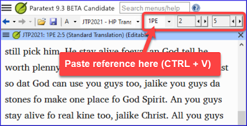
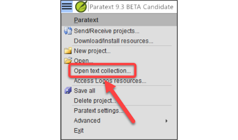
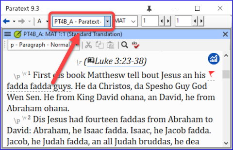

### Paratext Live

O Paratext Live utiliza alguns servidores.

-   O Paratext 8, 9.0, 9.1 (e 9.3) utilizam um servidor chamado Internet (secundário) WCF
-   O Paratext 9.2 (e 9.3) utiliza Internet (primário) AMQP.

:::tip
É por isso que você não pode usar o Paratext Live com as versões 9.2 e 9.1 ao mesmo tempo.
:::
-   No Paratext 9.3, quando você inicia o Paratext Live, você escolhe qual servidor deseja usar.
    -   **Internet (primário)**, que é 9.2 e 9.3.
    -   **Internet (secundário)**, que é 9.0, 9.1 ou Paratext 8.

:::note
Todos em uma sessão ao vivo ainda precisam usar o mesmo servidor, é apenas a partir do 9.3 que você pode trabalhar com alguém na versão 9.1 ou com outra pessoa na versão 9.2 (apenas não ao mesmo tempo).
:::

### Adições à Bíblia de Estudo

A novidade mais óbvia é a capacidade de **comparar versões**.

1.   Abra um projeto de Adições à Bíblia de Estudo
1.   No menu **Projeto**,
1.   Em **Projeto**, escolha **Comparar Versões**
     - *As alterações nas adições serão exibidas*.

#####

### Referência bíblica na barra de navegação

No Paratext 9.3, você pode copiar e colar uma referência bíblica na barra de navegação.

1.  Copie o texto de uma referência (de outro arquivo)
1.  Clique no **nome do livro** na barra de navegação
1.  Cole usando **Ctrl+V**
   
    -  A referência deve estar em um formato que corresponda ao idioma da interface. Por exemplo,
      -   em inglês: MAT 12.3, Mrk 5:4, Galatians 1:12
      -   em espanhol: Romanos 8:28

:::note
Os nomes devem corresponder aos nomes conforme são vistos nos títulos.
:::

### Ferramenta de Passagens Paralelas

-   As cores mudaram de **verde** para **cinza**
-   Você pode reduzir ou expandir o texto grego / hebraico clicando na pequena seta.  
  

### Abrir coleção de textos

Há um novo item de menu no **menu principal**  
   

1.  No menu **Paratext ≡**
1.  Escolha **Abrir coleção de textos**
     -  *Essa janela se parece com o que foi usado em versões anteriores do Paratext*.
1.  Abra uma coleção de textos previamente **salva** no canto inferior esquerdo
1.  Você ainda pode abrir uma coleção de textos a partir da janela **Abrir** também.

### Organizar janelas

1.  Organize as janelas em **linhas** e também em **colunas**.  
   

:::tip 
Lembre-se de salvar o seu layout!
:::

### Janelas flutuantes

-   Menu suspenso para alterar o projeto ativo  
  

#####

### Outras novidades/alterações

-   **RegEx Pal** - no menu Principal \> Avançado ou menu Projeto \> Avançado.
-   **Sincronização** com Logos e outros programas compatíveis agora está ativada **por padrão**
-   Foram feitas alterações para ajudar na localização dos arquivos de ajuda e da interface do usuário
-   Os **módulos da Bíblia** agora podem lidar com **marcadores de capítulo** nos livros extras