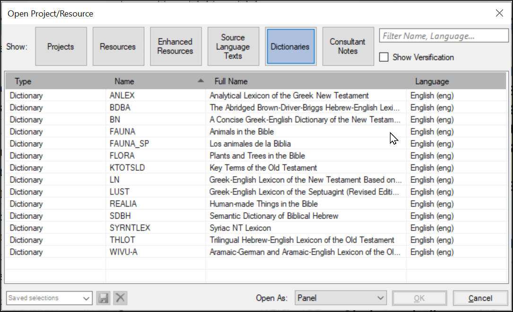

**Introduction**  As you work with your text in Paratext 9 you will want to see a variety of resources. In this module, you will learn how to open resources and organise your desktop.

**Before you start** You are getting ready to type text into an existing project. Before you can do this, someone must have already installed the program, created a project for your data and installed resources for you.

**Why is this important?**  The translator who organises his/her desktop well has all the resources necessary for his/her work.

**What are you going to do?** You will start the Paratext 9 program and open a previously saved layout (text combination). If needed you will open other resources, change the arrangement of the windows and resave the text layout.

:::info Videos

There are a number of videos available to help you with the different types of resources and arranging the windows. Below are some suggestions. Click on the link to see the video.

[**0.2.1b**](https://vimeo.com/368328862) Basics of Projects and Resources

[**0.2.1d**](https://vimeo.com/368328956) How To Arrange Windows

[**0.2.2a**](https://vimeo.com/377612892) How To Open And Modify A Text Collection

[**0.2.3a**](https://vimeo.com/382483908) How To Control Which Windows Scroll Together

[**0.2.3c**](https://vimeo.com/377612971) How To Swap A Text In A Window

[**0.2.3d**](https://vimeo.com/377613013) Further Tips On Arranging Windows

:::

### **Changes in Paratext 9** {#ed3427390c2b484f8c1343a8944fe332}

The menus changed in Paratext 9.0. To see the menu, you now need to click on the menu icon ≡. There are now two types of menus.

The main Paratext menu is on the title bar. Each window (or tab) has its own menu.

When you click on one of these menu icons all the menus are displayed, and you just need to click on the command.

:::tip

In this manual, when it says **≡ Paratext**, under **Menu** &gt; **Command** (e.g. **≡ Paratext**, under **Paratext** &gt; **Open**). It means click on the Paratext menu icon ≡, then under the menu (e.g. Paratext) choose the command (e.g. Open).

And when it says **≡ Tab**, under **Menu** &gt; **Command** it means click on the tab menu icon, then under the menu (e.g. Tools) click on the command (e.g. Wordlist). The most common Tab is the project menu so it may just say ”**≡ project** **menu**”.

:::

## 2.1 Load the program {#c07b16862b1d4f55821e9a5398e26435}

1. Double-click on Paratext 9 icon on the **desktop**

    

    - **OR**
2. (From the **Start** menu, choose **Paratext 9**)

## 2.2 Open a saved layout {#d65baaea138b4d72b0dbaaadd85f23d5}

:::info Upgrade

In 9.4 there are some improvements to manage layouts. Your recently used layout should be at the top of the menu.

For more details watch [What's New in 9.4 - Main menu - Manage Layouts](https://vimeo.com/857678678)

:::

1. Click the **≡ Paratext** menu, then under the **Layout** menu
2. Choose a saved layout (text combination).
    - _Your screen should look something like the picture below (if not, see below)._

        

## 2.3 Create a new text layout {#71e308de0d1f4c71b54acfb4d760fae8}

If you haven’t already saved a layout, then we recommend you do the following:

### **Open and arrange the windows** {#f5f12c7b122148ca9b9b4edd7c7eb807}

- 1= Text collection
    - **≡ Paratext** menu, under **Paratext** choose **Open Text Collection**, select several resources, click **Right arrow** button, click **OK**. See [2.5](/2.OD#204f93f95d7e4da7aa004d8b2aefaa86))
- 2 =Your project
    - **≡ Paratext** menu under **Paratext** > **Open**, Projects
- 5 = Renderings
    - **≡ Tab** menu, under Tools > **Biblical Terms renderings**
- 3 = Source text
    - **≡ Paratext** menu, under **Paratext** > **Open > Source language text**
- 4 = Enhanced resource
    - **≡ Paratext** menu, under **Paratext** > **Open > Enhanced resources**
- Arrange the windows as desired. See Paratext videos 0.2.1b, 0.2.1c, and 0.2.3d.

:::info Upgrade

In Paratext 9.3 (and above) you can use the main Paratext menu to arrange windows by **rows** and **columns**.

:::

:::tip

Remember to save your layout!

:::

### Save the layout {#d4ebb0ef8d0f49998351a50a09b5942b}

Once the windows are arranged as desired:

1. **≡ Paratext**, under **Layout** &gt; **Save current layout**
2. Type a new name
3. OR to replace an existing layout,
    1. Click the dropdown to the right
    2. Choose the name of the saved layout.
4. Click **OK**

## 2.4 Delete a text layout {#75e26e8bdc3345529b5b3fc702f4c748}

If you want to delete a saved layout,

1. **≡ Paratext** menu, under **Layout** &gt; **Delete layout**
2. Click the dropdown  to the right
3. Choose the name of the saved layout.
4. Click **Delete**

## 2.5 Open resources in a Text collection {#204f93f95d7e4da7aa004d8b2aefaa86}

:::info 9.4 Upgrade

In 9.4, Paratext can notify you when there are updates to any of your resources.

1. On the **Download/Install resources** dialog, below the list of resources
2. Click the dropdown list beside “**Check for resource updates**”
3. Choose how often to check
    1. _If a resource has changed, a green dot is shown on the Paratext menu icon._

For more details watch [What's new main menu](https://vimeo.com/857678678).

:::

With Paratext, it is possible to have several project/resources open at the same time. However, rather than having too many windows, it is better to have several texts in one window.

1. Click the dropdown list beside “**Check for project updates**”

2. Choose how often to check

:::  

:::info Upgrade

In Paratext 9.3 the Text Collection can also be opened directly from the **≡ Paratext** menu

:::

:::info 9.4 Upgrade

In 9.4, Paratext can notify you when there are updates to any of your resources.

1. On the **Download/Install resources** dialog, below the list of resources
2. Click the dropdown list beside “**Check for resource updates**”
3. Choose how often to check
    - _If a resource has changed, a green dot is shown on the Paratext menu icon._ For more details watch [What's new main menu](https://vimeo.com/857678678).

:::

### New method - Open directly from Paratext menu {#72a473aaf424486aaa027854c81aa784}

1. **≡ Paratext** menu, under **Paratext** &gt; **Open text collection**
2. Select several resources using the Ctrl key as you click on the resource.
3. Click on the **Right arrow button**.
    - _The resources are listed in the Selected column_.
4. Repeat as necessary.
5. Use the up and down arrows to reorder them as needed.

Save the collection

1. Click in the text box in the bottom left corner.
2. Type a name for the saved collection and click the save icon
3. Click **OK**.
    - _The text collection opens_.

### Previous method - Open dialog {#4ce29225a23d4f53998f378f3d1f993f}

1. **≡ Paratext** menu, under **Paratext** &gt; **Open**
2. Click on the Resources button (at the top).
3. Select several resources using the Ctrl key as you click on the resource.
4. Repeat as necessary.
5. Click on the **Open as** dropdown list.
6. Choose **Text collection panel**
7. Click **OK**

:::tip

It is suggested that resources be displayed in the order of more literal to less literal (to focus on the texts that are most faithful to the source texts). For English resources: ESV, RSV, NIV, NLT. For French resources, the following order is suggested: TOB, NVSR78Col, NBS, BDS, FC97, PDV11.

:::

There are several ways to change the order of texts in the collection

1. **≡ Tab**, **Modify text collection**

**From the Select Texts dialog**

1. Use the arrow buttons to change the order as necessary

2. Make any other changes

3. Click **OK**

:::tip

You can change the text in the second pane by clicking on the blue link of the abbreviation for the text. You can also use the **≡ Tab** under **View** menu to change the view (preview, unformatted or standard).

:::

## 2.6 Open an Enhanced Resource {#ddb656b63852444cbe84a309b3bb9923}

1. **≡ Paratext** menu, under **Paratext** > **Open**

2. Click on **Enhanced Resources**

:::tip

 Enhanced resources also contain a dictionary, images, maps, **videos,** etc. When you open an Enhanced Resource, a guide opens as well.

:::

:::info Upgrade 9.4

In 9.4, Paratext can notify you when a resource has been updated.

:::

## 2.7 Open a dictionary {#7ea1b54db25c492c832d9d92995b4030}

:::tip

If you do not use an enhanced resource, you can open a source language dictionary with glosses in other languages.

:::

1. **≡ Paratext** menu, under **Paratext** > **Open**

2. Click **Dictionaries**

3. Choose “A Concise Greek-English Dictionary of the New Testament” OR “Trilingual Hebrew-English Lexicon of the Old Testament”

4. Click **OK**

5. **View** > choose a language (e.g. **French**)

:::tip

 It is useful to add dictionary windows to the autohide, (right-click on the tab name, choose move to autohide).

:::

Other dictionaries (in English but with photos)

- "Plantas e árvores na Bíblia"
- "Animais na Bíblia"

## 2.8 Working with the Source language text {#9fe3171ca9784daf8bc9ff0681bcaa59}

You can open the source language text with glosses in an alternative language than English, e.g. Gloss FR.

1. **≡ Paratext**, under **Paratext** > **Open**

2. Click **Source Language Texts**

3. Choose HEB/GRK

4. Click **OK.**

If you have downloaded the special gloss resource, you can load them as follows

1. **≡ Tab** under **View** &gt; **Additional glosses**
2. Choose the specific resource that has the glosses (e.g. GlossFR)
3. Click **OK.**
