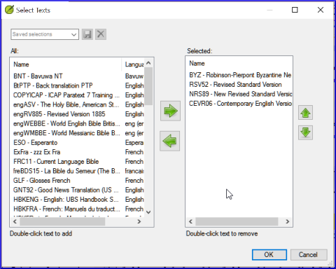

**Introdução**  Conforme você trabalha com seu texto no Paratext 9, você desejará ver uma variedade de recursos. Neste módulo, você aprenderá como abrir recursos e organizar sua área de trabalho.

**Antes de começar**  Você está se preparando para digitar texto em um projeto existente. Antes de fazer isso, alguém já deve ter instalado o programa, criado um projeto para seus dados e instalado recursos para você.

**Por que isso é importante**  O tradutor que organiza bem sua área de trabalho possui todos os recursos necessários para o seu trabalho.

**O que você vai fazer?**  Você iniciará o programa Paratext 9 e abrirá um layout salvo anteriormente (combinação de textos). Se necessário, você abrirá outros recursos, mudará a disposição das janelas e salvará novamente o layout do texto.

:::info Vídeos

Existem vários vídeos disponíveis para ajudá-lo com os diferentes tipos de recursos e a organização das janelas. Algumas sugestões são fornecidas abaixo. Click on the link to see the video.

[**0.2.1b**](https://vimeo.com/368328862) Noções básicas de projetos e recursos

[**0.2.1d**](https://vimeo.com/368328956) How To Arrange Windows

**≡ Aba**, **Modificar coleção de texto**

[**0.2.3a**](https://vimeo.com/382483908) How To Control Which Windows Scroll Together

[**0.2.3c**](https://vimeo.com/377612971) How To Swap A Text In A Window

[**0.2.3d**](https://vimeo.com/377613013) Further Tips On Arranging Windows

:::

### **Changes in Paratext 9** {#ed3427390c2b484f8c1343a8944fe332}

Os menus foram alterados no Paratext 9.0. Para ver o menu, agora você precisa clicar no ícone de menu ≡. Agora existem dois tipos de menus.

The main Paratext menu is on the title bar. Each window (or tab) has its own menu.

When you click on one of these menu icons all the menus are displayed, and you just need to click on the command.

:::tip

Neste manual, quando diz **≡ Paratext**, em **Menu** \> **Comando** (por exemplo, **≡ Paratext**, em **Paratext** \> **Abrir**). Isso significa que você deve

E quando diz **≡ Guia**, em **Menu** \> **Comando**, isso significa que você deve clicar no ícone de menu da guia e, em seguida, no menu (por exemplo, Ferramentas) clique no comando (por exemplo, Lista de palavras). Também pode dizer **menu** do projeto.

:::

## 2.1 Carregar o programa {#c07b16862b1d4f55821e9a5398e26435}

1. Dê um duplo clique no ícone do Paratext 9 na **área de trabalho**

    

    - **OR**
2. (No menu **Iniciar**, escolha Paratext 9)

## 2.2 Abrir um layout salvo {#d65baaea138b4d72b0dbaaadd85f23d5}

:::info Atualização

In 9.4 there are some improvements to manage layouts. Your recently used layout should be at the top of the menu.

For more details watch [What's New in 9.4 - Main menu - Manage Layouts](https://vimeo.com/857678678)

:::

1. Clique no menu **≡ Paratext**, em seguida, no menu **Layout**
2. Escolha um layout salvo (combinação de textos).
    - _*A sua tela deve ficar parecida com a imagem abaixo (caso contrário, veja abaixo).**

        

## 2.3 Criar um novo layout de texto {#71e308de0d1f4c71b54acfb4d760fae8}

Se você ainda não salvou um layout, então recomendamos que você faça o seguinte:

### **Open and arrange the windows** {#f5f12c7b122148ca9b9b4edd7c7eb807}

- 1= Coleção de textos
    - **≡ Paratext** menu, em Paratext escolha **Abrir Coleção de Texto**, selecione vários recursos, clique no botão **Seta para a direita**, clique em **OK**. Veja [2.5](../Stage-1---Drafting/2.OD.md#25)
- 2 = seu projeto
    - **≡ Paratext** menu, em **Paratext** \> **Abrir**
- 5 = Renderizações
    - **≡ Paratext** menu, em **Paratext** \> **Abrir**, Projetos
- 3 = Texto-fonte
    - **≡ Guia** menu, em Ferramentas \> **Renderizações de Termos Bíblicos**
- 4 = Recurso aprimorado
    - **≡ Paratext** menu, em **Paratext** \> **Abrir \> Texto em idioma-fonte**
- Organize as janelas conforme desejado. Veja o vídeo do Paratext [0.2.1b](https://vimeo.com/manage/videos/439411463), [0.2.1c](https://vimeo.com/manage/videos/749701910) e [0.2.1d](https://vimeo.com/manage/videos/439462085).

:::info Atualização

Menu **≡ Paratext**, em **Paratext** \> **Abrir**

:::

:::tip

Escolha o projeto que possui os glossários

:::

### Salvar o layout {#d4ebb0ef8d0f49998351a50a09b5942b}

Uma vez que as janelas estejam organizadas como desejado:

1. **≡ Paratext**, em **Layout** \> **Salvar layout atual**
2. Type a new name
3. OR to replace an existing layout,
    1. Click the dropdown to the right
    2. Escolha o nome do layout salvo.
4. Clique em **OK**.

## 2.4 Excluir um layout de texto {#75e26e8bdc3345529b5b3fc702f4c748}

Se você deseja excluir um layout salvo,

1. **≡ Paratext** menu, em **Layout** \> **Excluir layout**
2. Click the dropdown  to the right
3. Escolha o nome do layout salvo.
4. Clique em **Excluir**

## 2.5 Abrir recursos em uma Coleção de Texto {25} {#204f93f95d7e4da7aa004d8b2aefaa86}

Faça quaisquer outras alterações

In 9.4, Paratext can notify you when there are updates to any of your resources.

1. **≡ Paratext** menu, em **Paratext** \> **Abrir \> Recursos aprimorados**
2. Clique em **Recursos Avançados**
3. Choose how often to check
    1. _If a resource has changed, a green dot is shown on the Paratext menu icon._

For more details watch [What's new main menu](https://vimeo.com/857678678).

:::

Com o Paratext, é possível ter vários projetos/recursos abertos ao mesmo tempo. No entanto, em vez de ter muitas janelas, é melhor ter vários textos em uma única janela.

../media/OpenTextCol.png

No Paratext 9.3, a Coleção de Texto também pode ser aberta diretamente a partir do menu **≡ Paratext**
:::

:::

### Novo método - Abrir diretamente do menu do Paratext {#72a473aaf424486aaa027854c81aa784}

1. **≡ Paratext** menu, em **Paratext** \> **Abrir coleção de textos**
2. Selecione vários recursos usando a tecla Ctrl enquanto clica no recurso.
3. Clique em **OK**.
    - *Os recursos são listados na coluna Selecionados*.
4. Repita conforme necessário.
5. Use as setas para cima e para baixo para reordená-los, se necessário.

Salve a coleção

1. Clique na caixa de texto no canto inferior esquerdo.
2. Digite um nome para a coleção salva e clique no ícone de salvar
3. Clique em **OK**.
    - *A coleção de textos é aberta*.

### Método anterior - Diálogo de abertura {#4ce29225a23d4f53998f378f3d1f993f}

1. Menu **≡ Paratext**, em **Paratext** \> **Abrir**
2. Clique no botão Recursos (no topo).
3. Selecione vários recursos usando a tecla Ctrl enquanto clica no recurso.
4. Repita conforme necessário.
5. Clique na lista suspensa **Abrir como**.
6. Escolha **Painel de coleção de textos**
7. Clique em **OK**.

:::tip

É sugerido que os recursos sejam exibidos na ordem de mais literal para menos literal (para focar nos textos que são mais fiéis aos textos-fonte). Para recursos em inglês, a seguinte ordem é sugerida: ESV, RSV, NIV, NLT. For French resources, the following order is suggested: TOB, NVSR78Col, NBS, BDS, FC97, PDV11.

:::

Para alterar a ordem dos textos na coleção

1. **≡ Tab**, **Modify text collection**

**From the Select Texts dialog**

1. Use os botões de seta para alterar a ordem conforme necessário Make any other changes

3. Click **OK**

:::tip

Você pode alterar o texto no segundo painel clicando no link azul da abreviação do texto. You can also use the **≡ Tab** under **View** menu to change the view (preview, unformatted or standard).

:::

## 2.6 Abrir um Recurso Avançado {#ddb656b63852444cbe84a309b3bb9923}

1. **≡ Paratext** menu, under **Paratext** > **Open**

2. Click on **Enhanced Resources**

:::tip

 Enhanced resources also contain a dictionary, images, maps, **videos,** etc. Recursos avançados também contêm um dicionário, imagens, mapas etc. Quando você abre um Recurso Avançado, um guia também é aberto.

:::

./1623023997.png

In 9.4, Paratext can notify you when a resource has been updated.

:::

## 2.7 Abrir um dicionário {#7ea1b54db25c492c832d9d92995b4030}

:::tip

Escolha "A Concise Greek-English Dictionary of the New Testament" OU "Trilingual Hebrew-English Lexicon of the Old Testament"

:::

1. **≡ Paratext** menu, under **Paratext** > **Open**

2. Click **Dictionaries**

3. Choose “A Concise Greek-English Dictionary of the New Testament” OR “Trilingual Hebrew-English Lexicon of the Old Testament”

4. Click **OK**

5. **View** > choose a language (e.g. **French**)

:::tip

 É útil adicionar janelas de dicionário ao modo de ocultar automaticamente (clique com o botão direito no nome da guia e escolha mover para ocultar automaticamente).

:::

Outros dicionários (em inglês, mas com fotos)

- "Plantas e árvores na Bíblia"
- "Animais na Bíblia"

## 2.8 Trabalhando com o texto do idioma de origem {#9fe3171ca9784daf8bc9ff0681bcaa59}

Você pode abrir o texto do idioma de origem com glossários em um idioma alternativo ao inglês, por exemplo, francês.

1. **≡ Paratext**, under **Paratext** > **Open**

2. Click **Source Language Texts**

3. Choose HEB/GRK

4. Click **OK.**

If you have downloaded the special gloss resource, you can load them as follows

1. Menu **≡ Paratext**, em **Paratext** \> **Abrir**
2. Choose the specific resource that has the glosses (e.g. GlossFR)
3. Clique em **OK**
