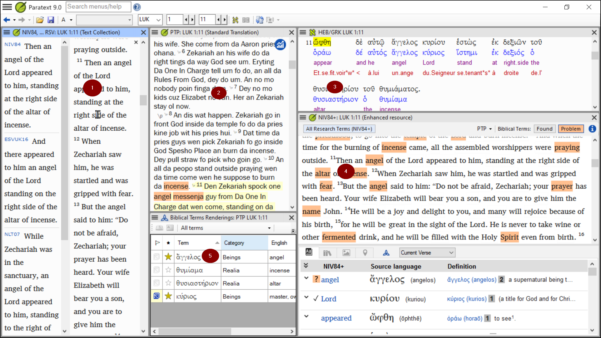
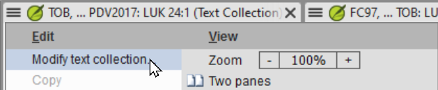

**Introdução**  
Conforme você trabalha com seu texto no Paratext 9, você desejará ver uma variedade de recursos. Neste módulo, você aprenderá como abrir recursos e organizar sua área de trabalho.

**Antes de começar**  
Você está se preparando para digitar texto em um projeto existente. Antes de fazer isso, alguém já deve ter instalado o programa, criado um projeto para seus dados e instalado recursos para você.

**Por que isso é importante**  
O tradutor que organiza bem sua área de trabalho possui todos os recursos necessários para o seu trabalho.

**O que você vai fazer?**  
Você iniciará o programa Paratext 9 e abrirá um layout salvo anteriormente (combinação de textos). Se necessário, você abrirá outros recursos, mudará a disposição das janelas e salvará novamente o layout do texto.

:::info Vídeos
Existem vários vídeos disponíveis para ajudá-lo com os diferentes tipos de recursos e a organização das janelas. Algumas sugestões são fornecidas abaixo. Clique no link para ver o resumo do vídeo.  
[0.2.1c](https://vimeo.com/manage/videos/749701910) Encontrando itens do menu  
[0.2.1d](https://vimeo.com/manage/videos/439462085) Como organizar as janelas  
[0.2.2a](https://vimeo.com/manage/videos/463171746) Como abrir e modificar uma coleção de textos  
[0.2.3a](https://vimeo.com/manage/videos/445682613) Como controlar quais janelas rolam juntas  
[0.2.3c](https://vimeo.com/manage/videos/442855994) Como substituir um texto em uma janela  
[0.2.3d](https://vimeo.com/manage/videos/451627553) Mais dicas sobre a organização das janelas  
:::

**Alterações no Paratext 9**  
Os menus foram alterados no Paratext 9.0. Para ver o menu, agora você precisa clicar no ícone de menu ≡. Agora existem dois tipos de menus. O menu principal do Paratext fica na barra de título () e cada janela (ou guia) tem seu próprio menu (). Ao clicar em um desses ícones de menu, todos os menus são exibidos e você só precisa clicar no comando desejado.

:::tip
Neste manual, quando diz **≡ Paratext**, em **Menu** \> **Comando** (por exemplo, **≡ Paratext**, em **Paratext** \> **Abrir**). Isso significa que você deve

 clicar no ícone de menu do Paratext ≡, em seguida, no menu (por exemplo, Paratext) escolha o comando (por exemplo, Abrir).

E quando diz **≡ Guia**, em **Menu** \> **Comando**, isso significa que você deve clicar no ícone de menu da guia e, em seguida, no menu (por exemplo, Ferramentas) clique no comando (por exemplo, Lista de palavras). Também pode dizer **menu** do projeto.
:::

## 2.1 Carregar o programa

1. Dê um duplo clique no ícone do Paratext 9 na **área de trabalho**  
   
   - **OU**
2. (No menu **Iniciar**, escolha Paratext 9)

## 2.2 Abrir um layout salvo

1. Clique no menu **≡ Paratext**, em seguida, no menu **Layout**
2. Escolha um layout salvo (combinação de textos).
   - *A sua tela deve ficar parecida com a imagem abaixo (caso contrário, veja abaixo).* 

## 2.3 Criar um novo layout de texto

Se você ainda não salvou um layout, então recomendamos que você faça o seguinte:

**Abrir e organizar as janelas**

- Abrir 5 janelas da seguinte forma:
- 1= Coleção de textos
  - **≡ Paratext** menu, em Paratext escolha **Abrir Coleção de Texto**, selecione vários recursos, clique no botão **Seta para a direita**, clique em **OK**. Veja [2.5](../02-Stage-1/2.OD.md#25)
- 2 = seu projeto
  - **≡ Paratext** menu, em **Paratext** \> **Abrir**, Projetos
- 5 = Renderizações
  - **≡ Guia** menu, em Ferramentas \> **Renderizações de Termos Bíblicos**
- 3 = Texto-fonte
  - **≡ Paratext** menu, em **Paratext** \> **Abrir \> Texto em idioma-fonte**
- 4 = Recurso aprimorado
  - **≡ Paratext** menu, em **Paratext** \> **Abrir \> Recursos aprimorados**
- Organize as janelas conforme desejado. Veja o vídeo do Paratext [0.2.1b](https://vimeo.com/manage/videos/439411463), [0.2.1c](https://vimeo.com/manage/videos/749701910) e [0.2.1d](https://vimeo.com/manage/videos/439462085).

:::note Atualização
No Paratext 9.3 (e superior), você pode usar o menu principal do Paratext para organizar as janelas por **linhas** e **colunas**.
:::

:::tip
Lembre-se de salvar seu layout!
:::

#### Salvar o layout

Uma vez que as janelas estejam organizadas como desejado:

1. **≡ Paratext**, em **Layout** \> **Salvar layout atual**
2. Digite um nome [ou para substituir uma combinação existente, escolha o nome existente]
3. Clique em **OK**

## 2.4 Excluir um layout de texto

Se você deseja excluir um layout salvo,

1. **≡ Paratext** menu, em **Layout** \> **Excluir layout**
2. Escolha o nome do layout salvo.
3. Clique em **Excluir**

## 2.5 Abrir recursos em uma Coleção de Texto {#25}

Com o Paratext, é possível ter vários projetos/recursos abertos ao mesmo tempo. No entanto, em vez de ter muitas janelas, é melhor ter vários textos em uma única janela.

:::info Atualização
No Paratext 9.3, a Coleção de Texto também pode ser aberta diretamente a partir do menu **≡ Paratext**
:::

#### Novo método - Abrir diretamente do menu do Paratext

1. **≡ Paratext** menu, em **Paratext** \> **Abrir coleção de textos**  
   
2. Selecione vários recursos usando a tecla Ctrl enquanto clica no recurso.
3. Clique no botão **Seta para a direita**.
   - *Os recursos são listados na coluna Selecionados*.
4. Repita conforme necessário.
5. Use as setas para cima e para baixo para reordená-los, se necessário.

Salve a coleção

1. Clique na caixa de texto no canto inferior esquerdo.
2. Digite um nome para a coleção salva e clique no ícone de salvar
3. Clique em **OK**.
   - *A coleção de textos é aberta*.

#### Método anterior - Diálogo de abertura

1. **≡ Paratext** menu, em **Paratext** \> **Abrir** 
2. Clique no botão Recursos (no topo).
3. Selecione vários recursos usando a tecla Ctrl enquanto clica no recurso.
4. Repita conforme necessário.
5. Clique na lista suspensa **Abrir como**.
6. Escolha **Painel de coleção de textos**
7. Clique em **OK**

:::tip  
É sugerido que os recursos sejam exibidos na ordem de mais literal para menos literal (para focar nos textos que são mais fiéis aos textos-fonte). Para recursos em português: ARA, ARC, NAA, NTLH00, NVI-P, NVT, VFL. Para recursos em inglês, a seguinte ordem é sugerida: ESV, RSV, NIV, NLT.
:::

Para alterar a ordem dos textos na coleção

1. **≡ Aba**, **Modificar coleção de texto**  
   
2. Use os botões de seta para alterar a ordem conforme necessário  
   
3. Faça quaisquer outras alterações
4. Clique em **OK**

:::tip
Você pode alterar o texto no segundo painel clicando no link azul da abreviação do texto. Você também pode usar o menu de visualização para alterar a visualização (prévia, não formatada ou padrão).
:::

## 2.6 Abrir um Recurso Avançado

1. Menu **≡ Paratext**, em **Paratext** \> **Abrir** 
2. Clique em **Recursos Avançados**

:::tip
Recursos avançados também contêm um dicionário, imagens, mapas etc. Quando você abre um Recurso Avançado, um guia também é aberto.
:::

## 2.7 Abrir um dicionário

:::tip
Se você não usa um recurso avançado, pode abrir um dicionário do idioma original das Escrituras com glossários em outros idiomas.
:::

1. Menu **≡ Paratext**, em **Paratext** \> **Abrir** 
2. Clique em **Dicionários**
3. Escolha "A Concise Greek-English Dictionary of the New Testament" OU "Trilingual Hebrew-English Lexicon of the Old Testament"
4. Clique em **OK**
5. **Exibir** \> escolha um idioma (por exemplo, **Spanish**)

:::tip
É útil adicionar janelas de dicionário ao modo de ocultar automaticamente (clique com o botão direito no nome da guia e escolha mover para ocultar automaticamente).
:::

Outros dicionários (em inglês, mas com fotos)

- "Plants and Trees in the Bible"
- "Animals in the Bible"

## 2.8 Trabalhando com o texto do idioma de origem

Você pode abrir o texto do idioma de origem com glossários em um idioma alternativo ao inglês, por exemplo, francês.

1. Menu **≡ Paratext**, em **Paratext** \> **Abrir** 
2. Clique em **Textos do Idioma de Origem**
3. Escolha HEB/GRK
4. Clique em **OK**
5. **≡ Aba** em **Exibir** \> **Glossários adicionais**
6. Escolha o projeto que possui os glossários
7. Clique em **OK**
