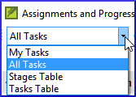

**Introdução**  
Você usa o Plano do Projeto para ajudar a organizar seu trabalho e ver quais tarefas devem ser feitas em seguida. Assim que você concluir uma tarefa, você deve marcá-la como concluída para poder relatar o que foi alcançado. [Se você usou uma versão anterior, verá que ela melhorou drasticamente no Paratext 9.]

**Antes de começar**  
Antes de poder usar o plano, ele precisa ter sido configurado. [Isso é geralmente feito pelo administrador do projeto, que adicionará o plano organizacional apropriado e o configurará para a sua equipe.]

**Por que isso é importante?**  
Há tantas tarefas a serem realizadas em um projeto de tradução. É importante ter um sistema para garantir que todas essas tarefas sejam concluídas. Agora que o seu plano foi configurado, você pode usá-lo para ver quais tarefas foram atribuídas a você para serem feitas em seguida. Ao concluir a tarefa, você pode marcá-la como concluída e ver a próxima tarefa a ser feita. Você pode usar essas informações para gerar relatórios para supervisores e doadores (consulte [Progresso do Projeto](6.PP2.md)).

**O que faremos?**  
Você irá marcar diversas tarefas como concluídas. Os passos exatos variarão um pouco dependendo se a tarefa é definida como uma vez por projeto, uma vez por livro ou por capítulo. O local para marcar o progresso de todos os tipos de tarefas é a coluna de Status.

## 3.1 Visualizar as tarefas que precisam ser feitas

1. Em seu projeto, clique no botão **Atribuições e Progresso**   
   OU  
   [**≡ Aba** no menu **Projeto**, selecione **Atribuições e progresso**]
1. No primeiro menu suspenso, escolha entre **Minhas tarefas** ou **Todas as tarefas**  
   
     -  *Uma lista das várias tarefas e verificações é exibida.*

:::tip 
Você pode ver mais detalhes sobre qualquer tarefa clicando no nome da tarefa.
:::

## 3.2 Identificar a próxima tarefa

A lista de tarefas mostra as tarefas não concluídas, cada uma com uma barra colorida ao lado.

1. Identifique a próxima tarefa que você precisa fazer. Ela terá uma barra verde ou uma barra verde com um traço.
1. Verifique se não está aguardando outra tarefa. Nesse caso, ela terá uma barra vermelha com um traço.
1. Faça a tarefa (consulte outros módulos, se necessário).

:::tip 
Quando a tarefa estiver concluída, consulte as instruções abaixo para marcá-la como concluída. (Uma tarefa é concluída quando não há problemas.)
:::

#####

## 3.3 Marcar uma tarefa como concluída

### Marcar uma tarefa de livro como concluída

1. Clique na marca de seleção à esquerda do status.  
   
     -   *Ela deve ficar sólida para mostrar que foi concluída.*

### Marcar uma tarefa de capítulo como concluída

1. Clique em **+** para marcar o próximo capítulo como concluído  
   
1. Para marcar outros capítulos como concluídos, você pode clicar na palavra **Concluído**  
   
     -  *Uma caixa de diálogo é exibida com uma lista dos capítulos*.  
       
2. Marque os capítulos que foram concluídos.

## 3.4 Verificações

- Se a tarefa for uma verificação, o status da verificação mostrará **Configuração necessária** ou mostrará o número de **problemas** restantes.
- Uma verificação está concluída quando não há **problemas**.

### Verificações - Configuração necessária (Administrador)

1. Clique no link azul "Configuração necessária"
     -  *O Paratext 9 executará o inventário apropriado ou abrirá as configurações para essa verificação.*
1. Conclua a configuração conforme apropriado.
1. Feche a janela quando terminar.

:::tip 
Se houver mais de um inventário necessário para uma verificação (por exemplo, capitalização), você precisará configurá-los manualmente no menu Verificação.
:::

### Verificações - Problemas

1. Clique no link azul "...problemas"
     -  *Uma lista de erros é exibida.*
1. Faça as correções necessárias.
1. Feche a lista de resultados (se desejar).
1. **≡ Paratext** em **Paratext** \> **Salvar tudo** (ou **Ctrl**+**s**).
2. Volte para Atribuições e Progresso.

:::tip 
A verificação é considerada concluída quando não há problemas. Se você não puder concluir uma verificação, é possível adiar a verificação para uma etapa posterior.
:::

### Adiar verificação

1. **≡ Aba**, no menu **Projeto**, selecione **Atribuições e Progresso**
1. Alterne para a visualização de **Todas as tarefas**
1. Passe o cursor sobre uma verificação que possui problemas
1. Clique em **Adiar** (que aparece à direita da coluna de Status),
1. Escolha em qual etapa deseja adiar a verificação
1. Digite o motivo para adiar a verificação.
     -  *A verificação será movida para essa etapa.*