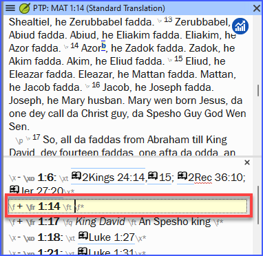

**Introduction**  This module explains how to keyboard your draft translations into a project in Paratext 9.

**Before you start**  We are about to keyboard text into an existing project. Before you can do that, someone must have already installed the program and created a project for your data.

**Why this is important**  This is the first stage of entering your translation into the computer. Once the text has been typed, you can run various checks on the content and format of the text.

## 4.1 Go to a Biblical verse {#51581b24aa2e48c3bf3d4017c24abce2}

:::tip

Before you can start typing your text, you need to move your cursor to the correct book, chapter and verse. You use the toolbar to do this.

:::

- Using the icons on the toolbar, change the project, book, chapter and verse as needed.

    

:::info Upgrade

In Paratext 9.3 you can copy and paste a scripture reference into the book name on the navigation bar. For example, in English: MAT 12.3, Mrk 5:4, Galatians 1:12.

:::

:::tip

If you don't know the verse reference, you could use the **Find** feature to look for a word that occurs in the verse you are looking for. Ctrl+F.

:::

## 4.2 Check that the project is editable {#5ace3b29698c4618b278657a58c7cde9}

Look at the titlebar of your project.

- _The titlebar should have the word (__**Editable****)._

    

1. If it is not editable, try changing the view (see below).
2. If the book is still not editable, and you need to edit it, you should talk with your project administrator.

## 4.3 Changing the view {#4ebf0759e8154f6a938ebc6a44d0d3e0}

:::tip

Paratext 9 has five views. All but the Preview view are editable.

:::

- **Ctrl** + **E** -or-
- **≡ Tab** under **View** menu, choose the view (usually Standard).

## 4.4 Typing special characters {#85ef7d3181e44b0a93f3669ef5068d93}

:::caution

Some orthographic characters are not found on the keyboard. To type these characters, you may need to press more than one key.

:::

1. Change your keyboard system as needed on your computer.
2. If you are using Keyman then choose your keyboard (e.g. Tchad Unicode (or for MS-Keyboards choose AF or TR/SQ/TZ/AF…)
3. Type the keys for the special character (see the chart provided with your Keyman file).

:::tip

You can use **≡ Tab** under **View** &gt; **Highlight Invalid Characters** to quickly see if you have typed any invalid characters. If you see lots of punctuation, then ask your instructor or administrator to configure your character inventory.

:::

## 4.5 Adding text in another marker – title or introduction {#8ec1c85f258b4da2ae2062a80f9897d1}

:::tip

Each piece of text needs to have a marker. The markers for the chapters and verses are already in your project. When you want to add text such as headings, or introductions etc you need to also add the appropriate marker as follows:

:::

1. Move your cursor to the end of the previous paragraph:
2. Type **Enter**
3. Type the marker (e.g. s1 or ip) press **Enter** (or select it from the list).
4. Type the text
5. Add a paragraph marker after the text (for example: \\ p)

:::caution

You must always have a USFM marker after a title and before the verse. This is usually \p (normal paragraph), but it can be different (for example \q1).

:::

### Character markers {#a8323ee1f37847e6b1ceaf05b6127968}

:::tip

Paratext has both paragraph and character markers. As the name suggests, paragraph markers format the whole paragraph. Character markers let you format part of the paragraph and so need a beginning and ending marker.

:::

1. Select the text you want to apply the character style
2. Type  **\\**
3. Select the marker from the list (e.g. nd)
4. Press **Enter**

- Paratext adds the two markers (before and after the text)  
  (for example: \\nd LORD*\nd)

:::tip

It is important to note that pressing **Enter displays paragraph markers** and typing **\\ displays character markers.**

:::

## 4.6 Add paragraph breaks {#9920f9d1850246219d4f1eb1dbaebbcb}

:::tip

Dividing the text into paragraphs:

:::

1. Move the cursor to where you want to break the paragraph.
2. Press **Enter**
3. Type **p**, then **Enter**.

## 4.7 Saving your work {#a76d8d7a421841f79c4dcb1e87671678}

:::tip

It is important to save your work regularly.

:::

- **≡ Paratext** under **Paratext** &gt; **Save All**
- OR **Ctrl** + **S**

## 4.8 Insert Footnotes {#0def5155dad145a7a96c40b56fe61974}

:::tip

You can add footnotes in the text at the place where you want the reference to appear.

:::

- Move the cursor to where you want to insert the footnote.

1. **≡ Tab**, under **Insert** > **Footnote**
    - _A set of footnote markers is added in the box below the text_

2. Type the text after the \ft

:::tip

If you hover your mouse over the superscript letter the text of the footnote will be displayed in a tip box.

- To **change** the footnote, **click** the superscript letter in the text.
- To **delete** the footnote, you can **delete** the superscript letter.
- or right-click the footnote text and choose **delete**.

:::

## 4.9 Send/receive {#70bb5cddeb3342d8bc10e403e64348ea}

:::tip

It is essential to have a second copy of your translation and to share your work with others in your team. This is done by doing a send/receive as follows:

:::

### Send/receive this project to the Internet {#062239d736b749eba1e1ab44dd3be2d4}

1. Make sure your computer is connected to the Internet.
2. **≡ Tab** under **Project**,&gt; **Send/Receive this project**
    - _Paratext will immediately Send/Receive i.e. without offering the different options._

### Send/receive to the Internet {#57f34914b58f4c3b8e50ea49450d0b8a}

1. Make sure your computer is connected to the Internet.
2. If you want to send/receive other projects, or change the way to send/receive
3. **≡ Paratext** under **Paratext** &gt; **Send/Receive projects**
4. Choose **Internet Server**
5. Check the box next to the projects to Send/Receive.
6. Click **Send/Receive**.
    - _The computer will make a copy of your files. A progress meter will be displayed. A message box will only appear if there are any problems._

### Send/receive to a USB stick to backup your data {#d6ce92480ac444279ffa54dc26dc945b}

It is essential to have a second copy of your translation. If you don't have access to the Internet, then you can use a USB stick. To backup your data to a USB stick you do a Send/Receive as follows:

1. Insert your USB key into your computer.

2. **≡ Paratext**, under **Paratext** > **Send/Receive project(s**)

3. Choose **USB drive**.

4. Check the box next to the projects to Send/Receive.

5. Click **Send/Receive**.
    - _The computer will make a copy of your files. A progress meter will be displayed. A message box will only appear if there are any problems._

### Send/Receive Again {#19ba693a99554a0eb9ffcd86a15367c2}

:::tip

The next time you want to Send/Receive you can use the toolbar to Send/Receive using the same settings as the previous time. This option does not allow you to choose a different method or different projects.

:::

- Insert your USB stick into your computer or connect to the Internet.

- Click the Send/Receive icon
    - _Paratext will immediately Send/Receive._

## 4.10 Moving your cursor efficiently {#f79550c3c28c4ac6a277a839e6c8546d}

A lot of time is spent moving your cursor to the place where you need to add text or make corrections. Here are some useful keystrokes to move your cursor quickly.

- The keys
    - arrow keys **←** **↑** **→** **↓**
    - **Home**, **End**, **PgUp**, and **PgDn**,
    - **F8** (chapter), **F9** (book)
- Try pressing **Ctrl** + any of those keys.  Some may be quite different to what you expect.
    - Ctrl + Arrow Down = Next Verse (Ctrl + Arrow Up for previous verse)
    - F8 = Next Chapter (Ctrl + F8 for previous chapter)
    - F9 = Next Book (Ctrl + F9 for previous book)
    - Alt + Arrow Left/Right = previous/next reference in history
    - Alt + Arrow Up/Down = previous/next reference in a list
    - Ctrl + B = go to the navigation area of the toolbar.

## 4.11 Recall: {#b43d69d9dc4a44029b365e87160c50be}

If the titlebar doesn’t say Editable (or your name), you should try changing the __________.

To add a different marker (such as section heading) you press _______.

To add paragraph marker you type ________.

To insert a footnote, you use the _______ menu and choose ______________.

To send/receive, you use the ____ menu then __________.

:::info

[Answers: view, Enter or \, Enter, Insert, Footnote, Project, Send/Receive this project]

:::

