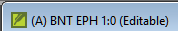

**Introdução**  
Este módulo explica como digitar suas traduções em um projeto no Paratext 9.

**Antes de começar**  
Antes de poder fazer isso, alguém deve ter instalado o programa e criado um projeto para seus dados.

**Por que isso é importante**  
Esta é a primeira etapa para inserir sua tradução no computador. Depois que o texto for digitado, você poderá executar várias verificações no conteúdo e formato do texto.

## 4.1 Ir para um versículo bíblico
:::tip
Antes de começar a digitar seu texto, você precisa mover o cursor para o livro, capítulo e versículo corretos. Você usa a barra de ferramentas para fazer isso.
:::
- Usando os ícones na barra de ferramentas, altere o projeto, livro, capítulo e versículo conforme necessário.  
   
:::caution Nota de atualização  
No Paratext 9.3, você pode copiar e colar uma referência bíblica no nome do livro na barra de navegação. Por exemplo, em inglês: MAT 12.3, Mrk 5:4, Gálatas 1:12.
:::

:::tip
Se você não souber a referência do versículo, pode usar a função **Localizar** para procurar uma palavra. Ctrl+F.
:::

#####

## 4.2 Verificar se o projeto é editável
1. Olhe para a barra de título do seu projeto.  
   
    -  *A barra de título deve exibir a palavra (Editável).*
2. Se o livro não for editável e você precisar editá-lo, deve falar com o administrador do projeto.
3. Se não for editável, tente alterar a visualização (veja abaixo).

## 4.3 Alterando a visualização
:::tip
O Paratext 9 possui cinco visualizações. Todas, exceto a visualização de pré-visualização, são editáveis.
:::

1. **Ctrl** + **E** -ou-
2. **≡ Guia** no menu **Visualizar**, escolha a visualização (geralmente Padrão).

## 4.4 Digitar caracteres especiais
:::tip
Alguns caracteres ortográficos não estão presentes no teclado. Para digitar esses caracteres, você precisa pressionar mais de uma tecla.
:::

1. Altere o sistema de teclado conforme necessário no seu computador.
2. Se estiver usando o Keyman, escolha seu teclado (por exemplo, Tchad Unicode)  
   (ou para teclados MS, escolha AF ou TR/SQ/TZ/AF...)
3. Digite as teclas para o caractere especial (consulte o gráfico).

:::tip
Você pode usar **≡ Guia** em **Visualizar** \> **Destacar caracteres inválidos** para ver rapidamente se você digitou algum caractere inválido.
:::

## 4.5 Adicionando texto em outro marcador - título ou introdução
:::tip
Cada trecho de texto precisa ter um marcador. Os marcadores para os capítulos e versículos já estão presentes em seu projeto. Quando você deseja adicionar texto, como títulos ou introduções etc., você também precisa adicionar o marcador apropriado da seguinte forma:
:::

1. Mova o cursor para o final do parágrafo anterior.
2. Digite **Enter** ou digite **\\**
3. Digite o marcador (por exemplo, s1 ou ip) **Enter** (ou selecione na lista).
4. Digite o texto.
5. Adicione um marcador de parágrafo após o texto  
   (por exemplo: \\p)

:::tip
Você sempre deve ter um marcador USFM após um título e antes do versículo. Geralmente, é \\p (parágrafo), mas pode ser diferente (por exemplo, \\q1).
:::

## 4.6 Adicionar quebras de parágrafo

Dividindo o texto em parágrafos:

1. Mova o cursor para onde deseja fazer a quebra de parágrafo.
2. Pressione **Enter**.
3. Digite p, e então pressione **Enter**.

## 4.7 Salvando seu trabalho
:::tip
É importante salvar seu trabalho regularmente.
:::

- **≡ Paratext** em **Paratexto** \> **Salvar tudo** -ou- **Ctrl** + **S**

## 4.8 Inserir notas de rodapé
:::tip
Você pode adicionar notas de rodapé no texto no local onde deseja que a referência seja exibida.
:::

1. Mova o cursor para onde deseja inserir a nota de rodapé.
2. **≡ Guia**, em **Inserir** \> **Nota de rodapé**
     -  *Um conjunto de marcadores de nota de rodapé será adicionado na caixa abaixo do texto*  
       
3. Digite o texto após \\ft.

:::tip
Se você passar o mouse sobre a letra sobrescrita, o texto da nota de rodapé será exibido em uma caixa de dica.
1. Para **alterar** a nota de rodapé, **clique** na letra sobrescrita no texto.
2. Para **excluir** a nota de rodapé, você pode **excluir** a letra sobrescrita.
:::

## 4.9 Enviar/receber
:::tip
É essencial ter uma segunda cópia de sua tradução e compartilhar seu trabalho com outras pessoas da equipe. Isso é feito por meio do envio/recebimento conforme a seguir:
:::

### Enviar/receber este projeto para a Internet
1. Verifique se seu computador está conectado à Internet.
2. **≡ Guia** em **Projeto**, \> **Enviar/receber este projeto**
     -  *O Paratexto enviará/receberá imediatamente, ou seja, sem oferecer diferentes opções.*

### Enviar/receber para a Internet
1. Verifique se seu computador está conectado à Internet.
2. Se você deseja enviar/receber outros projetos ou alterar a forma de enviar/receber.
3. **≡ Paratext o** em **Paratexto**, \> **Enviar/receber projetos**
4. Escolha **Servidor de Internet**.  
5. Marque a caixa ao lado dos projetos para enviar/receber.  
6. Clique em **Enviar/receber**.
    -  *O computador fará uma cópia de seus arquivos. Um medidor de progresso será exibido. Uma caixa de mensagem só aparecerá se houver algum problema.*

### Enviar/receber para um pen drive para fazer backup de seus dados
É essencial ter uma segunda cópia de sua tradução. Se você não tiver acesso à Internet, poderá usar um pen drive. Para fazer backup de seus dados em um pen drive, faça o envio/recebimento da seguinte forma:

1. Insira seu pen drive no computador.
2. **≡ Paratexto**, em **Paratexto** \> **Enviar/receber projeto(s)**  
   
3. Escolha **Drive USB**.
4. Marque a caixa ao lado dos projetos para enviar/receber.
5. Clique em **Enviar/receber**.
     -  *O computador fará uma cópia de seus arquivos. Um medidor de progresso será exibido. Uma caixa de mensagem só aparecerá se houver algum problema.*

### Enviar/Receber Novamente
:::tip
Na próxima vez que você quiser enviar/receber, você pode usar a barra de ferramentas para enviar/receber usando as mesmas configurações da última vez. Essa opção não permite escolher um método ou projetos diferentes.
:::

1. Insira seu pen drive no computador ou conecte-se à Internet.
2. Clique no ícone Enviar/Receber 
    -  *O Paratexto enviará/receberá imediatamente.*

## 4.10 Mover seu cursor eficientemente
Muito tempo é gasto movendo o cursor para o local onde você precisa adicionar texto ou fazer correções. Aqui estão algumas teclas úteis para mover o cursor rapidamente.

- As teclas
    - teclas de seta **←** **↑** **→** **↓**
    - **Início**, **Fim**, **PgUp** e **PgDn**,
    - **F8** (capítulo), **F9** (livro)
- e **Ctrl** + qualquer uma dessas teclas

## 4.11 Recapitulação:
Se a barra de título não exibir Editável (ou seu nome), você deve tentar alterar a \__________.

Para adicionar um marcador diferente (como um cabeçalho de seção), você pressiona \_______.

Para adicionar um marcador de parágrafo, você digita \________.

Para inserir uma nota de rodapé, você usa o menu \______\_ e escolhe \______________.

Para enviar/receber, você usa o menu \_______\_ e depois \________________.

:::info
[Respostas: visualização, enter ou \\, enter, Inserir, Nota de rodapé, Arquivo, Enviar/receber]
:::