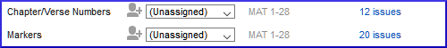

# 5. Basic checks 1 {#584144d4a3454570845a09cb69b1318f}

**Introduction**  In this module, you will check the chapters/verses and the markers using two methods: The Assignments and Progress and the project menu (4a.Checking).

**Before you start**  You must have already typed some text in Paratext 9. Agora você deseja começar a verificar. Neste módulo, começamos com as duas primeiras verificações básicas. The remaining checks are covered in [Basic Checks 2](/12.BC2) and [Basic Checks 3](/19.BC3).

**Why this is important**  These checks allow you to be sure that you have all the chapters and verses and that the other markers are correct. É importante executar a verificação de capítulo/versículo primeiro, pois todas as outras verificações dependem dela. Fazer essas verificações permite concluir a etapa de Rascunho.

**What you are going to do**  You are going to run the first two basic checks using two different methods. A maneira mais fácil é executar as verificações a partir do plano do projeto. However, you can also do the checks from the project menu **(Tools)** if you need to check more than one book at a time.

## 5.1 Running checks from the Assignments and Progress {#28ad38164bcc4c688e8e4d2f4a392b64}

É mais fácil executar as verificações a partir do plano do projeto.

### **View and correct errors** {#8dab705513394c93b89c6f71228b4783}

1. View the Assignments and Progress by clicking on the **blue icon** (at the top right of your project window).

1. Se houver alguma "questão" (erro), clique no link azul à direita.

    

    - _Uma janela aparece com uma lista de erros_.
2. Dê um duplo clique em uma linha da lista.
3. Corrija o erro em seu projeto.
4. Dê um duplo clique na próxima linha da lista.
5. Continue para cada erro.

### **Confirm that the errors have been corrected** {#648ac1a433e748dd82299215b61cb8b3}

1. Click **Rerun** button.
    - _A results list shows any remaining errors_.
2. <em x-id="3">Corrija quaisquer erros</em>.
3. Feche a janela da lista de resultados.
4. Return to the **Assignments and Progress**
5. Clique no link para mostrar as questões da verificação de marcadores.

:::tip

When you have finished with a check, some people like to close the results list, others like to keep it open particularly if it changes your window layout. You can also move it to a tab of another window.

:::

:::info

Watch the video  [How to use Checking Tools](https://vimeo.com/127298551)’ for examples of how to correct some common errors.

:::

## 5.2 Running the checks from the menu {#3d7c1c2bb72b412c84fa0be8315c0899}

If you want to check more than one book at a time, you can run the checks from the project menu **Tools** menu.

### Chapter/ Verse {#ac301c02271b4d2cbe873464d1494925}

Encontre os erros

1. Clique na janela do seu projeto.
2. **≡ Tab**, under **Tools** &gt; **Run Basic Checks**
3. Check only **Chapter/verse numbers**
4. Desmarque quaisquer outras verificações.
5. If necessary, click **Choose…** and choose the book(s) you want to check
6. Clique em **OK**
    - _A results list window appears with a list of the errors._

### Correct the errors {#2724585e15974d88b2f788b23d7711dc}

1. Dê um duplo clique em uma linha da lista.
2. Corrija o erro em seu projeto.
3. Dê um duplo clique na próxima linha da lista.
4. Continue para todos os erros.
5. Click **Rerun** button to check that all the errors have been corrected.
6. Close the results list window, if desired.

### Markers check {#b9296e794a82435ca258a466eb7c9ee4}

A verificação de marcadores exibe uma visão geral dos marcadores em seu texto. Você não pode alterar nada, mas pode procurar por marcadores que possam ser erros.

1. **≡ Tab**, under **Tools** &gt; **Checking Inventories** then **Markers Inventory**
    - _The list is displayed showing an overview of the markers in your text_.
2. Review the list for markers (see below)
3. Feche o inventário de marcadores.
4. **≡ Tab**, under **Tools** &gt; **Run Basic Checks**
5. Check the **Markers**
6. Clique em **OK**
7. Corrija quaisquer erros.

:::info

What to look for. Markers that only occur a few times. Similar markers \q and \q1. Markers that appear together but do not have the same count (e.g. \f and \f\*).

:::

