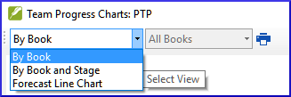

**Introdução**  
Neste módulo, você aprenderá como atualizar seu progresso marcando tarefas como concluídas. Você também criará um relatório de progresso.

**Antes de começar**  
Você tem trabalhado em sua tradução e concluiu uma tarefa. Agora você deseja atualizar seu progresso.

**Por que isso é importante**   
Para que o plano do projeto funcione bem, você precisa marcar as tarefas que já foram concluídas. Isso permite que o Paratext 9 torne a próxima tarefa disponível para os outros membros da equipe. Também fornece ao Paratext informações precisas sobre seu progresso para os relatórios. Criar um relatório de progresso ajuda você a preparar um relatório para seus supervisores e financiadores.

**O que você vai fazer**  
Você abrirá a janela de atribuições e progresso e atualizará o progresso realizado. Em seguida, você produzirá um relatório.

## 6.1 Certifique-se de que o progresso do plano esteja atualizado
1. Abra o plano do projeto (usando o botão azul).
2. Atualize o progresso em todas as tarefas (consulte PP1 para instruções sobre cada tipo de tarefa).

#####

## 6.2 Alterar uma atribuição
:::caution
Isso só pode ser feito se você tiver permissões de progresso.
:::

1. No **≡ Guia**, no menu **Projeto**, selecione **Atribuições e Progresso...**
2. Na primeira lista suspensa no canto superior esquerdo da caixa de diálogo, selecione **Todas as Tarefas**.
3. Na coluna **Atribuído a**, use a lista suspensa para escolher quem será responsável pela tarefa ou verificação (listada na coluna **Tarefa/Verificação** à esquerda).

## 6.3 Gerar um relatório de progresso
1. No menu **Ferramentas**, selecione **Relatório de Saúde do Projeto...**.
2. Escolha o(s) projeto(s) para os quais deseja relatar.
3. Clique em **OK**.
   - *O relatório conterá uma coluna para cada projeto selecionado.*  

## 6.4 Visualizar gráficos de progresso da equipe
1. No **≡ Guia**, no menu **Projeto**, selecione **Gráficos de Progresso...**  
     
2. Use a primeira caixa suspensa para escolher o tipo de gráfico.
3. Escolha os livros conforme necessário.
4. Clique no ícone de impressão.
   - *Uma janela se abre*.
5. Clique no ícone **Imprimir**.
6. Escolha sua impressora (ou impressora PDF).
7. Clique em **OK**.