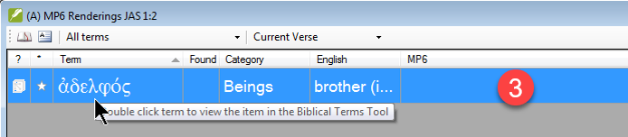
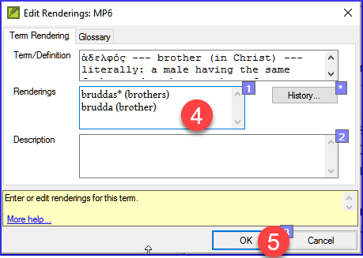
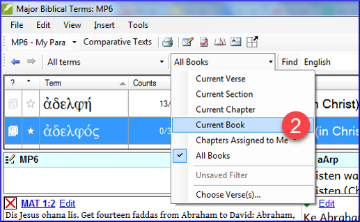
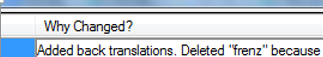
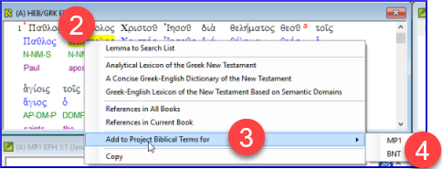

**Introduction**  The _Biblical terms rendering_ window and the separate _Biblical terms_ tool are very useful to make sure you are consistent in the use of terms, especially key terms. Com muitos termos em vários livros, isso pode se tornar uma tarefa bastante desafiadora. Este módulo explica um processo simples de 4 etapas para tornar seus termos bíblicos consistentes. Esse processo deve ser considerado parte do processo de tradução, e não apenas uma verificação.

**Before you start**  You are translating a verse in Paratext 9, and you want to see what renderings you have already chosen for the terms in the current verse, and then make sure they are consistent with other verses.

**Why this is important**  For your readers to understand your text, you need to be consistent in your use of terms. É uma tarefa grande torná-los completamente consistentes. Se você começar pelo versículo que está traduzindo e avançar a partir daí, a tarefa se torna mais gerenciável. O objetivo é ter Termos Bíblicos renderizados de forma consistente e decisões bem documentadas sobre por que foram feitas alterações.

**What you are going to do**  This method boils down to a short list of steps:

1. **[A]** Find all the ways you have rendered this term, and enter them in the renderings dialog.
2. **[B]** Choose which rendering is/are best, and record why it is best.
3. **[C]** Document why you rejected the other renderings.
4. **[D]** Clean up your translation by making this rendering consistent throughout your translation. (Make Consistent, Standardise, Normalise, Harmonise).

- Repita com o próximo Termo Bíblico que você encontrar na janela de Renderização de Termos Bíblicos.
- You will also use the new Paratext 9.4 feature to export terms from the Biblical terms list and share it with your colleagues.

## 10.1 Open the Biblical terms rending window {#f8f57567e6ff4b9193367abfbee7302a}

1. Clique no seu projeto.
2. **≡ Tab**, under **Tools** &gt; **Biblical terms rendering**
3. **≡ Tab** (of the new window), under **Biblical Terms** &gt; **Select Biblical terms list**
4. Escolha a lista desejada
5. Clique em **OK**.

## 10.2 A: Find all the ways you have rendered this term {#df4c8121b667426ca013ce2feace7348}

### Find the terms for the current verse {#3ffdc542c5f84c369b2c4cdfcc8569e1}

- Existe um sinal de marcação na coluna encontrada?
- Se houver um sinal de marcação, seu versículo usa o termo e você pode continuar com o próximo termo.
- Caso contrário, você precisa corrigir seu texto ou adicionar o novo termo que você usou (veja abaixo).

### Add another rendering {#dae5da6bfb1b40c99e9eb4f0c7fe1f06}

Se o termo que você usou precisa ser adicionado à lista:

1. Selecione a renderização do termo em seu texto.

2. Copy it (**Ctrl**+**C**)

3. Clique duas vezes na célula de renderização.
  - _The edit renderings dialog is displayed_.

4. Paste (**Ctrl**+**V**) the rendering in the dialog box.

5. Clique em **OK**.

### Find other verses in the current book with the same Biblical term {#bbdc4762638048adb945ccfff0f3c9e3}

A Ferramenta de Termos Bíblicos é aberta

1. Double-click on a word in the **Term** column
  - _The Biblical Terms Tool opens_

2. From the second filter button choose **current book**

3. Adicione renderizações para o termo nos versículos até que os termos em todos os versículos tenham sido identificados (veja abaixo).

### Add renderings from the other verses {#a5212cc460da4fabb7cb3db81d405280}

1. Selecione a renderização no versículo.
2. Add the rendering using **Ctrl**+**A**
3. Continue até que todos os termos para esses versículos tenham sido identificados.

### Dealing with verses that do not use the term {#3867de64e3064e85a08eed2cdab64dad}

:::tip

Há momentos em que um versículo é traduzido sem usar o termo real. Por exemplo, quando é usado um pronome. Nesse caso, você precisa negar que seja um erro.

:::

- Click the red cross to the left of the verse reference link
  - _The red cross turns into a green tick with a small red x_

:::caution

If you click on the cross by mistake, click the green tick and it will return to the red cross.

:::

## 10.3 B: Identify the best term {#55582923eae649c9964c1e0068ec29ac}

1. Clique duas vezes no termo no painel superior.
  - _The edit rendering dialog is displayed listing all the renderings you added._

    

2. Decida a melhor renderização.

3. Select, then Cut (**Ctrl**+**x**) and paste (**Ctrl**+**v**) it to the top of the dialogue box

4. Adicione \*\*\*\*\* conforme necessário para combinar renderizações semelhantes

:::tip

Você pode usar \* de várias maneiras: antes da palavra para prefixos e depois da palavra para sufixos. Você também pode colocar um \* no meio de uma palavra. Veja o guia para mais maneiras de usar o \*.

:::

## 10.4 C: Reject all the others {#91a3dcb7525c41919b79cdc020e1ca63}

- Selecione e corte as outras renderizações.

## 10.5 D: Document the reason for the change {#c70df72e555f44d4a73cd41076bd8718}

- Click on the **History** button

- Type in the reason why you rejected the others and why the first was the best.

- Clique em **OK**

### If you need more than one rendering {#7efa68af7a544631bf7f24302fa0449e}

:::tip

Você pode adicionar mais de uma renderização, se apropriado. É bom adicionar uma tradução reversa entre parênteses após a renderização. Por exemplo,
escravo (escravo)
rapaz \* trabalha para (rapaz que trabalha para)

:::

1. Abra a caixa de diálogo Editar renderizações.
2. Edite as renderizações conforme necessário.

### Clean up other books (as time permits) {#ad15f3d2b6c24b35a1bb0ef7a8c04731}

1. Altere o filtro para que todos os livros publicados sejam exibidos.
2. Limpe os versículos conforme necessário.

### Add the Biblical terms notes — ongoing discussion {#90110e260d7c40ca81c55c8e3604926b}

1. Clique duas vezes no ícone de nota (na segunda coluna)

  

2. Digite a nota

3. Atribua a nota conforme necessário.

4. Clique em **OK**.

### Add the decision to the renderings description {#1d89b36b75b14ab2a712924ef0e101e5}

1. Double-click on the term

2. Type the agreed-on rendering in the description field

3. Clique em **OK**

## 10.6 Add a term – from the source language text {#1ec5422db83c4bdeb51842a53f7df352}

:::tip

Você pode criar uma lista de versículos para uma palavra grega/hebraica específica e depois usar essa lista para adicionar a palavra/frase à lista de termos bíblicos do seu projeto.

:::

1. Clique na janela com o texto em língua de origem.

  

2. Clique com o botão direito em um lemma (palavra azul) na janela de texto em língua de origem

3. Choose **Add to project biblical terms for**

4. Escolha o seu projeto.

5. Edite o glossário, se necessário.

6. Click on the **Advanced** tab

7. Edite os termos, se necessário.

8. Clique em **OK**

### View the new term {#f269fc949f124cd5b1b68bb9a60766ad}

1. Change to the **Biblical Terms Tool**
2. Clique duas vezes no termo.

## 10.7 Add a term – from reference text search {#f683ccf4cdcf45f09c516c09c78ab277}

:::tip

Existem termos importantes para sua língua e cultura que podem não estar na lista. Você pode adicionar esses termos à lista do seu projeto.

:::

No Paratext

- From your reference text, do a find (using **≡ Tab**, under **Edit** &gt; **Find**) and search for the term.
  - _A list is displayed showing the verses with that term._

A partir da lista de resultados

1. **≡ Tab**, under **Edit**> **Add to Project Biblical Terms**, then choose your project

2. Edite o glossário, se necessário.

3. Click on the **Advanced** tab

4. Type in a name for the term

5. Clique em **OK**

## 10.8 Share a Biblical Terms List (optional) {#b6ca108e1c374004b5acb581e61ebecc}

:::info Upgrade

In Paratext 9.4 you can import or export terms from a Biblical Terms list. You can then share that exported list with your team members. Here is an overview. For more details watch [What’s New in Paratext 9.4 Biblical Terms](https://vimeo.com/858020833)

:::

1. From the **≡ Project**, Open **Biblical Terms**
2. Select or filter the desired terms
3. From the **≡ Tab**, choose **Export Filtered Biblical Terms**
4. Digite um nome para o arquivo
5. Share the file with a colleague.
6. They can open the shared list, **≡ Tab**, choose **Import Filtered Biblical Terms list** in the Biblical Terms tool.
