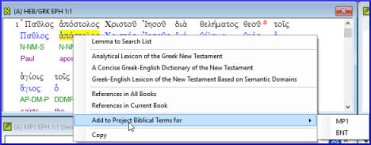

**Introdução**  
A janela de **Renderização de termos bíblicos** e a ferramenta separada de **Termos bíblicos** são muito úteis para garantir que você seja consistente no uso de termos, especialmente os termos-chave. Com muitos termos em vários livros, isso pode se tornar uma tarefa bastante desafiadora. Este módulo explica um processo simples de 4 etapas para tornar seus termos bíblicos consistentes. Esse processo deve ser considerado parte do processo de tradução, e não apenas uma verificação.

**Antes de começar**  
Você está traduzindo um versículo no Paratext 9 e deseja ver quais renderizações já foram escolhidas para os termos no versículo atual e, em seguida, garantir que sejam consistentes com os outros versículos.

**Por que isso é importante**  
Para que seus leitores compreendam seu texto, você precisa ser consistente no uso dos termos. É uma tarefa grande torná-los completamente consistentes. Se você começar pelo versículo que está traduzindo e avançar a partir daí, a tarefa se torna mais gerenciável. O objetivo é ter Termos Bíblicos renderizados de forma consistente e decisões bem documentadas sobre por que foram feitas alterações.

**O que você vai fazer**  
Este método se resume a uma lista curta de etapas:
1.  **[A]** Encontre todas as formas como você renderizou esse termo e insira-as no diálogo de renderização.
2.  **[B]** Escolha qual renderização é a melhor e registre o motivo pelo qual ela é a melhor.
3.  **[C]** Documente por que você rejeitou as outras renderizações.
4.  **[D]** Limpe sua tradução tornando essa renderização consistente em toda a sua tradução (Torne Consistente, Padronize, Normalize, Harmonize).
-  Repita com o próximo Termo Bíblico que você encontrar na janela de Renderização de Termos Bíblicos.

## 10.1 Abrir a janela de renderização de termos bíblicos
1.  Clique em seu projeto
1.  **≡ Tab**, em **Ferramentas** \> **Renderização de termos bíblicos**
1.  **≡ Tab** (da nova janela), em **Termos bíblicos** \> **Selecionar lista de termos bíblicos**
1.  Escolha a lista desejada
1.  Clique em **OK**.

## 10.2 A: Encontrar todas as formas como você renderizou esse termo

### Encontre os termos para o versículo atual
-  Existe um sinal de marcação na coluna encontrada?
-  Se houver um sinal de marcação, seu versículo usa o termo e você pode continuar com o próximo termo.
-  Caso contrário, você precisa corrigir seu texto ou adicionar o novo termo que você usou (veja abaixo).

### Adicionar outra renderização
Se o termo que você usou precisa ser adicionado à lista:
1.  Selecione a renderização do termo em seu texto.
1.  Copie-a (**Ctrl**+**C**).
1.  Clique duas vezes na célula de renderização.  
   
    - *A caixa de diálogo de edição de renderizações é exibida.*  
      
1.  Cole-a (**Ctrl**+**V**) na caixa de diálogo.
1.  Clique em **OK**.

### Encontre outros versículos no livro atual com o mesmo termo bíblico
1.  Clique duas vezes em uma palavra na coluna **Termo**
    -  *A Ferramenta de Termos Bíblicos é aberta*
1.  No segundo botão de filtro, escolha **livro atual**  
   
1.  Adicione renderizações para o termo nos versículos até que os termos em todos os versículos tenham sido identificados (veja abaixo).

### Adicionar renderizações dos outros versículos
1.  Selecione a renderização no versículo.
1.  Adicione a renderização usando **Ctrl**+**A**.
1.  Continue até que todos os termos para esses versículos tenham sido identificados.

### Lidando com versículos que não usam o termo
:::tip
Há momentos em que um versículo é traduzido sem usar o termo real. Por exemplo, quando é usado um pronome. Nesse caso, você precisa negar que seja um erro.
:::
-  Clique na cruz vermelha  à esquerda do link da referência do versículo. A cruz vermelha se transforma em um sinal de marca verde com um pequeno x vermelho 

:::caution
Se você clicar na cruz por engano, clique em  e ela voltará a ser .
:::

## 10.3 B: Identificar o melhor termo
1.  Clique duas vezes no termo no painel superior.
    -  *A caixa de diálogo de edição de renderização é exibida, listando todas as renderizações que foram adicionadas.*
1.  Decida a melhor renderização.
1.  Seção, em seguida, Corte (**Ctrl**+**x**) e cole (**Ctrl**+**v**) no topo da caixa de diálogo
1.  Adicione \* conforme necessário para combinar renderizações semelhantes  
    
:::tip  
Você pode usar \* de várias maneiras: antes da palavra para prefixos e depois da palavra para sufixos. Você também pode colocar um \* no meio de uma palavra. Veja o guia para mais maneiras de usar o \*.
:::

## 10.4 C: Rejeitar todos os outros
-  Selecione e corte as outras renderizações.

## 10.5 D: Documentar a razão da mudança
1.  Clique no botão **Histórico**  
   
1.  Digite a razão pela qual as outras foram rejeitadas e por que a primeira era a melhor.  
   
1.  Clique em **OK**

### Se você precisar de mais de uma renderização
:::tip
Você pode adicionar mais de uma renderização, se apropriado. É bom adicionar uma tradução reversa entre parênteses após a renderização. Por exemplo,  
escravo (escravo)  
rapaz \* trabalha para (rapaz que trabalha para)
:::
1.  Abra a caixa de diálogo Editar renderizações.
1.  Edite as renderizações conforme necessário.

### Limpar outros livros (conforme o tempo permitir)
1.  Altere o filtro para que todos os livros publicados sejam exibidos.
1.  Limpe os versículos conforme necessário.

### Adicionar notas de termos bíblicos - discussão contínua
1.  Clique duas vezes no ícone de nota (na segunda coluna)  
   
1.  Digite a nota.
1.  Atribua a nota conforme necessário.
1.  Clique em **OK**.

### Adicione a decisão à descrição das renderizações
1.  Clique duas vezes no termo.
1.  Digite a renderização acordada no campo de descrição  
   
1.  Clique em **OK**

## 10.6 Adicionar um termo - do texto em língua de origem
:::tip
Você pode criar uma lista de versículos para uma palavra grega/hebraica específica e depois usar essa lista para adicionar a palavra/frase à lista de termos bíblicos do seu projeto.
:::

1.  Clique na janela com o texto em língua de origem.
1.  Clique com o botão direito em um lemma (palavra azul) na janela de texto em língua de origem  
   
1.  Escolha **Adicionar à lista de termos bíblicos do projeto para**
1.  Escolha o seu projeto.
1.  Edite o glossário, se necessário.
1.  Clique na guia **Avançado**
1.  Edite os termos, se necessário.
1.  Clique em **OK**

### Visualizar o novo termo

1.  Mude para a **Ferramenta de Termos Bíblicos**
1.  Clique duas vezes no termo.

## 10.7 Adicionar um termo - a partir da busca no texto de referência
:::tip
Existem termos importantes para sua língua e cultura que podem não estar na lista. Você pode adicionar esses termos à lista do seu projeto.
:::

No Paratext

-  A partir do seu texto de referência, faça uma busca (usando **≡ Tab**, em **Editar** \> **Localizar**) e procure pelo termo.
    - *Uma lista é exibida mostrando os versículos com esse termo.*

A partir da lista de resultados

1.  **≡ Tab**, em **Editar** \> **Adicionar a Termos Bíblicos do Projeto**, então escolha seu projeto  
   
1.  Edite o glossário, se necessário.
1.  Clique na guia **Avançado**
1.  Digite um nome para o termo
1.  Clique em **OK**