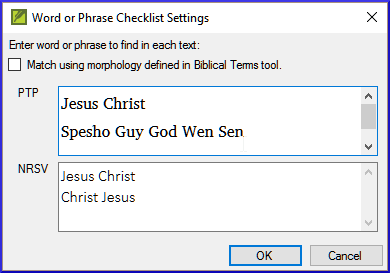

**Introdução**  Neste módulo, você irá buscar por uma palavra ou frase em um projeto e compará-la com a tradução dessa palavra ou frase em outro projeto.

**Por que isso é importante?**  No Paratext 9 (e versões posteriores), você pode ver onde uma palavra ou frase é encontrada em um projeto e compará-la com a palavra ou frase equivalente em um ou mais projetos diferentes. Por exemplo, você pode ver onde "roi" é encontrado em um projeto em francês e compará-lo com "rey" em um projeto em espanhol.

Você irá:

- utilizar a checklist "Palavra ou Frase" tanto do texto quanto da Ferramenta de Termos Bíblicos.
- alterar as configurações e textos de comparação.
- digitar a palavra ou frase a ser comparada para cada projeto.

## 11.1 Comparar uma palavra ou frase - do texto {#659828b2f3ee4616a7b10dd9380b9ce2}

:::tip

Sua primeira comparação não funcionará se ainda não houver textos de comparação escolhidos. Você precisa digitar uma palavra para buscar antes de poder definir os textos de comparação.

:::

1. Clique no projeto que você deseja comparar. From the **≡ Tab**, under **Tools**, point to **Checklists**, and select **Word or Phrase**.

3. Insira a palavra ou frase que você deseja visualizar na caixa de texto para cada projeto do diálogo.

4. Click **OK**

    - _A window is displayed_.

### Escolha os textos para comparar {#1b10fbeee1314150907b71b710e97dbd}

1. Click **Comparative Texts**…

2. Escolha os textos que você deseja comparar e clique em <strong x-id="1">OK</strong>.
    - _The_ _**Settings**_ _dialogue is displayed._

### Digite a palavra ou frase para comparar {#ed9ce5e42eee4988945547297f12b1e0}

1. Digite a palavra ou frase que você deseja comparar na caixa de texto para cada um dos projetos.

2. Click **OK**.

    - _A window is displayed with a button_ _**Hide matches**_ _on the toolbar._

:::tip

Você pode usar o botão **Ocultar correspondências** para mostrar apenas as referências onde há diferenças. A palavra ou frase é destacada em azul claro.

:::

## 11.2 Comparar usando uma Palavra ou Frase da Ferramenta de Termos Bíblicos {#14e18bd78f934875aa5084b16c1d7269}

### Na Ferramenta de Termos Bíblicos {#20feff24077248faa227e0c7cdef2fec}

1. Escolha um termo que tenha uma renderização.

2. Click on the tool icon

    - _The Settings dialogue is displayed with the rending filled-in._

3. Digite a palavra ou expressão para os outros projetos. Click **OK**

:::tip

Se você deseja comparar mais de uma palavra ou frase ao mesmo tempo, digite **Enter** após cada palavra ou frase para que elas fiquem em linhas separadas.

:::

