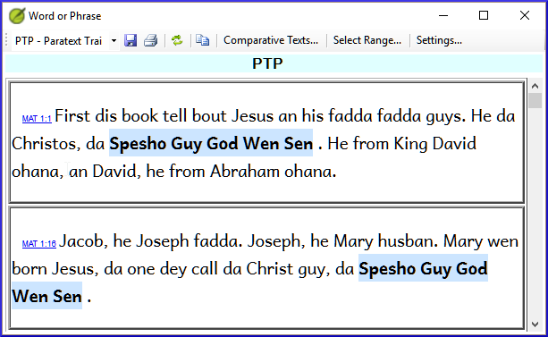

**Introduction**  In this module, you will search for a word or phrase in a project and compare it with the translation of that word or phrase in another project.

**Why this is important?**  In Paratext 9 (and above), you can see where a word or phrase is found in one project and compare it with the equivalent word or phrase in one or more other projects. Por exemplo, você pode ver onde "roi" é encontrado em um projeto em francês e compará-lo com "rey" em um projeto em espanhol.

Você irá:

- utilizar a checklist "Palavra ou Frase" tanto do texto quanto da Ferramenta de Termos Bíblicos.
- alterar as configurações e textos de comparação.
- digitar a palavra ou frase a ser comparada para cada projeto.

## 11.1 Compare a word of phrase – from the text {#659828b2f3ee4616a7b10dd9380b9ce2}

:::tip

Sua primeira comparação não funcionará se ainda não houver textos de comparação escolhidos. Você precisa digitar uma palavra para buscar antes de poder definir os textos de comparação.

:::

1. Click in the project that you want to compare

2. From the **≡ Tab**, under **Tools**, point to **Checklists**, and select **Word or Phrase**.

3. Enter the word or phrase that you want to see into the textbox for each project of the dialogue
   - _The Settings dialog is displayed_.

4. Clique em **OK**

   - _A window is displayed_.

### Choose the texts to compare {#1b10fbeee1314150907b71b710e97dbd}

1. Click **Comparative Texts**…

2. Escolha os textos que você deseja comparar e clique em <strong x-id="1">OK</strong>.
   - _The_ _**Settings**_ _dialogue is displayed._

### Type the word or phrase to compare {#ed9ce5e42eee4988945547297f12b1e0}

1. Digite a palavra ou frase que você deseja comparar na caixa de texto para cada um dos projetos.

2. Clique em **OK**.

   - _A window is displayed with a button_ _**Hide matches**_ _on the toolbar._

:::tip

You can use the **Hide matches** button to show only those references where there are differences. A palavra ou frase é destacada em azul claro.

:::

## 11.2 Compare using a Word or Phrase from the Biblical Terms tool {#14e18bd78f934875aa5084b16c1d7269}

### In the Biblical Terms tool {#20feff24077248faa227e0c7cdef2fec}

1. Escolha um termo que tenha uma renderização.

2. Click on the tool icon

   - _The Settings dialogue is displayed with the rending filled-in._

3. Type the word or expression for the other projects

4. Clique em **OK**

:::tip

If you want to compare more than one word or phrase at a time, type **Enter** after each word or phrase so that they are on separate lines.

:::
