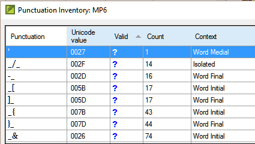

**Introdução**  
Neste módulo, você aprenderá a realizar várias outras verificações básicas (**Caracteres**, **Pontuação**, **Letras maiúsculas** e **Palavras repetidas**). Assim como no primeiro módulo de Verificações Básicas ([**Verificações básicas**](../02-Stage-1/5.BC1.md)), é mais fácil executar essas verificações a partir do plano do projeto. No entanto, se você quiser verificar vários livros, precisará usar o menu **Verificação**.

**Antes de começar**  
Você digitou sua tradução no Paratext 9. Certifique-se de ter verificado os números de capítulo/versículo e os marcadores, conforme descrito em [**Verificações básicas**](../02-Stage-1/5.BC1.md), antes de prosseguir, e verifique se seu administrador concluiu a configuração das verificações ou está com você para fazer a configuração agora.

**Por que isso é importante?**  
O Paratext 9 possui onze **Verificações Básicas**. Você já viu as duas primeiras, números de capítulo/versículo e marcadores. Este módulo ajudará você a encontrar erros relacionados a ortografia, pontuação, letras maiúsculas e palavras repetidas. Embora esses erros possam não influenciar o conteúdo do texto, corrigi-los torna o texto mais fácil de ler.

**O que faremos:**  
A maioria das verificações requer que um inventário tenha sido concluído pelo seu administrador. Neste módulo, você irá:

- Confirmar se a configuração foi concluída (ou solicitar ao administrador que faça a configuração)
- Realizar as Verificações Básicas
- Corrigir quaisquer erros.

## 12.1 Confirmar a configuração
Antes de poder executar estas outras verificações básicas, é necessário fazer uma forma de configuração. Algumas verificações requerem um inventário, outras requerem regras ou configurações.

:::caution
Você pode fazer a maioria dos inventários, mas apenas seu administrador pode fazer as regras ou configurações.
:::

## 12.2 Usando inventários para configurar as verificações
:::tip
Esses inventários mostram o que está atualmente em seu texto, ou seja, tanto o que está correto quanto o que está errado. Você precisa percorrer o inventário e informar ao Paratext 9 quais elementos estão corretos (válidos) e quais são erros (inválidos).
:::

Após concluir o inventário, você estará pronto para fazer a verificação.
1. Na guia **≡**, em **Ferramentas**, aponte para **Verificação de inventários** e escolha o inventário apropriado (por exemplo, inventário de caracteres).
2. Clique em um item na lista do painel superior.
   - *Os versículos são exibidos no painel inferior.*
3. Para cada item no painel superior, escolha **Válido** ou **Inválido**.
4. Repita para cada item.
5. Clique em **OK**.

:::tip
Em vez de usar o mouse, você pode usar  
**Ctrl ** + **y** para marcar uma entrada como **Válida** ou  
**Ctrl** + **n** para marcar uma entrada como **Inválida**.
:::

## 12.3 Caracteres
:::tip
Esta verificação (e inventário) ajuda você a identificar todos os caracteres incorretos, ou seja, os caracteres que não estão no seu alfabeto.
:::

### Configuração necessária
1. Na guia **≡**, em **Ferramentas**, aponte para **Verificação de inventários** e escolha **Inventário de caracteres**.
2. Para cada item, escolha **Válido** ou **Inválido**.

### Verificação
1. Na guia **≡**, em **Ferramentas**, aponte para **Verificação básica**.
2. Marque a opção **Caracteres**.
3. Clique em **OK**.
   - *Uma lista de erros será exibida.*
4. Faça as correções necessárias.

## 12.4 Pontuação
:::tip
Identifique todos os sinais de pontuação incorretos ou mal colocados. (Use a coluna de caracteres Unicode para identificar claramente a pontuação.)
:::

### Configuração necessária
1. Na guia **≡**, em **Ferramentas**, aponte para **Verificação de inventários** e escolha **Inventário de pontuação**.
2. Verifique cada marca de pontuação em seu contexto.
> Os contextos podem ser:  
> **início de palavra**,   
> **meio de palavra**,  
> **final de palavra** ou  
> **isolado** (espaço antes e depois).  

3. Para cada pontuação em seu contexto, escolha Válido, Inválido ou deixe como Desconhecido.
4. Quando terminar, clique em **OK**.

### Verificação
1. Na guia **≡**, em **Ferramentas**, aponte para **Verificação básica**.
2. Marque a opção **Pontuação**.
3. Clique em **OK**.
   - *Uma lista de erros será exibida.*
4. Faça as correções necessárias.

## 12.5 Pares Correspondentes
### Configuração necessária
1. Na guia **≡**, em **Pares de pontuação não correspondentes**:
2. Se a lista estiver vazia, não há erros.
3. Se necessário, clique em **Opções...** para adicionar outros pares

### Verificação
1. Na guia **≡**, em **Ferramentas**, aponte para **Verificação básica**.
2. Marque a opção **Pares de pontuação não correspondentes**.
3. Clique em **OK**.
   - *Uma lista de erros será exibida.*
4. Faça as correções necessárias.

## 12.6 Palavras repetidas
:::info
Essa verificação identifica palavras que foram repetidas no texto. Isso pode indicar um erro, mas nem sempre.
:::
### Configuração necessária
1. Na guia **≡**, em **Ferramentas**, aponte para **Verificação de inventários** e escolha **Inventário de palavras repetidas**.
2. Para cada item, escolha **Válido** ou **Inválido**.

### Verificação
1. Na guia **≡**, em **Ferramentas**, aponte para **Verificação básica**.
2. Marque a opção **Palavras repetidas**.
3. Clique em **OK**.
   - *Uma lista de erros será exibida.*
4. Faça as correções necessárias.

#####

## 12.7 Maiúsculas e minúsculas
:::tip
A verificação de maiúsculas e minúsculas busca vários tipos de problemas de capitalização. Existem quatro inventários para maiúsculas e minúsculas, mas apenas uma verificação. Talvez seja necessário clicar no botão **Opções** para adicionar marcadores ou pontuação.
:::  
**Configuração necessária**
1. Na guia **≡**, em **Ferramentas**, aponte para **Verificação de inventários** e escolha **Marcadores sem pontuação final de sentença**.
2. Para cada item, escolha **Válido** ou **Inválido**.
3. Na guia **≡**, em **Ferramentas**, aponte para **Verificação de inventários** e escolha **Marcadores seguidos por letra minúscula**.
4. Para cada item, escolha **Válido** ou **Inválido**.
5. Na guia **≡**, em **Ferramentas**, aponte para **Verificação de inventários** e escolha **Pontuação seguida por letra minúscula**.
6. Para cada item, escolha **Válido** ou **Inválido**.
7. Na guia **≡**, em **Ferramentas**, aponte para **Verificação de inventários** e escolha **Capitalização mista**.
8. Se você tiver prefixos em minúsculas, clique em **Opções** e insira os detalhes.
9. Para cada item, escolha **Válido** ou **Inválido**.

**Verificação**
1. Na guia **≡**, em **Ferramentas**, aponte para **Verificação básica**.
2. Marque a opção **Maiúsculas e minúsculas**.
3. Clique em **OK**.
   - *Uma lista de erros será exibida.*
4. Faça as correções necessárias.

## 12.8 Fazendo correções mínimas
:::caution
É possível fazer correções mínimas a partir de um inventário exibido. No entanto, se houver vários erros, é melhor executar a verificação para fazer as correções.
:::
1. Clique em um versículo no painel inferior.
2. Mantenha pressionada a tecla **Shift** e clique duas vezes.
3. Faça a correção.
4. Clique em **OK**.

:::tip
Em alguns casos, é preferível usar a Lista de Palavras ou o corretor ortográfico para corrigir vários erros de uma só vez.
:::

**Revisão**  
Existem muitas verificações básicas no Paratext 9. A tabela abaixo resume a configuração necessária para cada uma das verificações.

| **Verificação**                | **Configuração**                                                                   |
| ------------------------------ | ----------------------------------------- |
| Números de capítulo/versículo  | Nenhuma       |
| Marcadores                     | Nenhuma                        |
| Caracteres                     | Inventário de caracteres |             |
| Pontuação                      | Inventário de pontuação   |
| Pares Correspondentes          | Pares de pontuação não correspondentes       |
| Palavras repetidas             | Inventário de palavras repetidas                                                                                                                                   |
| Maiúsculas e minúsculas        | Marcadores sem pontuação final de sentença / Marcadores seguidos por letra minúscula / Pontuação seguida por letra minúscula / Capitalização mista / (opcional) |

:::tip
É possível executar todas as verificações ao mesmo tempo, porém, ao executá-las pela primeira vez, é melhor executá-las uma de cada vez para evitar uma lista grande de erros.
:::
