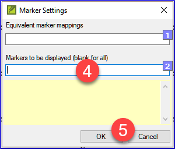

**Antes de começar**  
Você digitou seu rascunho em um projeto no Paratext. Você usará as listas de verificação para encontrar e corrigir erros relacionados à formatação e ao layout.

**Introdução**  
Neste módulo, você encontrará e corrigirá erros de formatação e layout.

**Por que isso é importante**  
Um Novo Testamento contém mais do que apenas capítulos e versículos. Também existem títulos, cabeçalhos de seção e vários tipos de parágrafos. Essas verificações permitem garantir que o layout do seu texto esteja correto e que seus títulos, etc., sejam consistentes.

**≡ Tab**, em \> **Ferramentas** \> **Listas de verificação** \> **Marcadores**

- comparar seus títulos e cabeçalhos de seção
- verificar as quebras de parágrafo
- comparar os marcadores de parágrafo em seu texto com os do seu texto de referência
- adicionar marcadores para formatação especial de texto.

## 13.1 Usando as listas de verificação - genérico {#ab06f030df1d407db09305cfb4731d3d}

:::caution

Existem várias listas de verificação que diferem um pouco, mas elas têm o seguinte em comum.

:::

**Como exibir a lista de verificação**

- **≡ Tab**, em \> **Ferramentas** \> **Listas de verificação** \> escolha a lista desejada
- Adicione um texto comparativo (se desejar) clicando no botão **Texto comparativo** Clique em **Configurações**
- Selecione os versículos/livros (se necessário) usando a **Seleção de intervalo**

**Fazendo correções**

- Clique no link **Editar** para corrigir quaisquer erros
- Clique no link de referência para ver mais contexto

**Fechando a lista**

- Quando você terminar com a lista, feche-a clicando no X no canto superior direito da janela.

## 13.2 Usando a lista de verificação - Cabeçalhos de seção {#3bb3fb489ec245438ee65525a4671432}

- **≡ Tab**, em \> **Ferramentas** \> **Listas de verificação** \> **Marcadores**

Verifique se

- os cabeçalhos estão consistentes com seu texto de referência (comprimento, gramática, estilo)
- todos os cabeçalhos começam com uma letra maiúscula
- não há pontuação no final
- eles não são muito longos

## 13.3 Quebras de parágrafo {#4beb41c77b7b41588a954c89f01a44d6}

1. **≡ Tab**, under > **Tools** > **Checklists** > **Markers**

2. Choose your reference text as the **comparative text**

3. Click **Settings**

4. Type the paragraph makers to be displayed
(e.g. p m)

5. Click **OK**.

6. Faça correções clicando no link azul <strong x-id="1">Editar</strong>.

OR

1. Clique no link azul **referência do versículo**.
2. Faça correções no Paratext.
3. Retorne à lista de verificação clicando no ícone na barra de tarefas.

## 13.4 Layout e recuos {#17698276f8084544a20d3d426679de1d}

1. **≡ Tab**, em \> **Ferramentas** \> **Listas de verificação** \> **Marcadores**
2. Escolha seu texto de referência como texto comparativo.
3. Clique em **Configurações**

Digite os marcadores a serem verificados.

- Click **OK**.

Procure por trechos que foram formatados com marcadores diferentes, como q1 e q2.

## 13.5 Adicionar USFMs para formatar texto especial {#2fed410218164e21834d0949e5ab3c07}

- Consulte a lista de trechos com formatação especial [Apêndice A](../08-Appendix/A.st.md).
- Adicione os USFMs conforme necessário (consulte o módulo KD ou a ajuda, se necessário).
