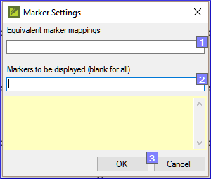
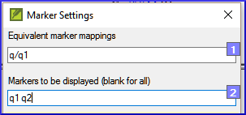

**Introdução**  
Neste módulo, você encontrará e corrigirá erros de formatação e layout.

**Antes de começar**  
Você digitou seu rascunho em um projeto no Paratext. Você usará as listas de verificação para encontrar e corrigir erros relacionados à formatação e ao layout.

**Por que isso é importante**  
Um Novo Testamento contém mais do que apenas capítulos e versículos. Também existem títulos, cabeçalhos de seção e vários tipos de parágrafos. Essas verificações permitem garantir que o layout do seu texto esteja correto e que seus títulos, etc., sejam consistentes.

**O que você vai fazer?**  
Você usará as listas de verificação para

- comparar seus títulos e cabeçalhos de seção
- verificar as quebras de parágrafo
- comparar os marcadores de parágrafo em seu texto com os do seu texto de referência
- adicionar marcadores para formatação especial de texto.

## 13.1 Usando as listas de verificação - genérico
:::caution
Existem várias listas de verificação que diferem um pouco, mas elas têm o seguinte em comum.
:::

#####

### Como exibir a lista de verificação
1. **≡ Tab**, em \> **Ferramentas** \> **Listas de verificação** \> escolha a lista desejada
1. Adicione um texto comparativo (se desejar) clicando no botão **Texto comparativo**
1. Selecione os versículos/livros (se necessário) usando a **Seleção de intervalo**

### Fazendo correções
1. Clique no link **Editar** para corrigir quaisquer erros
1. Clique no link de referência para ver mais contexto

### Fechando a lista
- Quando você terminar com a lista, feche-a clicando no X no canto superior direito da janela.

## 13.2 Usando a lista de verificação - Cabeçalhos de seção
- **≡ Tab**, em \> **Ferramentas** \> **Listas de verificação** \> **Marcadores**

#### Verifique se
1. os cabeçalhos estão consistentes com seu texto de referência (comprimento, gramática, estilo)
2. todos os cabeçalhos começam com uma letra maiúscula
3. não há pontuação no final
4. eles não são muito longos

#####

## 13.3 Quebras de parágrafo
1. **≡ Tab**, em \> **Ferramentas** \> **Listas de verificação** \> **Marcadores**
1. Escolha seu texto de referência como **texto comparativo**
1. Clique em **Configurações**  
   
1. Digite os marcadores de parágrafo a serem exibidos  
   (por exemplo, p m)
1. Clique em **OK**
1. Faça correções clicando no link azul **Editar**.

OU

1. Clique no link azul **referência do versículo**.
1. Faça correções no Paratext.
1. Retorne à lista de verificação clicando no ícone na barra de tarefas.

## 13.4 Layout e recuos
1. **≡ Tab**, em \> **Ferramentas** \> **Listas de verificação** \> **Marcadores**
1. Escolha seu texto de referência como texto comparativo.
1. Clique em **Configurações**  
   
1. Digite os marcadores a serem verificados.
1. Clique em **OK**.
1. Procure por trechos que foram formatados com marcadores diferentes, como q1 e q2.
1. Faça as alterações necessárias (veja abaixo).

## 13.5 Adicionar USFMs para formatar texto especial
1. Consulte a lista de trechos com formatação especial [Apêndice A](../08-Appendix/A.st.md).
1. Adicione os USFMs conforme necessário (consulte o módulo KD ou a ajuda, se necessário).