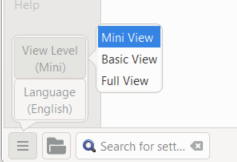

**Introdução**  
Neste módulo, você aprenderá como imprimir um rascunho da sua tradução para verificar e revisar.

**Antes de começar**  
Você inseriu e verificou sua tradução no Paratext 9 e agora está pronto para imprimir uma cópia. Seu projeto deve estar registrado antes de poder imprimir.

**Por que isso é importante**  
É muito mais fácil revisar e verificar o trabalho em papel do que no computador. Você também pode compartilhá-lo com mais pessoas se estiver em papel.

**O que você vai fazer**  
Você primeiro irá gerar uma versão em PDF da sua tradução, que pode ser impressa ou compartilhada com outras pessoas (incluindo usuários não-Paratext). Se necessário, você pode copiar o arquivo PDF para o seu pen drive e levá-lo a um computador com impressora.

:::info Upgrade Paratext 9.4

**PTXPrint** has replaced the previous Draft PDF. If it is not installed, it will ask you to download and install it first. PTXPrint is very powerful with many options. We recommend you use Mini View. 

:::

## 14.1 Criar um arquivo PDF {#f6c39f92a81d44aead7aa92c0f6bb317}

:::caution

Para imprimir frente e verso

:::

1. **≡ Guia**, em **Projeto** \> **Exportar rascunho em PDF**
2. At the bottom left, click the **menu button**
3. *Se houver erros nos marcadores, uma caixa de diálogo será exibida*.
4. Clique em **Não**, corrija os erros e tente novamente.
5. Verifique se o seu projeto está selecionado.
6. Escolha **Livro**
7. Escolha qual(is) livro(s) e capítulo(s) ou prioridade imprimir.

### Escolha as configurações de página da seguinte maneira {#ff7614d604f1485c8c6c4de117939575}

1. Click **Layout** on the left sidepanel. Escolha as configurações de página da seguinte maneira
2. Tamanho da página:
    - 210mm, 297mm (A4) ou
    - 148mm, 210mm (A5)
3. 12 mm (para A5)
4. Adjust the **Base Line Spacing** (single spacing is 120% of font)
5. Colunas: 1

### Escolha a fonte para o texto {#2f450c521a5a46e69f24dc8ef01b4262}

1. Escolha as fontes
2. Fonte do corpo do texto: Charis SIL (ou Charis SIL Compact)
3. Tamanho: 10 (ou 11)

### 14.2 Imprimir um PDF {#bcd83f846ef549d2ac75fcb83c8df8e6}

1. No Adobe Reader
2. PTXPrint will make the PDF
    - _The PDF opens in your default PDF program._

### Need further changes? {#d80d8aac8a4a43f7a53d3502637d61c0}

:::tip

The Mini View is good to test your PDF. If you want to any changes, you can change the view level to **Basic View**. Full view is very advanced and good for your final publication.

:::

1. Change to Basic View
    1. At the bottom left, click the **menu button**
    2. 1.0 (espaçamento simples)
2. Espaçamento entre linhas:
    1. Margens:
    2. Marque **layout espelhado em páginas ímpares e pares**
3. 25 mm (para A4) ou
    1. Escolha o que você deseja no **Cabeçalho de rodapé** (o texto no topo da página).
    2. Escolha as configurações de layout
    3. Faça outras escolhas conforme necessário.
4. Clique em **OK** e aguarde, o arquivo será aberto no leitor de PDF.

### Para A5 {#4ef8b4336abd46cf8f7383fcd9ae08c2}

:::tip

Make sure you have changed to Basic View

:::

In PTXPrint

1. Clique na guia **Avançado**
2. **Arquivo** \> **Imprimir**
3. Escolha as configurações avançadas
4. Check that the physical paper size is correct.
5. (Verifique se o arquivo PDF está aberto.)

In you PDF software

1. Orientação: **Retrato** (para impressoras mais recentes ou paisagem para impressoras mais antigas, especialmente Win7)
2. Print the 2-up version double-sided
- Clique no botão **Propriedades da impressora**
    - *Uma caixa de diálogo será exibida e pode ser diferente, mas terá uma forma de definir o modo frente e verso.* Por exemplo
    - Clique em **Acabamento**
    - Escolha **duplex** ou **frente e verso**.
    - Clique em **OK**.
- Clique em **Imprimir**

:::tip

Se você deseja seguir um sistema de pontuação (como o francês) e ter espaços inseridos automaticamente antes de pontuação complexa, consulte um consultor para fazer alterações no seu arquivo PrintDraftChanges.txt
:::

:::

## 14.3 Copiar o arquivo PDF para um pen drive {#2f0e6aec647e495db41b1992e5f40094}

:::info

O Paratext salva o arquivo PDF na pasta PrintDrafts da pasta do seu projeto. Por exemplo, C:\\Meus Projetos Paratext 9\\XXX\\PrintDraft
:::

:::

:::tip

Existem muitas maneiras de copiar arquivos. Um método é descrito abaixo.

:::

1. Pressione a tecla Windows e digite **E**
    - _O Explorador do Windows será aberto._
2. Vá para a pasta **Meus Projetos Paratext 8**.
3. Dê um duplo clique na pasta do seu projeto.
4. Dê um duplo clique na pasta **PrintDraft**.
5. Clique com o botão direito no arquivo PDF desejado.
6. Escolha **Enviar para**.
7. Escolha o seu pen drive.
