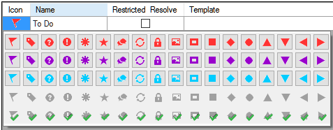

**Introdução**  
Ao traduzir e revisar, você pode querer fazer comentários sobre vários erros ou problemas. Você também pode querer registrar suas discussões sobre termos-chave e problemas de ortografia. O Paratext 9 permite que você registre esses comentários no texto, na lista de termos bíblicos ou na lista de palavras.

**Antes de começar**  
Você está digitando ou revisando seu texto, lista de palavras ou termos-chave e precisa fazer comentários sobre um problema que encontrou.

:::caution

Anotações e notas de rodapé são coisas diferentes. As notas de rodapé são impressas no Novo Testamento, enquanto as anotações são para perguntas e comentários e não são impressas no Novo Testamento.

:::

Clique em **OK**

- adicionar mais tipos de anotações (apenas administrador)
- criar anotações no texto usando ícones diferentes
- abrir, editar e resolver anotações
- abrir uma lista de anotações
- filtrar a lista
- imprimir uma lista das anotações

:::info Atualização

No Paratext 9.4, há uma opção para **mostrar/ocultar notas de projeto.**

- **≡ Guia**, em **Projeto** \> **Configurações do projeto**
    - _Note icons will be either shown or hidden._

:::

## 15.1 Diferentes tipos de anotações de projeto {#fe71e7bac96d4755bb40630bd0c2b1c0}

Você pode escolher entre muitos ícones para suas anotações de projeto no Paratext 9:

:::tip

Não tenha muitos ícones!

:::

**Um ícone pode ter quatro cores ou formas diferentes**

| Descrição                    | Significado                                                                                                                 |
| ---------------------------- | --------------------------------------------------------------------------------------------------------------------------- |
| Clique em **Atribuir a**     | A anotação tem pelo menos um comentário não lido.                                                                           |
| Clique em **OK**.            | Uma anotação de projeto atribuída a você, à equipe inteira ou não atribuída.                                                |
| Clique em **OK**.            | Uma anotação de projeto atribuída a outra pessoa.                                                                           |
| Clique em **OK**.            | Uma anotação de projeto com status resolvido. (This will not appear in the text, but only in the notes list.)               |
| Clique no botão **Resolver** | Há uma anotação de discussão de ortografia para esta palavra. (Somente lista de palavras.)                                  |
| Clique na guia **Anotações** | Não há uma anotação de discussão de ortografia para esta palavra. (Somente lista de palavras.)                              |
| Clique em **OK**.            | Uma anotação de consultor.                                                                                                  |
| Clique em **OK**.            | Uma anotação de consultor global.                                                                                           |
| Clique na guia **Anotações** | Há um conflito de mesclagem Enviar/Receber porque dois usuários fizeram alterações diferentes no mesmo versículo.           |
| Clique em **OK**             | Há uma anotação de discussão de renderização para este Termo Bíblico. (Somente janela ou ferramenta de termos bíblicos)     |
| Clique em **OK**             | Não há uma anotação de discussão de renderização para este Termo Bíblico. (Somente janela ou ferramenta de termos bíblicos) |

### **Configurando tags adicionais para anotações** {#04231dff267d4df992012fdcfb7f5b49}

:::caution

One must be an Administrator

:::

1. **≡ Guia**, em \> **Projeto** \> **Configurações do projeto** \> **Propriedades do projeto**
2. Clique na guia **Anotações**
3. Clique no botão **Adicionar** guia
    - _Uma nova linha é adicionada._
4. Clique no ícone na nova linha de tag
5. Escolha o ícone desejado
6. Digite um nome para o novo tipo de anotação
7. Continue para quaisquer outras novas anotações.

## 15.2 Usando anotações {#c8c21c6181cc4529a478dba32d984ba5}

**Inserindo uma anotação de projeto**

1. Clique no texto onde você deseja a anotação (e selecione o texto apropriado, se necessário).

2. **≡ Tab**, under **Insert** > **Note**

3. Choose the desired tag for the note from the list

4. Type the text for the note

5. Click **OK**.
    - _An icon is displayed beside the text._

.

### **Adicionar comentários a uma anotação existente** {#958963568fb4491bb7fedc24d80585bb}

- Click the icon in the text
    - _The note opens_.

        

- Digite uma anota ção
- Clique em **OK**.

### **Atribuir uma anotação a alguém** {#9a602aedc3974606bf478a02d0e2015a}

1. Um ícone é exibido ao lado do texto.

1. Digite seus comentários
2. **≡ Guia**, em **Inserir** \> **Anotação**
3. Escolha conforme desejado
4. Clique em **OK**.

### **Aplicar anotações a vários projetos** {#6536405a9e4842f29a1f267c60b4337d}

1. Abra a anotação no texto
2. Clique no botão **Múltiplos**
3. Escolha os projetos
4. Clique em **OK**.
5. Clique em **OK** novamente para fechar a caixa de diálogo.

### **Anexar anotação novamente** {#fe4f817bb1724ed6889d543fb3f4bbc8}

- Clique no ícone de anotação no texto para abrir a anotação.

    

Clique no botão Anexar anotação novamente (na barra de ferramentas) 

- Selecione a(s) palavra(s) a serem anexadas.
- Clique em **OK**.
    - _A anotação é anexada à(s) palavra(s)._

### **Resolver uma anotação** {#3f7599da36934413b855ecb7e595d63a}

1. Click on the icon in the text

2. Digite outro comentário, se necessário.

3. Click the **Resolve** button

4. Click **OK**

.

### **Excluir anotações** {#2f83955761a8491fb260cae2b8a7515e}

1. Click the note icon

2. Click the small trash can

3. Clique em <strong x-id="1">Sim</strong> para excluir permanentemente seu comentário.

4. Se houver mais comentários, continue excluindo o próximo comentário.

.

:::tip

You can only delete your own comments if they are the last in the list.

:::

## 15.3 Abrir uma lista de anotações {#c87dc9e1b95e46919469ec3681242fb0}

Ao revisar as anotações, é frequentemente útil vê-las em uma lista.

1. **≡ Guia**, em **Ferramentas** \> **Lista de anotações**
2. Selecione o projeto.
3. Clique em **OK**.
    - _A note list window opens (see below)._
4. Configuração de filtros

    :::tip

    :::tip
   Se a janela estiver em branco, altere os filtros usando os botões de filtro na barra de ferramentas (veja abaixo).

:::

### **Barra de ferramentas da janela de anotações** {#16ec056e5f1a44c18f715698dcfd0baa}

Há quatro caixas suspensas na barra de ferramentas

1. Filtro de anotações
2. Adicionar um novo filtro
3. Search
4. Classificar por [versículo, data, atribuído a]

### **Filtro da lista de anotações** {#58384e92b3154b6d87c93ea6b7fc5073}

- Clique no primeiro botão/lista
- Escolha um filtro existente, conforme apropriado

### **Definir um novo filtro** {#ae915757c45d40c79820d8588c7173c9}

- Click the first button/list

- Choose **New filter**

- Choose the status, tag, person and date as desired.

- Click **OK**

### **Excluir um filtro** {#c943f2ad210e4b65b07b60a324e4331b}

1. Ajuste os filtros conforme necessário.

2. Click in the textbox at the top left (1).

3. Digite um nome para o novo filtro Click the save icon (2).

## Escolha a tag desejada para a anotação na lista {#229174addf7e4280a3da1b08d9b11d7c}

- Click arrow to expand the note
    - _The note opens_

- Digite o texto para a anotação

    

- Resolve or assign the note as needed.
- Click the arrow to collapse the note.

:::tip

Clique na guia **Anotações**

:::

## 15.4 Imprimir uma lista de anotações {#a6ef1b8b74ec4e569f5211f8384d8c8e}

1. Click in a notes list window.
2. Aplique os filtros desejados
3. Clique no botão **Imprimir**
4. Choose the printer and any options.
5. Clique em **OK**.
6. Close the window.
