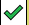
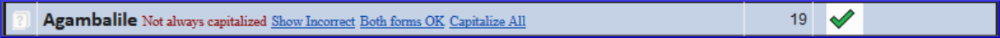
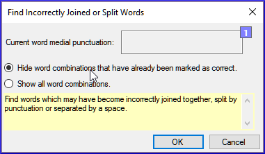
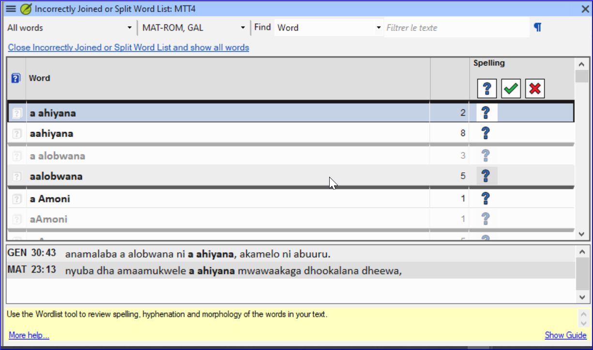

**Introdução**  Este módulo explica como verificar erros de ortografia no texto que você digitou em seu projeto no Paratext 9.

**≡ Aba**, em **Ferramentas** \> **Verificar ortografia do livro atual**

**≡ Aba**, em **Ferramentas** \> **Verificar ortografia \>**

Configurar a lista de palavras para criar uma base de palavras corretas.

- Trabalhar em seu texto com linhas onduladas vermelhas mostrando palavras que o Paratext não reconhece como corretas.
- Trabalhar na lista de palavras, corrigindo erros ou informando ao Paratext 9 que as palavras estão corretas.
- Usar uma variedade de verificações da lista de palavras.
- Adicionar uma nota de discussão ortográfica a palavras que precisam de discussão antes de decidir a ortografia correta.

## 8.1 Configurar a lista de palavras {#7490cb4639dc4f2d9eb8ac343d7e79c2}

:::tip

Antes de verificar a ortografia, é importante ter uma base de palavras que sejam conhecidas como corretas. Podemos fazer três coisas:
:::

:::

### Aprovar a ortografia de palavras comuns {#c86b35e4794640e980a0796316c04f29}

No Paratext :::tip

- **≡ Aba**, em **Ferramentas** \> **Lista de Palavras**

Na Lista de Palavras

1. **≡ Aba**, em **Ferramentas** \> **Aprovar a ortografia de palavras comuns**
2. Insira um número

    :::tip

    O número é a quantidade de vezes que as palavras devem aparecer para serem automaticamente marcadas como corretas. O padrão é 100, mas você pode escolher mais (se tiver dúvidas sobre o texto) ou menos (se estiver confiante na precisão do digitador).

:::

3. Clique em **OK**.
4. Clique em **Sim** (para confirmar que você não pode desfazer)

### Verificar as palavras que o Paratexto considera incorretas {#bf5578928c41416f955b0ffa478e72af}

- Make sure you are in the Wordlist.
    - _Na Lista de Palavras (**≡ Aba** em **Ferramentas** \> **Lista de Palavras**)_
- **≡ Aba**, em **Ferramentas** \> **Verificação Ortográfica \> Todas as verificações**
    - _Uma lista de palavras é exibida._

- Click on a word in the top pane.
    1. If the word is **correct** – click on the green icon at the top of the column
    2. If the word is **incorrect**, but Paratext 9 has **suggested** the correct word, then click the **blue link** for the correct word.
    3. If the word is **incorrect**, and Paratext 9 **hasn’t suggested** the correct word, click on the red checkbox and correct the word. (Veja 8.1)

### Verificar palavras com grafia semelhante {#1fdc348be8334ff6841f08689c4aaae5}

Na Lista de Palavras

1. **≡ Aba**, em **Ferramentas** \> **Encontrar palavras semelhantes**
2. Insira letras que soam semelhantes separadas por / (por exemplo, s/sh/z)

    :::tip

    Dependendo do seu idioma, marque ou desmarque "Ignorar todos os diacríticos ao comparar palavras".

:::

3. Clique em **OK**.
    - _Uma lista de palavras é exibida._
4. Corrija as palavras (conforme descrito acima).

## 8.2 Verificação ortográfica - a partir do texto {#66602cff1c654a81ae88a1f8b7e7842f}

No Paratext :::tip

- **≡ Aba**, em **Visualizar** \> **Mostrar ortografia**  
  :::tip

:::tip

Um medidor de progresso é exibido inicialmente e, em seguida, todas as palavras desconhecidas ou incorretas têm linhas onduladas vermelhas abaixo.

:::

### Fazendo correções {#a468ce2f5f594dcbbd8446fd4225814b}

:::tip

O Paratexto 9 sublinhará em vermelho as palavras que não foram aprovadas na lista de palavras. Isso significa que a palavra está grafada incorretamente ou é desconhecida.

:::

1. Clique com o botão direito em uma palavra que está sublinhada em vermelho ou cinza Digite a correção na caixa ou selecione a palavra correta na lista Click **OK**

:::tip

Quando possível, é melhor usar a verificação ortográfica mesmo ao fazer correções menores, pois o Paratexto 9 lembrará a correção e você poderá aplicá-la se ela ocorrer novamente.

:::

Quando houver mais de uma correção, uma caixa de diálogo será exibida.

Escolha conforme apropriado:

- **Sim** = altera este versículo e procura o próximo
- **Não** = pula este versículo e procura o próximo
- Sim para todos - **é perigoso**, use com cautela
- **Cancelar** = interrompe mais alterações

## 8.3 Verificação ortográfica - livro atual {#8e6b30ac29584b0a89ef0fee37d20f8f}

1. <em x-id="3">Uma janela aparece com uma lista de algumas palavras no livro atual.</em> Faça as correções conforme explicado acima <a href="#82mc">8.2</a> Click **More items available** to see additional words.

4. Continue as needed.

## 8.4 Verificação ortográfica - a partir da lista de palavras {#5de76f0b6fe1460ea6c8a341b2fff194}

### Usando as verificações {#a440e07d85cf494eb7a3263ba280aa60}

Na Lista de Palavras

1. **≡ Tab**, under **Tools**> **Spell check >**

2. Choose the desired check (see descriptions below)
    - _A list of words is displayed_.

3. Faça as correções conforme necessário.

4. Click **More items available** to see more words.

5. Continue as needed.

6. When you have finished the list, a message is displayed

    

7. Click **Yes**.

### Todas as verificações {#039b8b6f676f4a8fbe3e75ec8918ecb6}

Isso executa todas as verificações. É muito útil, pois encontrará todos os tipos de erros, especialmente palavras com vários tipos de erros.

### Letras maiúsculas faltando {#cfe2c818fa2249c0bcb5d219ae76e8eb}

1. Uma lista de palavras é exibida que possui formas com letras maiúsculas, mas nem sempre são maiúsculas (ou seja, ambas as formas são usadas). A lista mostra a palavra em minúsculas e, abaixo dela, a forma em maiúsculas, que possui um link azul para a palavra

    

2. Clique no link azul para a forma em maiúsculas

    

3. Clique no link azul apropriado.
4. *Mostrar como incorreta* (para ver os versículos)
5. *As duas formas são aceitáveis* (para aceitar ambas as formas)
6. *Colocar em maiúscula todas* (para corrigir todas as palavras)

### Erros de um único caractere {#92974e1cd65443aeb4191d34b42a0468}

Uma lista de palavras é exibida com links para outras palavras que são semelhantes, mas têm apenas uma letra diferente.

### Combinações de letras incomuns {#d8cc2055dd494b7ab955c85deb277795}

Uma lista de palavras é exibida que possui combinações incomuns de letras (como aglomerados de consoantes ou vogais...).

### Erros diacríticos {#a802e37a792c4d63b2eb3c041d251e7d}

Uma lista de palavras é exibida que possui o mesmo tipo de problema que já

### Erros Comuns de Digitação {#718eac9af3e8429da63cb91677bc90fd}

Uma lista de palavras é exibida com links para outras palavras que são iguais, exceto pelos diacríticos. E.g. foi corrigido em outras palavras. Por exemplo, se você já corrigiu "teh" para "the" e ele encontrar "tehm", ele sugerirá "them".

### Morfologia desconhecida {#bfac7ce2ba6a48449f1af20604181ae6}

Uma lista de palavras é exibida que o computador não conseguiu determinar a morfologia com base em outras palavras.

### Encontrar palavras incorretamente unidas ou separadas {#2f1d11a1518a454d8cc4d33c9c70ef3f}

Na Lista de Palavras (**≡ Aba**, em **Ferramentas** - Lista de Palavras)

- **≡ Aba**, em **Ferramentas** \> **Encontrar palavras incorretamente unidas ou separadas**

    

- Digite qualquer pontuação que possa estar no meio de uma palavra, por exemplo, - '
- Clique em **OK**.
    - _*Uma lista de palavras é exibida com palavras semelhantes agrupadas.**

        

### Corrigir uma palavra que foi marcada incorretamente {#db3081f9aaa14b6299225b8af9fb3be0}

1. Encontre a palavra na lista (usando o filtro, se necessário)
2. Clique na linha para ver a palavra em contexto
3. Clique no status de ortografia correta.

## 8.5 Nota de discussão ortográfica {#0fc290656fb540eda14989e1ad48876b}

:::tip

Se você ainda não tomou uma decisão final sobre a ortografia, pode adicionar uma nota de discussão ortográfica.

:::

1. Clique duas vezes no ícone de nota (na primeira coluna)

    

2. Digite a nota
3. Atribua a nota conforme necessário e clique em **OK**.
