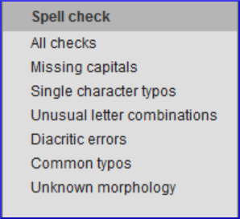

**Introdução**  
Este módulo explica como verificar erros de ortografia no texto que você digitou em seu projeto no Paratext 9.

**Antes de começar**  
Você digitou seu texto no Paratext 9 e fez algumas verificações, mas pode haver erros de ortografia.

**Por que isso é importante?**  
É importante corrigir quaisquer erros de ortografia para que seu texto comunique claramente.

**O que você vai fazer**
- Configurar a lista de palavras para criar uma base de palavras corretas.
- Trabalhar em seu texto com linhas onduladas vermelhas mostrando palavras que o Paratext não reconhece como corretas.
- Trabalhar na lista de palavras, corrigindo erros ou informando ao Paratext 9 que as palavras estão corretas.
- Usar uma variedade de verificações da lista de palavras.
- Adicionar uma nota de discussão ortográfica a palavras que precisam de discussão antes de decidir a ortografia correta.

#####

## 8.1 Configurar a lista de palavras
:::tip
Antes de verificar a ortografia, é importante ter uma base de palavras que sejam conhecidas como corretas. Podemos fazer três coisas:
:::
### Aprovar a ortografia de palavras comuns

No Paratexto

- **≡ Aba**, em **Ferramentas** \> **Lista de Palavras**

Na Lista de Palavras

1. **≡ Aba**, em **Ferramentas** \> **Aprovar a ortografia de palavras comuns**
1. Insira um número

:::tip
O número é a quantidade de vezes que as palavras devem aparecer para serem automaticamente marcadas como corretas. O padrão é 100, mas você pode escolher mais (se tiver dúvidas sobre o texto) ou menos (se estiver confiante na precisão do digitador).
:::

3. Clique em **OK**
1. Clique em **Sim** (para confirmar que você não pode desfazer)

### Verificar as palavras que o Paratexto considera incorretas

Na Lista de Palavras (**≡ Aba** em **Ferramentas** \> **Lista de Palavras**)

1. **≡ Aba**, em **Ferramentas** \> **Verificação Ortográfica \> Todas as verificações**
    - *Uma lista de palavras é exibida.*
1. Clique em uma palavra no painel superior.  
   a. Se a palavra estiver **correta** - clique em  no topo da coluna  
   b. Se a palavra estiver **incorreta**, mas o Paratext 9 **sugeriu** a palavra correta, clique no **link azul** para a palavra correta.  
   c. Se a palavra estiver **incorreta** e o Paratext 9 **não sugeriu** a palavra correta, clique na caixa de seleção vermelha  e corrija a palavra. (Veja 8.1)

### Verificar palavras com grafia semelhante

Na Lista de Palavras

1. **≡ Aba**, em **Ferramentas** \> **Encontrar palavras semelhantes**
1. Insira letras que soam semelhantes separadas por / (por exemplo, s/sh/z)

:::tip
Dependendo do seu idioma, marque ou desmarque "Ignorar todos os diacríticos ao comparar palavras".
:::

3. Clique em **OK**
    - *Uma lista de palavras é exibida*.
1. Corrija as palavras (conforme descrito acima).

## 8.2 Verificação ortográfica - a partir do texto
No Paratexto

- **≡ Aba**, em **Visualizar** \> **Mostrar ortografia**  
:::tip
Um medidor de progresso é exibido inicialmente e, em seguida, todas as palavras desconhecidas ou incorretas têm linhas onduladas vermelhas abaixo.
:::

### Fazendo correções
:::tip
O Paratexto 9 sublinhará em vermelho as palavras que não foram aprovadas na lista de palavras. Isso significa que a palavra está grafada incorretamente ou é desconhecida.
:::

1. Clique com o botão direito em uma palavra que está sublinhada em vermelho ou cinza
    - *Uma caixa de diálogo é exibida*  
      
1. Digite a correção na caixa ou selecione a palavra correta na lista
1. Clique em **OK**

:::tip
Quando possível, é melhor usar a verificação ortográfica mesmo ao fazer correções menores, pois o Paratexto 9 lembrará a correção e você poderá aplicá-la se ela ocorrer novamente.
:::

Quando houver mais de uma correção, uma caixa de diálogo será exibida.  
Escolha conforme apropriado:
- **Sim** = altera este versículo e procura o próximo
- **Não** = pula este versículo e procura o próximo
- Sim para todos - **é perigoso**, use com cautela
- **Cancelar** = interrompe mais alterações

## 8.3 Verificação ortográfica - livro atual
1.  **≡ Aba**, em **Ferramentas** \> **Verificar ortografia do livro atual**
    -  *Uma janela aparece com uma lista de algumas palavras no livro atual.*  
      
1.  Faça as correções conforme explicado acima [8.2](#82mc)
1.  Clique em **Mais itens disponíveis** para ver palavras adicionais.
1.  Continue conforme necessário.

## 8.4 Verificação ortográfica - a partir da lista de palavras
### Usando as verificações
Na Lista de Palavras

1.  **≡ Aba**, em **Ferramentas** \> **Verificar ortografia \>**
1.  Escolha a verificação desejada (veja as descrições abaixo)  
   
    -  *Uma lista de palavras é exibida*.
1.  Faça as correções conforme necessário.
1.  Clique em **Mais itens disponíveis** para ver mais palavras.
1.  Continue conforme necessário.
1.  Quando a lista estiver concluída, uma mensagem é exibida  
   
1.  Clique em **Sim**.

### Todas as verificações
Isso executa todas as verificações. É muito útil, pois encontrará todos os tipos de erros, especialmente palavras com vários tipos de erros.

#####

### Letras maiúsculas faltando
1.  Uma lista de palavras é exibida que possui formas com letras maiúsculas, mas nem sempre são maiúsculas (ou seja, ambas as formas são usadas). A lista mostra a palavra em minúsculas e, abaixo dela, a forma em maiúsculas, que possui um link azul para a palavra  
   
2.  Clique no link azul para a forma em maiúsculas  
   
3.  Clique no link azul apropriado.
4.  *Mostrar como incorreta* (para ver os versículos)
5.  *As duas formas são aceitáveis* (para aceitar ambas as formas)
6.  *Colocar em maiúscula todas* (para corrigir todas as palavras)

### Erros de um único caractere
Uma lista de palavras é exibida com links para outras palavras que são semelhantes, mas têm apenas uma letra diferente.

### Combinações de letras incomuns
Uma lista de palavras é exibida que possui combinações incomuns de letras (como aglomerados de consoantes ou vogais...).

### Erros diacríticos
Uma lista de palavras é exibida com links para outras palavras que são iguais, exceto pelos diacríticos.

### Erros comuns de digitação
Uma lista de palavras é exibida que possui o mesmo tipo de problema que já

 foi corrigido em outras palavras. Por exemplo, se você já corrigiu "teh" para "the" e ele encontrar "tehm", ele sugerirá "them".

### Morfologia desconhecida
Uma lista de palavras é exibida que o computador não conseguiu determinar a morfologia com base em outras palavras.

### Encontrar palavras incorretamente unidas ou separadas
Na Lista de Palavras (**≡ Aba**, em **Ferramentas** - Lista de Palavras)

1.  **≡ Aba**, em **Ferramentas** \> **Encontrar palavras incorretamente unidas ou separadas**  
   
1.  Digite qualquer pontuação que possa estar no meio de uma palavra, por exemplo, - '
1.  Clique em **OK**
    -  *Uma lista de palavras é exibida com palavras semelhantes agrupadas.*  
      

### Corrigir uma palavra que foi marcada incorretamente
1.  Encontre a palavra na lista (usando o filtro, se necessário)
1.  Clique na linha para ver a palavra em contexto
1.  Clique no status de ortografia correta.

## 8.5 Nota de discussão ortográfica
:::tip
Se você ainda não tomou uma decisão final sobre a ortografia, pode adicionar uma nota de discussão ortográfica.
:::

1.  Clique duas vezes no ícone de nota (na primeira coluna)  
   
1.  Digite a nota
1.  Atribua a nota conforme necessário e clique em **OK**.