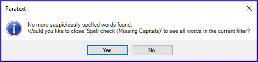

**Introduction**  This module explains how to check for spelling mistakes in the text you have typed into your project in Paratext 9.

**Before you start**  You have typed your text in Paratext 9 and have done some checks, but there may still be spelling mistakes.

**Why is this important?**  It is important to correct any spelling mistakes so that your text will communicate clearly.

**What you are going to do**  Configure the wordlist to build up a base of correct words.

- Trabalhar em seu texto com linhas onduladas vermelhas mostrando palavras que o Paratext não reconhece como corretas.
- Trabalhar na lista de palavras, corrigindo erros ou informando ao Paratext 9 que as palavras estão corretas.
- Usar uma variedade de verificações da lista de palavras.
- Adicionar uma nota de discussão ortográfica a palavras que precisam de discussão antes de decidir a ortografia correta.

## 8.1 Configure the wordlist {#7490cb4639dc4f2d9eb8ac343d7e79c2}

:::tip

Antes de verificar a ortografia, é importante ter uma base de palavras que sejam conhecidas como corretas. Podemos fazer três coisas:
:::

:::

### Approve the spelling of common words {#c86b35e4794640e980a0796316c04f29}

No Paratext

- **≡ Tab**, under **Tools** &gt; **Wordlist**

Na Lista de Palavras

1. **≡ Tab**, under **Tools** &gt; **Approve spelling of common words**

2. Insira um número

   :::tip

   O número é a quantidade de vezes que as palavras devem aparecer para serem automaticamente marcadas como corretas. O padrão é 100, mas você pode escolher mais (se tiver dúvidas sobre o texto) ou menos (se estiver confiante na precisão do digitador).

   :::

3. Click **OK**

4. Click **Yes** (to confirm that you cannot undo)

### Check the words that Paratext thinks are incorrect {#bf5578928c41416f955b0ffa478e72af}

- Make sure you are in the Wordlist.
  - _If you are back in Paratext Window, go to the Wordlist (__**≡ Tab**_ _under_ _**Tools**_ _>_ _**Wordlist**__)_
- **≡ Tab**, under **Tools** &gt; **Spell Check &gt; All checks**
  - _A list of words is displayed._

- Click on a word in the top pane.
  1. If the word is **correct** – click on the green icon at the top of the column
  2. If the word is **incorrect**, but Paratext 9 has **suggested** the correct word, then click the **blue link** for the correct word.
  3. If the word is **incorrect**, and Paratext 9 **hasn’t suggested** the correct word, click on the red checkbox and correct the word. (Veja 8.1)

### Check similarly spelled words {#1fdc348be8334ff6841f08689c4aaae5}

Na Lista de Palavras

1. **≡ Tab**, under **Tools** &gt; **Find Similar Words**

2. Insira letras que soam semelhantes separadas por / (por exemplo, s/sh/z)

   :::tip

   Dependendo do seu idioma, marque ou desmarque "Ignorar todos os diacríticos ao comparar palavras".

   :::

3. Click **OK**
   - _A list of words is displayed._

4. Corrija as palavras (conforme descrito acima).

## 8.2 Spell checking – from the text {#66602cff1c654a81ae88a1f8b7e7842f}

No Paratext

- **≡ Tab**, under **View** &gt; **Display spelling**

:::tip

Um medidor de progresso é exibido inicialmente e, em seguida, todas as palavras desconhecidas ou incorretas têm linhas onduladas vermelhas abaixo.

:::

### Making corrections {#a468ce2f5f594dcbbd8446fd4225814b}

:::tip

O Paratexto 9 sublinhará em vermelho as palavras que não foram aprovadas na lista de palavras. Isso significa que a palavra está grafada incorretamente ou é desconhecida.

:::

1. Right-click a word which is underlined in either red or grey
   - _A dialogue is displayed_

2. Either type the correction in the box or select the correct word from the list

3. Click **OK**

:::tip

Quando possível, é melhor usar a verificação ortográfica mesmo ao fazer correções menores, pois o Paratexto 9 lembrará a correção e você poderá aplicá-la se ela ocorrer novamente.

:::

Quando houver mais de uma correção, uma caixa de diálogo será exibida. 

Escolha conforme apropriado:

- **Yes** = changes this verse and looks for the next
- **No** = skips this verse and looks for the next
- Yes to all – **is dangerous**, use with caution
- **Cancel** = stops further changes

## 8.3 Spell checking – current book {#8e6b30ac29584b0a89ef0fee37d20f8f}

1. **≡ Tab**, under **Tools** > **Spell Check Current Book**
   - _A window appears with a list of some words in the current book._

2. Make corrections as explained above [8.2](/8.SP#66602cff1c654a81ae88a1f8b7e7842f)

3. Click **More items available** to see additional words.

4. Continue as needed.

## 8.4 Spell checking – from the wordlist {#5de76f0b6fe1460ea6c8a341b2fff194}

### Using the checks {#a440e07d85cf494eb7a3263ba280aa60}

Na Lista de Palavras

1. **≡ Tab**, under **Tools**> **Spell check >**

2. Choose the desired check (see descriptions below)
   - _A list of words is displayed_.

3. Faça as correções conforme necessário.

4. Click **More items available** to see more words.

5. Continue as needed.

6. When you have finished the list, a message is displayed

   

7. Click **Yes**.

### All checks {#039b8b6f676f4a8fbe3e75ec8918ecb6}

Isso executa todas as verificações. É muito útil, pois encontrará todos os tipos de erros, especialmente palavras com vários tipos de erros.

### Missing Capitals {#cfe2c818fa2249c0bcb5d219ae76e8eb}

1. Uma lista de palavras é exibida que possui formas com letras maiúsculas, mas nem sempre são maiúsculas (ou seja, ambas as formas são usadas). A lista mostra a palavra em minúsculas e, abaixo dela, a forma em maiúsculas, que possui um link azul para a palavra

   

2. Clique no link azul para a forma em maiúsculas

   

3. Clique no link azul apropriado.

4. _Show incorrect_ (to see the verses)

5. _The two forms are acceptable_ (to accept both forms)

6. _Capitalise All_ (to correct all the words)

### Single Character Typos {#92974e1cd65443aeb4191d34b42a0468}

Uma lista de palavras é exibida com links para outras palavras que são semelhantes, mas têm apenas uma letra diferente.

### Unusual Letter Combinations {#d8cc2055dd494b7ab955c85deb277795}

Uma lista de palavras é exibida que possui combinações incomuns de letras (como aglomerados de consoantes ou vogais...).

### Diacritic Errors {#a802e37a792c4d63b2eb3c041d251e7d}

Uma lista de palavras é exibida que possui o mesmo tipo de problema que já

### Common Typos {#718eac9af3e8429da63cb91677bc90fd}

Uma lista de palavras é exibida com links para outras palavras que são iguais, exceto pelos diacríticos. E.g. foi corrigido em outras palavras. Por exemplo, se você já corrigiu "teh" para "the" e ele encontrar "tehm", ele sugerirá "them".

### Unknown Morphology {#bfac7ce2ba6a48449f1af20604181ae6}

Uma lista de palavras é exibida que o computador não conseguiu determinar a morfologia com base em outras palavras.

### Find incorrectly joined or split words {#2f1d11a1518a454d8cc4d33c9c70ef3f}

In the Wordlist (**≡ Tab**, under **Tools** – Wordlist)

- **≡ Tab**, under **Tools**&gt; **Find Incorrectly Joined or Split Words**

  

- Digite qualquer pontuação que possa estar no meio de uma palavra, por exemplo, - '

- Click **OK**
  - _A list of words is displayed with similar words grouped together._

    

### Correct a word which was incorrectly marked {#db3081f9aaa14b6299225b8af9fb3be0}

1. Encontre a palavra na lista (usando o filtro, se necessário)
2. Clique na linha para ver a palavra em contexto
3. Clique no status de ortografia correta.

## 8.5 Spelling discussion note {#0fc290656fb540eda14989e1ad48876b}

:::tip

Se você ainda não tomou uma decisão final sobre a ortografia, pode adicionar uma nota de discussão ortográfica.

:::

1. Clique duas vezes no ícone de nota (na primeira coluna)

   

2. Digite a nota

3. Assign the note as necessary, and click **OK**.
