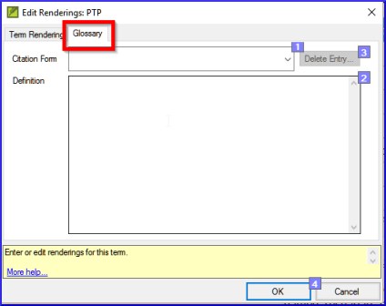

**Introdução**  
Este módulo explica como adicionar entradas ao glossário usando a ferramenta **Termos Bíblicos**.

**Antes de começar**  
Você já redigiu e inseriu seu texto no Paratext 9. Agora você irá adicionar algumas entradas de glossário para explicar alguns dos termos.

**Por que isso é importante**  
É bom ter uma lista de palavras importantes e suas explicações para que os leitores possam entender bem o texto. Em vez de digitar diretamente no glossário, é melhor usar a ferramenta **Termos Bíblicos**, pois ela mantém o glossário em ordem alfabética. A ferramenta também registra as alterações feitas no glossário.

**O que você vai fazer**  
Você usará a ferramenta Termos Bíblicos para adicionar uma tradução para o termo e, em seguida, usará a guia de glossário para inserir a forma de citação e a definição.

Existem quatro vídeos de treinamento disponíveis sobre   
[adicionar](https://vimeo.com/manage/videos/687268174),  
[vincular](https://vimeo.com/manage/videos/779769165) e   
[editar](https://vimeo.com/manage/videos/715802910) e obter  
[permissão para editar](https://vimeo.com/manage/videos/715799530)  
glossários. (P9 1A.4a-d). 

:::note
Esses vídeos não foram atualizados para o Paratext 9.3. Embora os passos sejam muito semelhantes, a versão 9.3 melhorou a edição da forma de citação e a ordenação das entradas. Portanto, você não precisa usar soluções alternativas para editar a forma de citação ou ordenar as entradas no livro GLO.
:::

## 9.1 Abrir a ferramenta Termos Bíblicos
1.  Dentro do Paratext, vá para um versículo que contenha o termo que você deseja adicionar ao glossário.
1.  Clique com o botão direito e escolha **Ver Termos Bíblicos**, depois **Versículo(s) Atual(is)**
1.  Verifique se você tem a lista correta aberta (por exemplo, sua lista de projeto ou a Lista de Termos Bíblicos do NT [SIL])
   
1.  Para alterar a lista, na guia **≡**, no menu **Termos Bíblicos**, escolha **Selecionar lista de termos bíblicos**

## 9.2 Adicionar uma entrada
1.  Clique duas vezes no termo na lista do painel superior
1.  Clique na guia **Glossário**  
   
1.  Digite a forma de citação do termo (ou seja, como você deseja que ele apareça no glossário) [1]
1.  Digite a definição [2]
1.  Clique em  **OK**
    -  *A(s) palavra(s) e a definição serão adicionadas ao glossário em ordem alfabética.*

## 9.3 Vincular uma entrada existente
:::tip
Se a palavra já estiver no glossário, você pode vincular um termo bíblico à entrada existente no glossário. Posteriormente, na etapa 6, você vinculará o termo bíblico ao texto para adicionar o \* no texto impresso ou o link no aplicativo eletrônico.
:::
### Encontrar o termo bíblico
1.  Na ferramenta **Termos Bíblicos**
1.  Verifique se você tem a lista correta aberta (por exemplo, sua lista de projeto ou a Lista de Termos Bíblicos do NT [SIL])
1.  Clique duas vezes na palavra na lista do painel superior

### Vincular à entrada do glossário
1.  Clique na guia **Glossário**
3.  Clique na seta para baixo perto da forma de citação [1]
4.  Escolha a entrada do glossário
5.  Clique em **OK**

## 9.4 Visualizar o glossário
No Paratext

1.  Use a barra de navegação para mudar o livro  
   
1.  Escolha o livro **GLO**

## 9.5 Editar uma entrada - no livro GLO
No Paratext 
:::tip
Recomenda-se usar a ferramenta Termos Bíblicos para trabalhar nas entradas do glossário. No entanto, pode ser útil editar as definições do livro GLO.
:::

1.  Abra o livro **GLO**
1.  Edite o texto normalmente.

## 9.6 Editar uma entrada - nos Termos Bíblicos
1.  Guia **≡**, em **Ferramentas** \> **Termos Bíblicos...**
1.  Clique duas vezes na palavra na lista do painel superior.
1.  Clique na guia **Glossário**
1.  Edite a definição
1.  Clique em **OK**.

:::tip Paratext 9.3
Agora você pode editar a forma de citação nesta guia sem quebrar o link para a entrada.
:::
## 9.7 Adicionar um Termo Bíblico
-  veja a seção [**10.7 Adicionar um termo - da busca de texto de referência**](BT#107-adicionar-um-termo--da-busca-de-texto-de-referência)

## 9.8 Lembrar
-  Você abre a ferramenta Termos Bíblicos a partir do menu \_\_\_\_\_\_\_\_.
-  A guia **Glossário** está na caixa de diálogo \_\_\_\_\_\_\_\_. Para abrir essa caixa de diálogo, clique com o botão \_\_\_\_\_\_ no termo no painel \_\_\_\_\_\_\_.
-  Para visualizar o glossário, você muda para o livro \_\_\_\_\_\_ (após Apocalipse).

:::info
[Respostas: clique com o botão direito, Editar Renderização, duplo, superior, GLO]
:::