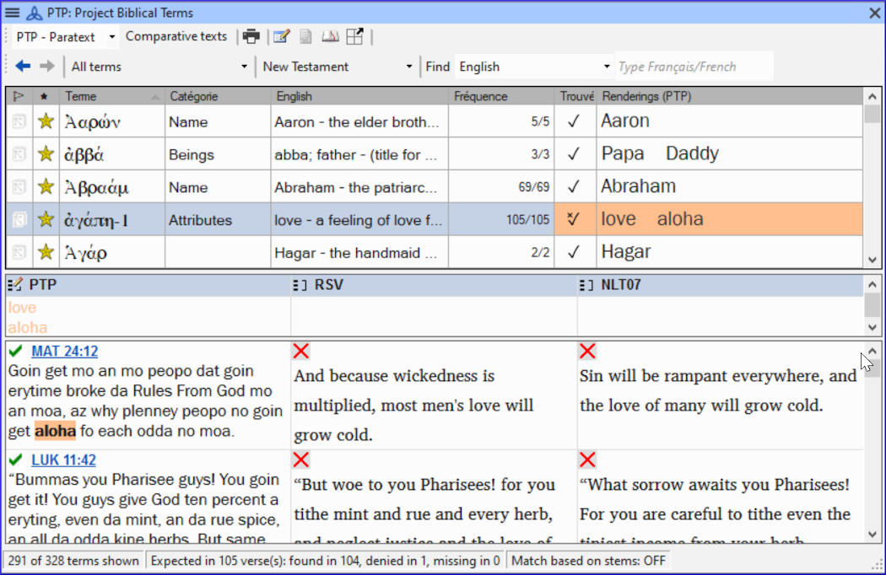
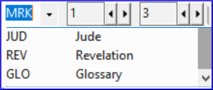

Guia **≡**, em **Ferramentas** \> **Termos Bíblicos...**

**O que você vai fazer**  
Você usará a ferramenta Termos Bíblicos para adicionar uma tradução para o termo e, em seguida, usará a guia de glossário para inserir a forma de citação e a definição.

**Por que isso é importante**  É bom ter uma lista de palavras importantes e suas explicações para que os leitores possam entender bem o texto. Em vez de digitar diretamente no glossário, é melhor usar a ferramenta **Termos Bíblicos**, pois ela mantém o glossário em ordem alfabética. A ferramenta também registra as alterações feitas no glossário.

**Introdução**  Este módulo explica como adicionar entradas ao glossário usando a ferramenta **Termos Bíblicos**.

Existem quatro vídeos de treinamento disponíveis sobre   
[adicionar](https://vimeo.com/manage/videos/687268174),  
[vincular](https://vimeo.com/manage/videos/779769165) e   
[editar](https://vimeo.com/manage/videos/715802910) e obter  
[permissão para editar](https://vimeo.com/manage/videos/715799530)  
glossários. (P9 1A.4a-d).

## 9.1 Abrir a ferramenta Termos Bíblicos {#137d8af8c8314fdba16891790c49c178}

1. Dentro do Paratext, vá para um versículo que contenha o termo que você deseja adicionar ao glossário.
2. Clique com o botão direito e escolha **Ver Termos Bíblicos**, depois **Versículo(s) Atual(is)**
3. Verifique se você tem a lista correta aberta (por exemplo, sua lista de projeto ou a Lista de Termos Bíblicos do NT [SIL])

    

4. Para alterar a lista, na guia **≡**, no menu **Termos Bíblicos**, escolha **Selecionar lista de termos bíblicos**

:::info

If the Biblical Term is not on either list, ask your Administrator to add the Biblical term to your project list.

:::

## 9.2 Adicionar uma entrada {#99fd9ee0be454494b0e01a773eee6f96}

1. Double-click on the term in the list in the top pane

2. Click the **Glossary** tab

3. Digite a forma de citação do termo (ou seja, como você deseja que ele apareça no glossário) [1] Type the Definition [2]

5. A(s) palavra(s) e a definição serão adicionadas ao glossário em ordem alfabética.

## 9.3 Vincular uma entrada existente {#b9f4ff025225434cbba15665f0894328}

:::tip

Se a palavra já estiver no glossário, você pode vincular um termo bíblico à entrada existente no glossário. Posteriormente, na etapa 6, você vinculará o termo bíblico ao texto para adicionar o \* no texto impresso ou o link no aplicativo eletrônico.

:::

### Encontrar o termo bíblico {#120bd663b5ff4b7a840f4ef3c26b06d8}

1. Clique na guia **Glossário**
2. Verifique se você tem a lista correta aberta (por exemplo, sua lista de projeto ou a Lista de Termos Bíblicos do NT [SIL])
3. Clique duas vezes na palavra na lista do painel superior

### Vincular à entrada do glossário {#dd6a347260a34a9ab7c52f8b91f9b165}

1. Na ferramenta **Termos Bíblicos**
2. Clique na seta para baixo perto da forma de citação [1]
3. Escolha a entrada do glossário
4. Clique em **OK**.

## 9.4 Visualizar o glossário {#ebf2c2a15ff946199b5764dfe7af56a8}

No Paratext

1. Use a barra de navegação para mudar o livro Choose the **GLO** book

## 9.5 Editar uma entrada - no livro GLO {#059626f045a34c24bcdd466553c8e18a}

No Paratext

:::tip

Recomenda-se usar a ferramenta Termos Bíblicos para trabalhar nas entradas do glossário. No entanto, pode ser útil editar as definições do livro GLO.

:::

1. Clique na guia **Glossário**
2. Edite o texto normalmente.

## 9.6 Editar uma entrada - nos Termos Bíblicos {#b1ea5eaaee78499bbffe70a892a4ce81}

1. Clique em  **OK**
2. Clique duas vezes na palavra na lista do painel superior.
3. Na ferramenta **Termos Bíblicos**
4. Edite a definição
5. Clique em **OK**.

Agora você pode editar a forma de citação nesta guia sem quebrar o link para a entrada.
:::

## 9.7 Adicionar um Termo Bíblico {#717471a3fbf3477fbab8e730af1b1ad7}

- veja a seção [**10.7 Adicionar um termo - da busca de texto de referência**](/10.BT#f683ccf4cdcf45f09c516c09c78ab277)

## 9.8 Lembrar {#2843edbecf5e4950944e24a78538bc99}

- Você abre a ferramenta Termos Bíblicos a partir do menu \_\_\_\_\_\_\_\_.
- A guia **Glossário** está na caixa de diálogo \_\_\_\_\_\_\_\_. Para abrir essa caixa de diálogo, clique com o botão \_\_\_\_\_\_ no termo no painel \_\_\_\_\_\_\_.
- Para visualizar o glossário, você muda para o livro \_\_\_\_\_\_ (após Apocalipse).

:::info

[Respostas: clique com o botão direito, Editar Renderização, duplo, superior, GLO]
:::

:::

