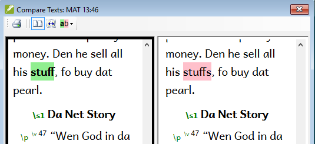
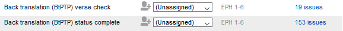

**Introdução**  
Ao se preparar para uma verificação do consultor, o consultor precisará de uma ou mais versões do seu texto em um idioma que ele compreenda. Isso é frequentemente chamado de retrotradução. Existem dois tipos de retrotradução. Este módulo explica como fazer uma retrotradução livre e mantê-la atualizada. O próximo módulo explica como fazer uma retrotradução palavra por palavra usando o interlinearizador do projeto.

**Antes de começar**  
Você digitou, verificou e revisou sua tradução no Paratext e agora está se preparando para uma verificação do consultor. Antes de começar, o administrador deve ter criado um projeto separado para a sua retrotradução.

**Por que isso é importante?**  
Seu texto precisa ser verificado por um consultor. Mas como o consultor não conhece seu idioma, você precisa traduzir seu texto de volta para um idioma que ele possa entender. É daí que vem o termo "retrotradução". O consultor usará essa tradução para ajudar sua equipe a melhorar as escolhas exegéticas no texto.

É preferível que isso seja feito por alguém que não tenha participado da tradução. Dessa forma, essa pessoa irá digitar o que o texto diz e não o que você quis dizer. Isso também deve ser feito sem consultar outras ajudas ou outras Bíblias.

**What will you do?**

- Abra seu projeto e o projeto de retrotradução.
- Organize seu texto na tela.
- Elabore sua retrotradução.
- Marque o status como concluído quando terminar um capítulo.
- Verifique se seu texto está atualizado (ou sincronizado) e veja as diferenças, avançando para a próxima alteração, se necessário.

:::info Atualização

Your project is the base project of your back translation project. In 9.4, you can now open your project from the back translation (**≡ Project** choose **Open base project …**).

:::

## 16.1 Criar um novo projeto para a retrotradução {#44530c9822fc4c2d9677cc06c747491c}

:::caution

O projeto é criado uma vez por um administrador. Se um projeto já existir, consulte [16.2](#162) abaixo.

:::

- **≡ Paratext**, em **Paratext** \> **Novo Projeto**

### **Digite os nomes para o projeto** {#c929f129f8d848d890d32d1ed85ed86a}

- Clique em **Editar**
- Digite um nome completo para o projeto e um nome curto
- Clique em **OK**.

### Para o tipo de projeto, escolha **Retrotradução** {#2db659565b714589be113884683c1f1f}

1. Escolha o idioma para sua retrotradução (por exemplo, Português)
2. Deixe a versificação como está
3. Clique em **OK**
4. Para **Com base em**, escolha o seu projeto
    - _Se necessário, o Paratext ajustará a versificação para corresponder ao seu projeto._
5. Clique em **OK**.
    - _The new project opens with links to Create book(s) or Import book(s)_.

:::info

Este projeto não precisa ser registrado, pois herda o registro do seu projeto.

:::

### **Criar livros** {#53659e0ab6c34a939d0e69dcdfd786e4}

- Clique no link **Criar Livro(s)**
- Crie os livros conforme necessário.

:::caution

Use the option **Create based on** [your project]. so that all of the markers are added to match your project.

:::

## 16.2 Elaborar sua retrotradução{#162} {#e6cb21ddb31146938d0576ea7f4f3b06}

1. Abra o seu projeto.
2. Abra seu projeto de retrotradução
3. Organize as janelas para que você possa ver facilmente ambas.
4. Clique na janela de retrotradução (o versículo no seu projeto será destacado).
5. Digite sua retrotradução em cada versículo (após a caixa de seleção).
6. Continue para cada versículo do capítulo.

## 16.3 Marcar o capítulo como concluído {#a1bc8a251f9148009ea57dd4fbd96e44}

Quando você terminar o capítulo:

- Na barra de ferramentas no topo da janela de retrotradução, clique na seta ao lado da marca de seleção.

    

- Escolha **Marcar Todos os Versículos do Capítulo como Concluídos**.
    - _Todas as caixas de seleção do capítulo serão marcadas com marcas de seleção verdes._

## 16.4 Quando uma alteração é feita no seu projeto {#0f230b5f95404967a3537e86379eaf33}

O Paratext detectará quaisquer alterações salvas em seu texto e alterará a caixa de seleção de retrotradução para um ponto de interrogação vermelho  e adicionará problemas ao status de retrotradução no plano do projeto.

1. Clique em um versículo com o ponto de interrogação vermelho.
2. Reveja e corrija a retrotradução.
    - _If the changes are not clear, see the “View the differences for outdate verses” below._
3. When it is correct, click the red question mark
    - _Ele será alterado para uma marca de seleção verde._

    :::info

    Derived projects can open the base project.

:::

### **Ver as diferenças para os versículos desatualizados** {#fe5fdc6b632b4f3cbafe2f390961a391}

na barra de ferramentas para ver as diferenças.
    <em x-id="3">Uma janela de comparação será exibida.</em>

        

### **Avançar para as próximas diferenças** {#b59e604df6cc42b7b68abda3173fde99}

- Clique nas setas para cima e para baixo para avançar para as diferenças anteriores ou próximas.

    

## 16.5 Check your **Assignments and Progress** {#860fd280ce5d4bb2bed1d1e4fb5d878c}

- Click the Assignments and Progress icon

- Expanda a Etapa 3, as verificações de retrotradução estão no final.
    - *O número de problemas (se houver) será exibido.*

        

### 16.6 Verificação de versículos de retrotradução no plano do projeto {#e861e8ecf8a142e99d31c5630c1f21a4}

- Clique no link de problemas.
    - _Uma janela de lista de resultados lista quaisquer erros._
    - _E a janela de retrotradução também é exibida com o cursor no primeiro versículo com problemas._
- Corrija o problema e avance para o próximo versículo desatualizado clicando nas setas na barra de ferramentas.

### 16.7 Status de retrotradução completo no plano do projeto {#631313ddd7ac4707adba5762ef16b842}

- O status de retrotradução está completo quando não há problemas.

### 16.8 Tarefa de aprendizado {#639f58c0e08342e390afddee7236d11f}

As caixas de seleção em uma retrotradução podem ter vários símbolos.

| 1 | Número de versículo inconsistente |
| - | --------------------------------- |
| 2 | Sem texto/número de versículo     |
| 3 | Concluído                         |
| 4 | Não concluído                     |
| 5 | Out of date                       |

:::info

[Respostas: A3, B4, C5, D1, E2]
:::

:::

