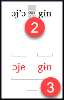

**Introduction**  The previous module explained how to create a back translation that expresses what a reader understands when he reads or hears the text. Há outro tipo de retrotradução que às vezes é usado, que é uma retrotradução estilo palavra por palavra. Alguns consultores podem solicitar esse estilo de retrotradução. Se você precisar fazer uma dessas, pode usar a função Interlinearizer do projeto no Paratext.

:::caution

14. Por favor, observe que no Paratext 9 você só pode usar o Interlinearizador em projetos registrados.

:::

**Before you start:** You have typed, checked, and revised your translation in Paratext and are now preparing for a consultant check by doing a word-for-word back translation. Antes de começar, seu administrador deve ter criado um projeto separado para sua retrotradução palavra por palavra. [Isso é separado da retrotradução legível no módulo anterior.]

**Why this is important:** Your consultant needs to have a copy of your translation in a language they can understand. A retrotradução feita no módulo anterior é muito útil, mas há momentos em que uma tradução literal é mais útil.

**What you will do:** You will use the project interlinearizer to produce a word-for-word gloss of the text. Primeiramente, você configurará o interlinearizador e, em seguida, corrigirá quaisquer erros. Os palpites iniciais do computador muitas vezes estão errados, mas ele aprende à medida que avança e se torna bastante preciso rapidamente. A ideia é que o glossário esteja correto, mesmo que a ordem das palavras não esteja correta. Quando estiver satisfeito com o verso, você poderá aprovar os glossários e passar para o próximo verso com glossários não aprovados.

## 17.1 Configure the project interlinearizer {#85a79610577747e588eb6de3f3764b58}

1. Clique no seu projeto.

2. **≡ Tab**, under **Tools** &gt; **Interlinearizer**

   

3. Clique para abrir a lista suspensa [1].

4. Escolha criar glossários com base em um texto modelo. Isso geralmente é seu texto de referência ou seu projeto de retrotradução livre [2].

### Export glosses to a project  {#187c0a7da78942f085a0b0ce7cd23c79}

1. If necessary, click the lock icon [3] to unlock the settings.

2. Escolha seu texto modelo [3].

   

3. Click the checkbox to output glosses to the project that the administrator created

4. Choose the output project created by your administrator

   

5. Clique em **OK**

## 17.2 Correct the interlinearized text {#5692bdbcfc5e493e9eaca52bf0dbcaa0}

Para corrigir os glossários:

1. Clique no glossário incorreto.
   - _A list is displayed_.
2. Clique no glossário correto na lista.
   - _or type the correct gloss in the textbox_
3. Click **Enter**

## 17.3 Translate/gloss a phrase {#5dcf6d99cb4c4653a4d3426c32e41623}

1. Click between two words
2. Click the chain icon  **(Link words)**
3. Click the red line
4. Type the gloss

## 17.4 Add extra words {#397336e9e1e34f43953ba179210b763c}

1. Clique no espaço entre dois glossários.
2. Digite a(s) palavra(s) extra(s).

## 17.5 Specify the morphology – break a word into morphemes {#4be396e96f22469ea459ab6501e55386}

1. Clique na palavra na linha de tradução (linha superior).
2. Click **Add word parse**
3. Add **spaces** to separate the morphemes and add **+** prefixes and suffixes (see guide)
4. Clique em **OK**

## 17.6 Approve and Export the text {#9295ee6e6c294b8591bbab695a814ea1}

Quando você aprovar e exportar o texto, quaisquer glossários vermelhos restantes serão aprovados.

1. Click **Approve glosses**
2. To continue, click **Next Unapproved Verse**

## 17.7 Help {#192a271a080f459886a47400bde27014}

Para obter mais ajuda sobre o uso da função Interlinearizer, consulte os seguintes tópicos na Ajuda do Paratext:

1. Introdução ao Interlinearizer do Projeto
2. Como abrir o Interlinearizer do Projeto?
3. Como gerar uma retrotradução interlinear?
4. Como criar um projeto de retrotradução com o Interlinearizer?
5. Como criar um projeto de revisão/adaptação de texto com o Interlinearizer?
6. O que significam as cores dos glossários no Interlinearizer?
