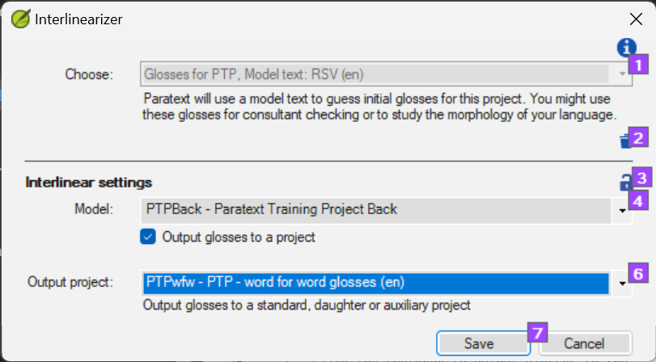

**Introdução**  
O módulo anterior explicou como criar uma retrotradução que expressa o que um leitor entende quando lê ou ouve o texto. Há outro tipo de retrotradução que às vezes é usado, que é uma retrotradução estilo palavra por palavra. Alguns consultores podem solicitar esse estilo de retrotradução. Se você precisar fazer uma dessas, pode usar a função Interlinearizer do projeto no Paratext.

:::caution

14. Por favor, observe que no Paratext 9 você só pode usar o Interlinearizador em projetos registrados.

:::

**Antes de começar**  
Você digitou, verificou e revisou sua tradução no Paratext e agora está se preparando para uma verificação do consultor fazendo uma retrotradução palavra por palavra. Antes de começar, seu administrador deve ter criado um projeto separado para sua retrotradução palavra por palavra. [Isso é separado da retrotradução legível no módulo anterior.]

**Por que isso é importante**  
Seu consultor precisa ter uma cópia de sua tradução em um idioma que ele possa entender. A retrotradução feita no módulo anterior é muito útil, mas há momentos em que uma tradução literal é mais útil.

**O que você fará**  
Você usará o interlinearizador do projeto para produzir um glossário palavra por palavra do texto. Primeiramente, você configurará o interlinearizador e, em seguida, corrigirá quaisquer erros. Os palpites iniciais do computador muitas vezes estão errados, mas ele aprende à medida que avança e se torna bastante preciso rapidamente. A ideia é que o glossário esteja correto, mesmo que a ordem das palavras não esteja correta. Quando estiver satisfeito com o verso, você poderá aprovar os glossários e passar para o próximo verso com glossários não aprovados.

## 17.1 Configurar o interlinearizador do projeto {#85a79610577747e588eb6de3f3764b58}

1. Clique no seu projeto.
2. **≡ Aba**, em **Ferramentas** \> **Interlinearizer**

    

3. Clique para abrir a lista suspensa [1].
4. Escolha criar glossários com base em um texto modelo. Isso geralmente é seu texto de referência ou seu projeto de retrotradução livre [2].

### Export glosses to a project {#187c0a7da78942f085a0b0ce7cd23c79}

1. If necessary, click the lock icon [3] to unlock the settings.
2. Escolha seu texto modelo [3].

    

3. Click the checkbox to output glosses to the project that the administrator created
4. Choose the output project created by your administrator

    

5. Clique em **OK**.

## 17.2 Corrigir o texto interlinearizado {#5692bdbcfc5e493e9eaca52bf0dbcaa0}

Para corrigir os glossários:

1. Clique no glossário incorreto.
    - *Uma lista será exibida*.
2. Clique no glossário correto na lista.
    - _or type the correct gloss in the textbox_
3. Clique em **Enter**.

## 17.3 Traduzir/glossar uma frase {#5dcf6d99cb4c4653a4d3426c32e41623}

1. Clique entre duas palavras Click the chain icon  **(Link words)**
3. Clique na linha vermel ha. Type the gloss

## 17.4 Adicionar palavras extras {#397336e9e1e34f43953ba179210b763c}

1. Clique no espaço entre dois glossários.
2. Digite a(s) palavra(s) extra(s).

## 17.5 Especificar a morfologia - dividir uma palavra em morfemas {#4be396e96f22469ea459ab6501e55386}

1. Clique na palavra na linha de tradução (linha superior).
2. Clique em **Adicionar análise de palavra**.
3. Adicione **espaços** para separar os morfemas e adicione prefixos e sufixos com **+** (consulte o guia).
4. Clique em **OK**.

## 17.6 Aprovar e Exportar o texto {#9295ee6e6c294b8591bbab695a814ea1}

Quando você aprovar e exportar o texto, quaisquer glossários vermelhos restantes serão aprovados.

1. Clique em **Aprovar glossários**.
2. Para continuar, clique em **Próximo verso não aprovado**.

## 17.7 Ajuda {#192a271a080f459886a47400bde27014}

Para obter mais ajuda sobre o uso da função Interlinearizer, consulte os seguintes tópicos na Ajuda do Paratext:

1. Introdução ao Interlinearizer do Projeto
2. Como abrir o Interlinearizer do Projeto?
3. Como gerar uma retrotradução interlinear?
4. Como criar um projeto de retrotradução com o Interlinearizer?
5. Como criar um projeto de revisão/adaptação de texto com o Interlinearizer?
6. O que significam as cores dos glossários no Interlinearizer?
