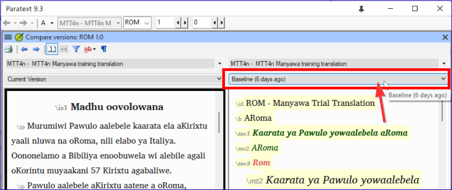

**Introduction** In this module, you will learn how to save your text at various points and review them later.

**Antes de começar**  
Você trabalhou no seu texto e chegou a uma etapa importante do seu projeto.

**Por que isso é importante?**  
Conforme você trabalha em sua tradução, estará fazendo mudanças constantemente. É bom ter uma cópia do seu texto como estava em um ponto específico, por exemplo, como estava antes de passar por uma verificação do consultor.

**Introdução**  
Neste módulo, você aprenderá como salvar seu texto em vários pontos e revisá-los posteriormente.

### 18.1 Marcar Ponto no Histórico {#6bc0d79911234870b4fe00d7193f8414}

1. Clique na janela do seu projeto para ativá-la (no Paratext).
2. **≡ Aba** em **Projeto** \> **Marcar um ponto no histórico do projeto**
3. Digite um comentário para descrever o ponto.
4. Clique em **OK**.

:::tip

É bom começar o comentário com alguns símbolos, como **\#\#**, para identificar facilmente os pontos que você adicionou na longa lista de pontos automáticos que o Paratext cria.

:::

### 18.2 Comparar Duas Versões {#b1533bd8ac644603a394e939685a6d4a}

:::tip

Any text that has been deleted is crossed out. Any text that has been added is red or underlined.

:::

- **≡ Aba** expanda os menus e em **Projeto** \> **Comparar Versões**

Clique na lista suspensa de versão base

Escolha o ponto desejado no histórico.

