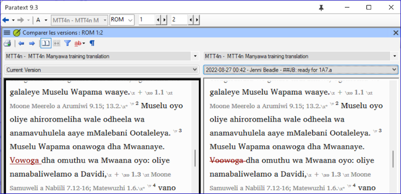

**Introdução**  
Neste módulo, você aprenderá como salvar seu texto em vários pontos e revisá-los posteriormente.

**Antes de começar**  
Você trabalhou no seu texto e chegou a uma etapa importante do seu projeto.

**Por que isso é importante?**  
Conforme você trabalha em sua tradução, estará fazendo mudanças constantemente. É bom ter uma cópia do seu texto como estava em um ponto específico, por exemplo, como estava antes de passar por uma verificação do consultor.

**O que você fará?**  
Você marcará um ponto no histórico do projeto. Mais tarde, poderá comparar o texto em diferentes pontos.

## 18.1 Marcar Ponto no Histórico
1. Clique na janela do seu projeto para ativá-la (no Paratext).
1. **≡ Aba** em **Projeto** \> **Marcar um ponto no histórico do projeto**
1. Digite um comentário para descrever o ponto.
2. Clique em **OK**
      - *O ponto é adicionado à lista de histórico do projeto*.

:::tip
É bom começar o comentário com alguns símbolos, como **\#\#**, para identificar facilmente os pontos que você adicionou na longa lista de pontos automáticos que o Paratext cria.
:::
#####

## 18.2 Comparar Duas Versões
1. **≡ Aba** expanda os menus e em **Projeto** \> **Comparar Versões**
2. Clique na lista suspensa de versão base  
   
     - *Uma lista de versões é exibida*.  
       
3. Escolha o ponto desejado no histórico.
    - *A tela mostrará as diferenças*.  
      

> Qualquer texto que tenha sido **removido** é **riscado**.  
> Qualquer texto que tenha sido **adicionado** está **sublinhado**.