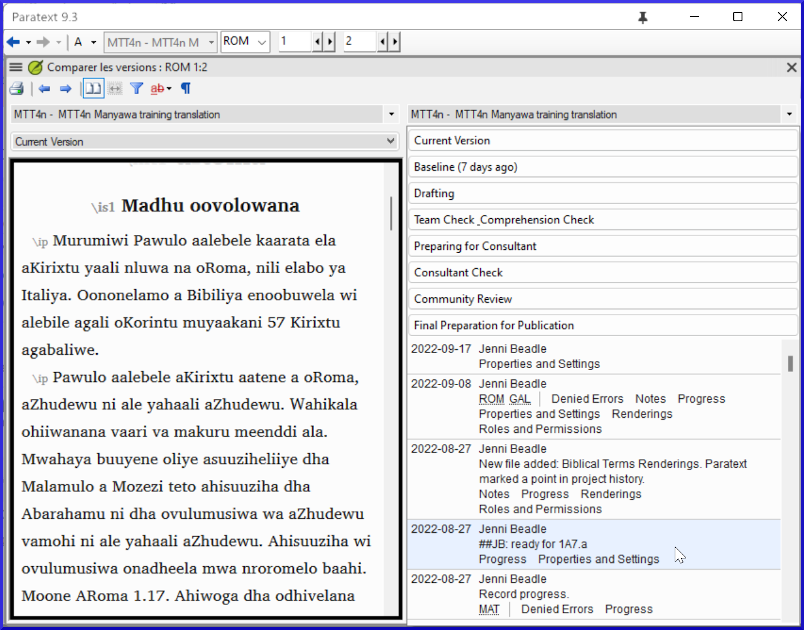

**Introduction** In this module, you will learn how to save your text at various points and review them later.

**Before you start** You have worked on your text and you have arrived at an important stage of your project.

**Why is this important?**  As you work on your translation, you will be continually making changes. É bom ter uma cópia do seu texto como estava em um ponto específico, por exemplo, como estava antes de passar por uma verificação do consultor.

**What will you do?**  You will mark a point in the history of the project. Neste módulo, você aprenderá como salvar seu texto em vários pontos e revisá-los posteriormente.

### 18.1 Mark Point in History {#6bc0d79911234870b4fe00d7193f8414}

1. Clique na janela do seu projeto para ativá-la (no Paratext).
2. **≡ Tab** under **Project** &gt; **Mark a point in project history**
3. Digite um comentário para descrever o ponto.
4. Clique em **OK**

:::tip

It is good to start the comment with some symbols, like **##**, to easily identify the points you have added in the long list of automatic points that Paratext creates.

:::

### 18.2 Compare Two Versions {#b1533bd8ac644603a394e939685a6d4a}

:::tip

Any text that has been deleted is crossed out. Any text that has been added is red or underlined.

:::

- **≡ Tab** expand the menus then under **Project** &gt; **Compare Versions**

- Click on the base version dropdown list
    - _A list of versions is displayed_.

- Choose the desired point in the history
    - _The screen shows the differences_.

