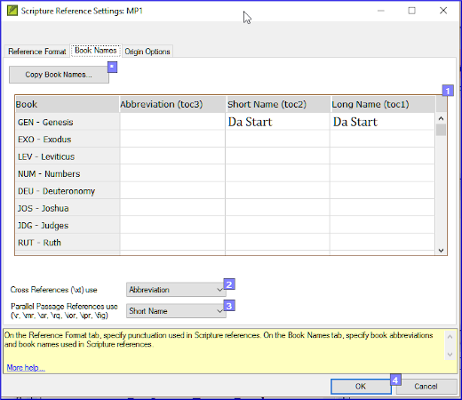

**Introduction**  In this module you will learn how to run the remaining basic checks (references, quoted text, numbers, punctuation in pairs and quotations). Assim como nos dois primeiros módulos de verificações básicas, é mais fácil executar as verificações a partir do plano do projeto. No entanto, se você deseja verificar mais de um livro, é necessário executar as verificações no menu de verificação.

**Before you start**  You have typed your translation into Paratext. Make sure you have done the checks described in modules [BC1](/5.BC1) and [BC2](/12.BC2) before continuing. Além disso, verifique se o administrador fez a configuração das verificações ou está disponível para fazer a configuração com você.

**Why this is important**  Paratext has eleven basic checks. Você já viu as primeiras seis verificações. Este último conjunto de verificações ajuda a encontrar erros relacionados ao material referenciado de outros livros. Você deseja garantir que as referências sejam precisas para que o leitor possa encontrar essas passagens.

**What you are going to do**  As before, most of the checks require your administrator to do some setup. Neste módulo, você irá:

- Confirmar se a configuração foi feita
- Executar a verificação básica
- Corrija quaisquer erros.

## 19.1 Unmatched pairs of Punctuation {#37c2805933944d69852bddc3b8b8c520}

:::tip

Essa verificação analisa a pontuação que ocorre em pares (abertura e fechamento) e lista os erros em que ela não está correspondida pela outra metade do par. Isso pode ser intencional, mas é mais provável que seja um erro, por exemplo, ( ), [ ], etc.

:::

**Setup – inventory**

1. **≡ Tab**, under **Tools** &gt; **Checking Inventories** &gt; **Unmatched pairs of punctuation**:
   - _If the list is empty, then there are no errors._
2. If necessary, click **Options…** to add other pairs.
3. Clique em **OK**.

**Run the check**

1. **≡ Tab**, under **Tools** &gt; **Run Basic Checks**
2. Check “**Unmatched pairs of punctuation**”
3. Clique em **OK**
   - _A list of errors is displayed._
4. Faça as correções necessárias.

## 19.2 References {#03533bb10f7a4a0a9d600b3684876edf}

### Settings {#13450fc38203431a8a92bfadc41599a8}

:::caution

Before you can run the references check, your **Administrator** must define various settings.

:::

1. **≡ Tab**, under **Project** > **Scripture reference settings**

2. For each setting, type the punctuation in the box
   - _The sample will be updated on the right._

Book names

1. Click the **Book names** tab

2. Preencha as três colunas [1] com abreviação, nome curto e nome longo.

3. Choose **Abbreviations** [2] and [3] for both cross-references and references

4. Clique em **OK.**
   - _Paratext will update the \toc fields in the text._

:::caution

O Paratext informará se houver inconsistências entre essas configurações de nomes de livros e as linhas \\toc e permitirá que você verifique os conflitos. This needs to be done by the Administrator.

:::

### Check {#fb34163adfba4da4980a20476539efe8}

1. **≡ Tab**, under **Tools** &gt; **Run Basic Checks**
2. Click **References**
3. Clique em **OK**
4. Corrija quaisquer erros.

## 19.3 Numbers check {#038fe67d3fd342c591ee4004ab5d4819}

### Settings {#e3ccf79de0524459a0cb1c6860b1c22c}

:::caution

Antes de executar a verificação de números, seu Administrador deve definir várias configurações de número.

:::

1. **≡ Tab,** under **Project settings** > **Number settings**

2. Fill in the dialog box with the correct information.

3. Clique em **OK.**

:::caution

You may need to remove unneeded items.

:::

### Check {#6bc0906c4efa4d44bc49ef74f42c53b5}

1. **≡ Tab**, under **Tools** &gt; **Run basic checks**
2. Click **Numbers**
3. Clique em **OK**

## 19.4 Quotation {#9764347cc21744099fe2122e180c5cd2}

A verificação de citações é usada para garantir que você tenha sido consistente na marcação do discurso direto corretamente. It only checks the quotations you have marked.

:::info Update

The new "Quotation Types" Basic Check knows where quotations should occur in the text based on Glyssen (audio script) data and can ensure that they are all marked appropriately. It is more advanced than this course. But if you want more details, watch the video on [Quotation Types in Paratext 9.4.](https://vimeo.com/859138745)

:::

### Settings {#22033012b57b40c7a8e2a901cd735140}

:::caution

Seu administrador deve definir as regras para suas citações antes de executar a verificação de citações.

:::

1. **≡ Tab**, under **Project settings** &gt; **Quotation rules**
2. Fill-in the quotation marks used for each level [1] - [9]
3. **Check Flag all quotes near other errors [12]**
4. Clique em **OK**.

### Quotation check {#62f2574a47824607bcca515faed0a6da}

1. **≡ Tab**, under **Tools** &gt; **Run basic checks**
2. **Quotations**
3. Clique em **OK**.
   - _A list of errors is displayed. It also includes four correct quotations before and after the possible error._
4. Clique duas vezes no primeiro item que não começa com ...
5. Corrija conforme necessário.
6. Click the **Rerun** button to confirm you have corrected the error.

## 19.5 Footnote Quotes {#dba28acec0d943519d752763b6afa537}

:::caution

The Footnote quotes check (previously Quoted text) looks at text in a footnote (after the \fk or the \fq marker) or in a cross-reference (after the \xk or the \xq marker) to make sure it matches text in the verse where the footnote or cross-reference is located.

:::

1. **≡ Tab**, under **Tools** &gt; **Run basic checks**
2. **Footnote Quotes**
3. Clique em **OK**.
   - _A list of errors is displayed._
4. Faça as correções necessárias.
