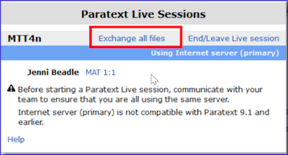

**Introdução**  
Neste módulo, você utilizará o Paratext Live como uma forma de colaboração em equipe, permitindo que todos possam visualizar as alterações no texto em seus próprios computadores.

**Antes de começar**  
Já vimos como colaborar com o envio/recebimento. Existem momentos, como durante uma verificação do consultor, em que várias pessoas precisam visualizar o mesmo texto e, talvez, editá-lo juntas. O Paratext Live permite que todos visualizem o texto em seu próprio computador e vejam as alterações em tempo real.

**Por que isso é importante**  
Existem várias outras maneiras de permitir que todos visualizem o mesmo texto. No entanto, o Paratext Live não apenas permite que todos visualizem o texto, mas também permite que mais de uma pessoa o edite.

**O que você vai fazer?**
- Conectar todos os usuários à mesma rede.
- Enviar/receber.
- Iniciar o Paratext Live e entrar em uma sessão.
- Editar o documento.
- Trocar todos os arquivos.
- Sair do Paratext Live.
- Enviar/receber.

:::info
O vídeo [4.1 Ferramentas de Colaboração](https://vimeo.com/641947293) está disponível e foi revisado para o Paratext 9.3.
:::

:::caution Atualização
O Paratext 9.3 permite que você escolha um servidor. Todos os participantes de uma sessão ao vivo ainda precisam usar o mesmo servidor. A diferença é que, a partir da versão 9.3, você pode trabalhar com alguém na versão 9.1 ou com outra pessoa na versão 9.2 (**mas não ao mesmo tempo**).
:::
## 20.1 Paratext Live
:::tip
Não é mais necessário fazer um envio/recebimento antes de iniciar o Paratext Live. No entanto, se o Paratext encontrar muitas diferenças, ele solicitará que você faça um envio/recebimento. Todos os usuários devem fazer um **envio/recebimento** e todos devem estar conectados à mesma rede.
:::

### Conectar à mesma rede

O Paratext Live pode utilizar:
- Internet
- Uma rede local
- Roteador Wi-Fi offline
- Ponto de acesso com dados móveis desativados.

## 20.2 Iniciar o Paratext Live
1. Abra o **menu** do projeto.
2. Em **Ferramentas**, clique em **Paratext Live** ou use o ícone na barra de ferramentas.
3. Serão exibidas duas opções.

### Escolher o servidor
1. Se todos os usuários estiverem usando o Paratext 9.2 ou superior, escolha a primeira opção **Internet (primário)**.
2. Clique em "Aguardar para entrar" ou "Iniciar sessão" conforme apropriado.
3. Caso contrário, escolha a segunda opção **Selecionar servidor diferente** e selecione o servidor adequado na caixa de diálogo.

### Entrar na sessão ou aguardar
1. Clique em **Iniciar/Entrar na sessão**.  
1. Se você não for o editor principal/anfitrião, clique em **Aguardar**, não pressione Cancelar, pois isso cancelará sua entrada na sessão ao vivo. 
1. Se você for o anfitrião, clique em **Iniciar Sessão**.

:::tip
Com uma sessão ativa, o botão do Paratext Live fica **verde**.
:::

### Compartilhar alterações das ferramentas
Por padrão, todo o texto das escrituras é compartilhado durante o envio/recebimento. No entanto, as alterações feitas com várias ferramentas não são compartilhadas automaticamente. Exemplos dessas alterações não compartilhadas são o status de ortografia, o status de passagens paralelas, termos bíblicos e suas renderizações identificadas, e notas. Para compartilhar essas alterações:

1. Clique no botão do Paratext Live na barra de ferramentas.

  
2. Clique em "Trocar todos os arquivos".
   - Todos os usuários receberão atualizações desses arquivos.

:::caution
As alterações de todos os usuários são compartilhadas, mas se duas pessoas tiverem alterado o mesmo item de maneiras diferentes, apenas a alteração de uma pessoa será salva.
:::

## 20.3 Encerrar a sessão do Paratext Live
1. Clique no ícone do Paratext Live.
2. Escolha **Encerrar/Sair da sessão ao vivo**.
3. Se você for o editor principal (anfitrião), verá uma mensagem.
4. Clique em **Encerrar a sessão normalmente**.
5. Envie/Receba.

:::info
Para obter mais ajuda, pesquise **live** na caixa de pesquisa da barra de título. Há muitos tópicos úteis sobre o Paratext Live.
:::