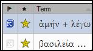

**Introdução**  
Uma tarefa nesta etapa é produzir um relatório das mudanças feitas nos termos-chave bíblicos.

Clique no **?** (segunda coluna do cabeçalho) para ordenar por Notas de discussão de tradução.

**Por que isso é importante?**  
Embora você não possa usar o Paratext para escrever o relatório, ele pode gerar uma lista dos termos com os quais você tem lidado e que pode precisar incluir no relatório.

**O que você vai fazer?**  
Na ferramenta de termos bíblicos, você filtrará o(s) livro(s) que deseja incluir no relatório. Em seguida, salvará a lista de termos em um arquivo HTML separado. Você também pode filtrar a lista com base em quaisquer notas de discussão.

### 22.1 Ferramenta de termos bíblicos {#4623aa1ae72343009f7497174d3c68ca}

1. Clique no seu projeto.
2. **≡ Aba**, em **Ferramentas** \> **Termos Bíblicos**
    - If this menu option is not displayed, click on the down arrow at the bottom of the menus to show the complete menus.
3. Configure o filtro de termos.
4. Configure o filtro de versículos (para os livros).
5. Ordene a lista conforme desejado.

### 22.2 Salvar a lista em um arquivo {#ea281a10dd8242029b54b4fa3e413408}

1. **≡ Aba**, em **Termos Bíblicos** \> **Exportar como HTML**
2. Digite um nome para o arquivo
3. Clique em **Salvar**.
4. Abra o arquivo no **Word/LibreOffice**.

### 22.3 Outras maneiras de identificar traduções {#73e7e3a90122427a8502e3c2df78672f}

**Sort on terms notes**

- Click on the flag icon (first column heading) to sort on Rendering discussion notes.

**Find terms with specific text in the** **rendering description**

1. Click the first filter on the toolbar
2. Escolha **Descrição de Tradução**.
3. Na caixa de texto à direita, digite o texto a ser encontrado.
    - _The list is filtered._
4. Salve a lista em HTML (conforme mencionado anteriormente).
