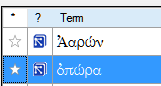

**Introdução**  
Uma tarefa nesta etapa é produzir um relatório das mudanças feitas nos termos-chave bíblicos.

**Antes de começar**  
Ao trabalhar na sua tradução, você identificou e alterou vários termos-chave bíblicos.

**Por que isso é importante?**  
Embora você não possa usar o Paratext para escrever o relatório, ele pode gerar uma lista dos termos com os quais você tem lidado e que pode precisar incluir no relatório.

**O que você vai fazer?**  
Na ferramenta de termos bíblicos, você filtrará o(s) livro(s) que deseja incluir no relatório. Em seguida, salvará a lista de termos em um arquivo HTML separado. Você também pode filtrar a lista com base em quaisquer notas de discussão.

## 22.1 Ferramenta de termos bíblicos
1. Clique no seu projeto.
1. **≡ Aba**, em **Ferramentas** \> **Termos Bíblicos**
    - *Expanda os menus, se necessário, para ver esse comando*.
2. Configure o filtro de termos.
3. Configure o filtro de versículos (para os livros).
4. Ordene a lista conforme desejado.

## 22.2 Salvar a lista em um arquivo
1. **≡ Aba**, em **Termos Bíblicos** \> **Exportar como HTML**
1. Digite um nome para o arquivo.
1. Clique em **Salvar**.
1. Abra o arquivo no **Word/LibreOffice**.

## 22.3 Outras maneiras de identificar traduções
**Ordenar por notas de termos**
- Clique no **?** (segunda coluna do cabeçalho) para ordenar por Notas de discussão de tradução.  
  

### Localizar termos com texto na descrição de tradução
1. Clique na seta ao lado de **Localizar** na barra de ferramentas.
1. Escolha **Descrição de Tradução**.
1. Na caixa de texto à direita, digite o texto a ser encontrado.
    - *A lista será filtrada*.
1. Salve a lista em HTML (conforme mencionado anteriormente).