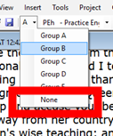

**Introduction**
There are thousands of passages in the NT where either the same event is being described or where another verse is being quoted from the Old or New Testament. Esses versículos precisam ser comparados para garantir que sejam consistentes.

**Before you start**
Normally you will have translated and checked the text of both books with a consultant first before comparing the texts. Mas há momentos em que você desejará ver uma segunda passagem enquanto está traduzindo.

**Why this is important**
The parallel passages need to be consistent but they do not always need to be exactly the same. A ferramenta de Passagens Paralelas exibe as várias passagens e destaca o texto que é o mesmo. Mas é o significado (não necessariamente a forma) que é importante.

Normalmente, você terá traduzido e verificado o texto de ambos os livros com um consultor antes de comparar os textos. Embora haja momentos em que você desejará comparar os outros versículos antes de traduzir a segunda passagem. But there are times when you will want to be able to see a second passage while you are translating.

**O que vamos fazer**

- Usar a ferramenta de Passagens Paralelas para comparar os versículos.
- Usar as caixas de seleção para informar ao Paratext que você verificou as passagens.
- Filtrar quaisquer versículos alterados.
- Abrir uma janela de referência rápida no Paratext para ver outra passagem enquanto você está traduzindo.
- Abrir uma terceira passagem em uma janela.

### 23.1 Open the Parallel passages window {#925421753cc849dbb0b0e5c29c6f549c}

1. Navegue até o capítulo e versículo desejados.
2. **≡ Tab**, under **Tools** &gt; **Parallel passages**
    - _A window is displayed showing a list and parallel passages_.

### 23.2 Display source texts {#63b7d3882a4f4eb7845d2ed8e45ca813}

1. Clique na seta suspensa ao lado das opções de texto de origem

    

2. Escolha a opção apropriada
    - _The display changes to show the source language text at the top of the table._

:::tip

<em x-id="3">A exibição será alterada.</em>   &#062; No Paratext 9.3, você pode reduzir ou expandir o texto em grego/hebraico clicando na pequena seta.

:::

### 23.3 Select comparative texts {#2341540c08b34e67b22aa556a7a3d12d}

1. Click the **Comparative texts** button
2. Clique em um recurso (à esquerda)
3. Clique na seta para a direita
4. Repita conforme necessário
5. Clique em **OK**

### 23.4 Filters {#bddd1bb153c84ee9bca3bc97ffb62b3b}

- Escolha os filtros desejados: [por exemplo, Todas as referências, Livro atual, Evangelhos sinóticos]

### 23.5 Compare the passages {#15c4aeb5a832426887603cefb4fe4e37}

- Clique em uma linha de referências no painel superior.
    - _Os textos são exibidos no painel inferior._

:::info

- Text is shown in **grey** in a project (or **green** in source texts) when the text is exactly the same as in the other passage.
- Text is shown in **yellow** (in source texts) when it has the same meaning (or thought) even though it is not exactly the same as in the other passage.
- For many people the grey is very hard to see. You can make this darker by going to the main Paratext Settings and changing the highlight to **Bright**. This will also affect highlights in the text and menus.

:::

:::tip

If the text is **green** in Greek, then **your text** should also be the same (but **darker green**).
Normalmente, se o texto for diferente no grego, ele deve ser diferente no seu texto, mas nem sempre.

:::

### 23.6 To correct the text {#7337f71cd3c44034befaf9a302214031}

1. Click the blue link **Edit**
2. Faça as correções.
3. Clique em **OK**.

### 23.7 Copying a text {#f792366370e34edaa04a467ba812183e}

:::tip

Se duas passagens precisarem ser iguais, você deve escolher uma (normalmente sua tradução posterior) e copiá-la sobre a outra.

:::

**Cópia**

1. Click the blue link **Edit**
2. Selecione o texto
3. Copie (Ctrl+C)
4. Clique em **OK**.

**Paste**

1. Clique no link azul para o outro texto
2. Selecione o texto
3. Paste (Ctrl+V)
4. Clique em **OK**.

:::caution

Tenha cuidado quando houver mais de um versículo. Você não deseja colar o \\v.

:::

### 23.8 Mark the passage as checked {#d2196130c2104131b84a2bea4a95ad68}

- Clique na caixa de seleção ao lado da referência.
    - _The set of references are approved_.

### Three modes for approving {#08445ce9fc804dc1afac9e744e6025c0}

Nesta versão do Paratext, existem três modos de aprovação.

1. Open the **menu** for the window.
2. Under **View** you can choose between
    - **Approve Sets of Parallels** - which is the default
    - **Approve Passages individually** individual checkboxes
    - **Approve by Set or Individually**, which allows you to switch back and forth between modes.

### To change from set to individually {#d8817e289b6245e385115906581f599b}

1. Abra o menu da janela.
2. Em Visualizar, escolha Aprovar por Conjunto ou Individualmente.
    - _Initially, a checkbox for the entire set is shown in the Status column_.
3. Passe o mouse sobre a caixa de seleção inferior para o conjunto
4. _A pencil icon is shown_.
5. Click the **pencil**
    - _As caixas de seleção passam para o outro modo, mas somente para esse conjunto de passagens._

### 23.9 Passages which have changed {#e989e64519384fff9e358789ba19411e}

Identificar as passagens que foram alteradas desde que foram marcadas como concluídas.

1. Na ferramenta de Passagens Paralelas
2. Change the passage filter to **Changed Text**
3. Click **ab** icon under the passage reference.

    

    - _<em x-id="3">Uma janela de comparação é exibida no Paratext</em>._
4. Faça as alterações necessárias no texto.
5. Retorne à ferramenta de Passagens Paralelas (usando os ícones da barra de tarefas)
6. Marque a caixa de seleção para marcá-la como concluída.

### 23.10 Compare the text as you translate {#ff56ce1d6f24468a8b5c84e7eedbf652}

1. Clique no seu projeto.
2. **≡ Tab**, under **Tools** &gt; **Quick reference** (Ctrl+q)
    - _A floating_ _window_ _opens with the scroll group set to none._
3. Altere a referência para a outra passagem.

### 23.11 To see a third passage {#c0a5d24f77314597a326fd75e4fbc55c}

1. Open you project a second time [**≡ Paratext** > **Paratext** > **Open** and double-click your project]

2. Change the scroll group from **[A]** to **None**.

3. Altere a referência para a outra passagem.

