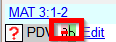

**Introdução**  
Existem milhares de passagens no Novo Testamento em que o mesmo evento está sendo descrito ou em que outro versículo está sendo citado do Antigo ou Novo Testamento. Esses versículos precisam ser comparados para garantir que sejam consistentes.

**Antes de começar**  
Normalmente, você terá traduzido e verificado o texto de ambos os livros com um consultor antes de comparar os textos. Embora haja momentos em que você desejará comparar os outros versículos antes de traduzir a segunda passagem.

**Por que isso é importante**  
As passagens paralelas precisam ser consistentes, mas nem sempre precisam ser exatamente iguais. A ferramenta de Passagens Paralelas exibe as várias passagens e destaca o texto que é o mesmo. Mas é o significado (não necessariamente a forma) que é importante.

Normalmente, você faria as comparações depois de ter traduzido a passagem, porque não quer ser influenciado por uma tradução anterior que possa estar incorreta. Mas há momentos em que você desejará ver uma segunda passagem enquanto está traduzindo.

**O que você vai fazer**
-  Usar a ferramenta de Passagens Paralelas para comparar os versículos.
-  Usar as caixas de seleção para informar ao Paratext que você verificou as passagens.
-  Filtrar quaisquer versículos alterados.
-  Abrir uma janela de referência rápida no Paratext para ver outra passagem enquanto você está traduzindo.
-  Abrir uma terceira passagem em uma janela.

## 23.1 Abrir a janela de passagens paralelas
1.  Navegue até o capítulo e versículo desejados.
1.  **≡ Aba**, em **Ferramentas** \> **Passagens paralelas**
    -  *Uma janela é exibida mostrando uma lista e passagens paralelas*.

## 23.2 Exibir textos de origem
1.  Clique na seta suspensa ao lado das opções de texto de origem  
   
1.  Escolha a opção apropriada
    -  *A exibição será alterada.*   > No Paratext 9.3, você pode reduzir ou expandir o texto em grego/hebraico clicando na pequena seta.  
      

## 23.3 Selecionar textos comparativos
1.  Clique no botão **Textos comparativos**
1.  Clique em um recurso (à esquerda)
1.  Clique na seta para a direita
1.  Repita conforme necessário
1.  Clique em **OK**

## 23.4 Filtros
-  Escolha os filtros desejados: [por exemplo, Todas as referências, Livro atual, Evangelhos sinóticos]

## 23.5 Comparar as passagens
-  Clique em uma linha de referências no painel superior.
    -  *Os textos são exibidos no painel inferior.*

:::info
O texto é mostrado em **cinza** em um projeto (ou **verde** nos textos de origem) quando é exatamente igual ao da outra passagem.  
O texto é mostrado em **amarelo** (nos textos de origem) quando tem o mesmo significado (ou pensamento), mas não o mesmo texto da outra passagem.
:::

:::tip
Se o texto estiver **verde** em grego, então **seu texto** também deve ser o mesmo (mas **cinza**).  
Normalmente, se o texto for diferente no grego, ele deve ser diferente no seu texto, mas nem sempre.
:::

## 23.6 Corrigir o texto
1.  Clique no link azul **Editar**
1.  Faça as correções.
1.  Clique em **OK**.

## 23.7 Copiar um texto
:::tip
Se duas passagens precisarem ser iguais, você deve escolher uma (normalmente sua tradução posterior) e copiá-la sobre a outra.
:::

#####

### Copiar
1.  Clique no link azul **Editar**
1.  Selecione o texto
1.  Copie (Ctrl+C)
1.  Clique em **OK**.

### Colar
1.  Clique no link azul para o outro texto
1.  Selecione o texto
1.  Cole (Ctrl+V)
1.  Clique em **OK**.

:::caution
Tenha cuidado quando houver mais de um versículo. Você não deseja colar o \\v.
:::

## 23.8 Marcar a passagem como verificada
-  Clique na caixa de seleção ao lado da referência.
     -  *O conjunto de referências é aprovado*.

### Três modos para aprovação
Nesta versão do Paratext, existem três modos de aprovação.
1.  Abra o **menu** da janela.
2.  Em **Visualizar**, você pode escolher entre
     -  **Aprovar conjuntos de paralelos** - que é o padrão
     -  **Aprovar passagens individualmente** - caixas de seleção individuais
     -  **Aprovar por Conjunto ou Individualmente** - que permite alternar entre os modos.

### Mudar de conjunto para individualmente
1.  Abra o menu da janela.
1.  Em Visualizar, escolha Aprovar por Conjunto ou Individualmente.
    -  *Inicialmente, uma caixa de seleção para o conjunto inteiro é mostrada na coluna Status*.
1.  Passe o mouse sobre a caixa de seleção inferior para o conjunto
    -  *É exibido um ícone de lápis*.
1.  Clique no **lápis**
    -  *As caixas de seleção mudam para o outro modo, mas apenas para este conjunto de passagens.*

## 23.9 Passagens que foram alteradas
Identificar as passagens que foram alteradas desde que foram marcadas como concluídas.

1.  Na ferramenta de Passagens Paralelas
1.  Altere o filtro de passagem para **Texto alterado**
1.  Clique no ícone **ab** abaixo da referência da passagem.  
   
    - *Uma janela de comparação é exibida no Paratext*.
1.  Faça as alterações necessárias no texto.
1.  Retorne à ferramenta de Passagens Paralelas (usando os ícones da barra de tarefas)
1.  Marque a caixa de seleção para marcá-la como concluída.

## 23.10 Comparar o texto enquanto você traduz
1.  Clique no seu projeto.
1.  **≡ Aba**, em **Ferramentas** \> **Referência rápida** (Ctrl+q)
    - *Uma janela é aberta com o grupo de rolagem definido como nenhum.*
1.  Altere a referência para a outra passagem.

## 23.11 Para ver uma terceira passagem
1.  Abra seu projeto uma segunda vez [**≡ Paratexto** \> **Paratexto** \> **Abrir** e clique duas vezes no seu projeto]
1.  Altere o grupo de rolagem de **[A]** para **Nenhum**.  
   
1.  Altere a referência para a outra passagem.