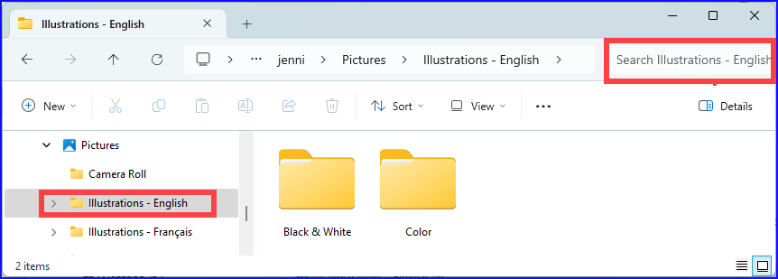
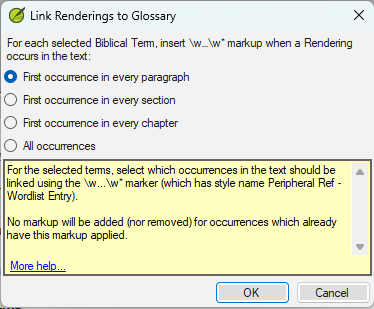

**Introduction**
This module looks at the variety of tasks needed to finalise the text for publication.

**O que você fará**

- Add **illustrations** and captions
- Identificar nomes para os mapas
- Esboçar a Introdução para o NT/Bíblia
- Verificar passagens paralelas
- Verificar se todas as verificações foram concluídas
- Verificação final de Nomes Próprios
- Verificação de números, dinheiro, pesos e medidas
- Verificação de formatação.
- Mark glossary items in the text.

## 24.1 Choosing illustrations and captions {#f380fb1fc81e4cbbb72d511558a49bb6}

Existem mais de 2800 imagens disponíveis, então pode ser difícil escolher as ilustrações. Fortunately, it is now possible to search for images by chapter reference and by keywords in English. Observe que qualquer ilustração que você inserir no Paratext aumentará o tamanho do seu projeto. Adicione apenas esses pequenos arquivos JPG (ou, alternativamente, apenas o nome do arquivo). Quando estiver compondo, eles serão substituídos por imagens maiores de alta resolução.

**Create a folder of images to search**

Primeira vez:

1. Abra o link https://tiny.cc/sampleimages na internet
2. Right-click on the folder **Illustrations - English**,
3. Select **Download**
    - _It will download about 121MB_.
4. Search and open the downloaded **zip file**.
5. Extract the single folder in the archive: **Illustrations - English** and put it in your **Pictures** folder
    - _(Windows starts to index the contents of the images…)_

**Try various searches**

Quando suas imagens estiverem indexadas, você pode fazer diferentes buscas.

1. Open this new folder in the **File Explorer**.

    

2. Digite no campo de busca:

3. **A search word**, like cross, sheep, house, etc.

4. **A Bible reference**, like MAT27, ACT03, etc. (using at least 2 digits for the chapter).

5. Add **black** or **color** to display only black and white images.

## 24.2 Adding illustrations and captions {#b8896167ea3a4f46945fbab4670e0e58}

1. No seu projeto, navegue até o versículo desejado.

2. From the **Insert** menu, choose **Figure**

    

3. Enter a **caption** to be printed with the image (in your language)[1].

4. Enter a **description** to be printed with the image (in your language) [2].

5. Indique se a imagem deve preencher a largura de uma coluna ou de uma página. [3]

6. Se aplicável, digite um intervalo de versículos como localização aceitável. \[\*\] \[Opcional\]

7. Insira as informações de direitos autorais necessárias sobre a imagem [4]

8. O Paratext preencherá a referência do capítulo e versículo que se refere à imagem. [5]

**Browse to find the image file**

1. Click **Browse**… to search for the image file. [7]
    - _A dialog box is displayed_.

2. In the dialog, select the **Pictures - Illustrations - English** folder on the left

    

3. Click in the **Search** field (top right) and type to filter the images (as above)

4. Click on the desired image and click on the **Open** button.

5. Click on **OK**.

:::caution

To make searching easier, double click on the title bar to **enlarge the window**, **show** the very large icons and **hide the viewing pane**.

:::

## 24.3 Map names {#e649bd9a447840cf8dcc7737ef3ba118}

:::info

A plug-in for doing map names will soon be available (Map Labeler Plugin). In the meantime you can continue with the old system of identifying map names as explained below.

:::

:::caution

A lista de Termos Bíblicos dos Mapas do NT Combinados não é uma lista padrão no Paratext 9. It is [**available here**](pathname:///img/CombinedNTMapBiblicalTerms.xml): and once downloaded, the file should be copied into "My Paratext 9 Projects"

:::

1. Clique no seu projeto.
2. **≡ Tab**, under **Tools** &gt; **Biblical Terms**
3. **≡ Tab**, under **Bibllical Terms** &gt; **Select Biblical Terms List**
4. Escolha NT MapBiblicalTerms
5. Adicione traduções para todos os termos
6. **≡ Tab**, under **Biblical terms** &gt; **Export as HTML**
7. Digite um nome para o arquivo
8. Click **Save**.

### 24.4 Draft Introduction to the NT/Bible {#8dbe5d1eded645b4b7399b7445e87c9b}

1. Mude para o livro INT
2. Verifique se há uma linha \\h
3. Digite sua introdução usando os seguintes marcadores:
    - \mt1
    - \is
    - \ip
4. Type in the overall introduction to the Bible/NT in the book **INT**

## 24.5 Check parallel passages {#41283e7f0e9e4ad0b0cc096515eaea02}

- See module [PP Compare Parallel passages](/23.PP)

## 24.6 Verify all checks are complete {#bad57bb5b1164152978a284244e46078}

**Livro atual**

1. Open the **Assignments and Progress**.
2. Confirme se não há problemas em nenhuma das verificações.

**Vários livros**

1. Refaça os inventários.
2. **≡ Tab** under **Tools** &gt; **Run basic checks.**
3. Verifique se todas as verificações estão marcadas.
4. Verifique se todos os livros a serem publicados estão selecionados.
5. Clique em **OK**.
6. Corrija quaisquer erros.

**Verificações da lista de palavras**

A partir da lista de palavras, faça as seguintes verificações:

1. **≡ Tab**, under **Tools** &gt; **Spell check** &gt; **All checks**
2. **≡ Tab**, under **Tools** &gt; **Find Similar Words**
3. **≡ Tab**, under **Tools** &gt; **Find Incorrectly Joined or Split Words**

## 24.7 Proper Names final check {#9848258611574d89b055afe4eb493920}

1. **≡ Tab**, under **Tools** &gt; **Biblical Terms**
2. **≡ Tab**, under **Biblical terms** &gt; **Select Biblical Terms list** and choose the **Major Biblical Terms** list
3. Filtrar por nomes com traduções ausentes
4. Verifique se todos os nomes têm uma tradução (adicione, se necessário).

## 24.8 Numbers, money, weights and measures {#1ab8c0f85ac14e36ba936d5d546c8dbd}

1. Clique no seu projeto.
2. **≡ Tab**, under **Tools** &gt; **Biblical Terms**
3. **≡ Tab**, under **Biblical terms** &gt; **Select Biblical Terms list**
4. Escolha a lista apropriada.
5. Add renderings as usual.

## 24.9 Formatting checks {#6468aa6cc0bb4ed7bc531a2111ee63ee}

1. Refaça o módulo FC: Verificações de formatação.
2. **≡ Tab**, under **Tools** &gt; **Checklists** &gt; **Long/short verses**
3. **≡ Tab**, under **Tools** &gt; **Checklists** &gt; **Word or phrase**
4. **≡ Tab**, under **Tools** &gt; **Checklists** &gt; **Section headings**
5. **≡ Tab**, under **Tools** &gt; **Checklists** &gt; **Book titles**
6. **≡ Tab**, under **Tools** &gt; **Checklists** &gt; **References**
7. **≡ Tab**, under **Tools** &gt; **Checklists &gt; Footnotes**

## 24.10 Mark (Link) Glossary Words in the Text {#53d0e7fe579147988b0f728b5c2c7b7d}

It is common to mark words in the printed text with an asterisk when there is a glossary entry for the word/phrase or add a link in the electronic versions. It is recommended to leave this until the end to avoid missing words because of spelling errors. You do this in the Biblical Terms Tool using the Link Renderings to Glossary command.

What about entries in the glossary that are not on the Biblical Terms list? For these, you need to add entries to your project list. This involves finding the word/phrase in the text and creating an entry in your project Biblical terms list. (see [10.7](/10.BT#f683ccf4cdcf45f09c516c09c78ab277)) It is recommended start by doing a few glossary entries at a time.

1. Ensure you have editing permission for all book.

2. In the Biblical Terms tool, select a few glossary entries.

3. **≡ Tab**, under **Edit** &gt; **Link Renderings to Glossary**
    1. The dialog box is displayed.

        

4. Choose **First occurrence in every section**.
    - _Paratext will search through the text and add \w … \w\* markers. Then displays a results list of verses changed._

5. Carefully check through the results list for errors.

:::tip

If there are many unwanted results, you can undo by selecting the entries and choosing **Unlink Renderings to Glossary.**

:::

:::tip

- If you have both a phrase and a word, link the longer entry first.
- If you have two very different renderings, consider creating a second term in the Biblical Terms Tool.
- If you have used "_" in the rendering, carefully review the results and manually delete the \w … \w_ from the verse.
- Be careful if any Biblical Term rendering is a homograph of a rendering for another Biblical Term.

:::

