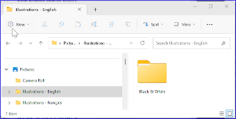

**Introdução**  
Este módulo aborda a variedade de tarefas necessárias para finalizar o texto para publicação.

**O que você fará**
- Adicionar **ilustrações** e legendas
- Identificar nomes para os mapas
- Esboçar a Introdução para o NT/Bíblia
- Verificar passagens paralelas
- Verificar se todas as verificações foram concluídas
- Verificação final de Nomes Próprios
- Verificação de números, dinheiro, pesos e medidas
- Verificação de formatação.

## 24.1 Escolhendo ilustrações e legendas

Existem mais de 2800 imagens disponíveis, então pode ser difícil escolher as ilustrações. Felizmente, agora é possível buscar imagens por referência de capítulo e por palavras-chave em francês. Observe que qualquer ilustração que você inserir no Paratext aumentará o tamanho do seu projeto. Adicione apenas esses pequenos arquivos JPG (ou, alternativamente, apenas o nome do arquivo). Quando estiver compondo, eles serão substituídos por imagens maiores de alta resolução.

**Criar uma pasta de imagens para buscar**

Primeira vez:

1. Abra o link https://tiny.cc/sampleimages na internet
1. Clique com o botão direito na pasta **Illustrations - English**,
1. Selecione **Download**
   - *Será feito o download de aproximadamente 121 MB*.
1. Procure e abra o arquivo **zip** baixado.
1. Extraia a única pasta do arquivo: **Illustrations - English** e coloque-a na sua pasta **Images**
   - *(O Windows começará a indexar o conteúdo das imagens...)*

**Experimente diferentes buscas**

Quando suas imagens estiverem indexadas, você pode fazer diferentes buscas.

1. Abra esta nova pasta no **Explorador de Arquivos**.  
   
1. Digite no campo de busca:
1. Uma **palavra-chave**, como cruz, ovelha, casa, etc.
1. Uma **referência bíblica**, como MAT27, ACT03, etc. (usando pelo menos 2 dígitos para o capítulo).
1. Adicione **preto** ou **-color** para exibir apenas imagens em preto e branco.

## 24.2 Adicionando ilustrações e legendas

1. No seu projeto, navegue até o versículo desejado.
1. No menu do Projeto, em **Inserir**, escolha **Figura**  
   
1. Insira uma **legenda** a ser impressa com a imagem (no seu idioma)[1].
1. Insira uma **descrição** a ser impressa com a imagem (no seu idioma) [2].
1. Indique se a imagem deve preencher a largura de uma coluna ou de uma página. [3]
1. Se aplicável, digite um intervalo de versículos como localização aceitável. \[\*\] \[Opcional\]
1. Insira as informações de direitos autorais necessárias sobre a imagem [4]
1. O Paratext preencherá a referência do capítulo e versículo que se refere à imagem. [5]

**Procure o arquivo de imagem**

1. Clique em **Procurar**... para buscar o arquivo de imagem. [7]
   - *Uma caixa de diálogo é exibida*.  
     
1. Na caixa de diálogo, selecione a pasta **Pictures \> Illustrations - English** à esquerda
1. Clique no campo de **Pesquisa** (canto superior direito) e digite para filtrar as imagens (como acima)
1. Clique na imagem desejada e clique no botão **Abrir**.
1. Clique em **OK**.

:::tip
Para facilitar a busca, clique duas vezes na barra de título para **aumentar a janela**, **Visualizar** os ícones extragrandes e **Ocultar** o painel de visualização**.
:::

## 24.3 Nomes dos mapas
:::info
A lista de Termos Bíblicos dos Mapas do NT Combinados não é uma lista padrão no Paratext 9. Ela está [**disponível aqui**](pathname:///img/CombinedNTMapBiblicalTerms.xml): e, uma vez baixado, o arquivo deve ser copiado para "Meus Projetos do Paratexto 9"
:::
1. Clique no seu projeto.
1. **≡ Aba**, em **Ferramentas** \> **Termos Bíblicos**
1. **≡ Aba**, em **Termos Bíblicos** \> **Selecionar Lista de Termos Bíblicos**
1. Escolha NT MapBiblicalTerms
1. Adicione traduções para todos os termos
1. **≡ Aba**, em **Termos Bíblicos** \> **Exportar como HTML**
1. Digite um nome para o arquivo
1. Clique em **Salvar**.

## 24.4 Esboço da Introdução para o NT/Bíblia
1. Mude para o livro INT
1. Verifique se há uma linha \\h
1. Digite sua introdução usando os seguintes marcadores:
   - \\mt1
   - \\is
   - \\ip
1. Digite a introdução geral para a Bíblia/NT no livro **INT**

## 24.5 Verificar passagens paralelas
- Consulte o módulo [Comparar passagens paralelas (PP)](23.PP.md)

## 24.6 Verificar se todas as verificações foram concluídas
**Livro atual**  
1. Abra o plano do projeto.
1. Confirme se não há problemas em nenhuma das verificações.

**Vários livros**  
1. Refaça os inventários.
1. **≡ Aba**, em **Ferramentas** \> **Executar verificações básicas**.
1. Verifique se todas as verificações estão marcadas.
1. Verifique se todos os livros a serem publicados estão selecionados.
1. Clique em **OK**.
1. Corrija quaisquer erros.

**Verificações da lista de palavras**

A partir da lista de palavras, faça as seguintes verificações:

1. **≡ Aba**, em **Ferramentas** \> **Verificação ortográfica** \> **Todas as verificações**
1. **≡ Aba**, em **Ferramentas** \> **Encontrar palavras semelhantes**
1. **≡ Aba**, em **Ferramentas** \> **Encontrar palavras incorretamente unidas ou separadas**

## 24.7 Verificação final de Nomes Próprios
1. **≡ Aba**, em **Ferramentas** \> **Termos Bíblicos**
1. **≡ Aba**, em **Termos Bíblicos** \> **Selecionar lista de Termos Bíblicos** e escolha a lista de **Principais Termos Bíblicos**
1. Filtrar por nomes com traduções ausentes
1. Verifique se todos os nomes têm uma tradução (adicione, se necessário).

## 24.8 Números, dinheiro, pesos e medidas
1. Clique no seu projeto.
1. **≡ Aba**, em **Ferramentas** \> **Termos Bíblicos**
1. **≡ Aba**, em **Termos Bíblicos** \> **Selecionar lista de Termos Bíblicos**
1. Escolha a lista apropriada.
1. Adicione as traduções como de costume.

## 24.9 Verificações de formatação
1. Refaça o módulo FC: Verificações de formatação.
1. **≡ Aba**, em **Ferramentas** \> **Listas de Verificação** \> **Versículos longos/curtos**
1. **≡ Aba**, em **Ferramentas** \> **Listas de Verificação** \> **Palavra ou frase**
1. **≡ Aba**, em **Ferramentas** \> **Listas de Verificação** \> **Títulos de seção**
1. **≡ Aba**, em **Ferramentas** \> **Listas de Verificação** \> **Títulos de livro**
1. **≡ Aba**, em **Ferramentas** \> **Listas de Verificação** \> **Referências**
1. **≡ Aba**, em **Ferramentas** \> **Listas de Verificação** \> **Notas de rodapé**