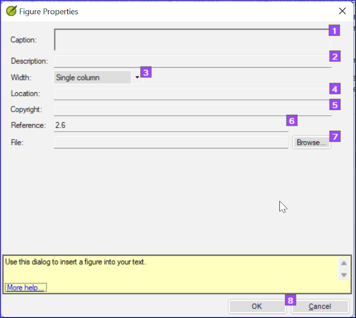
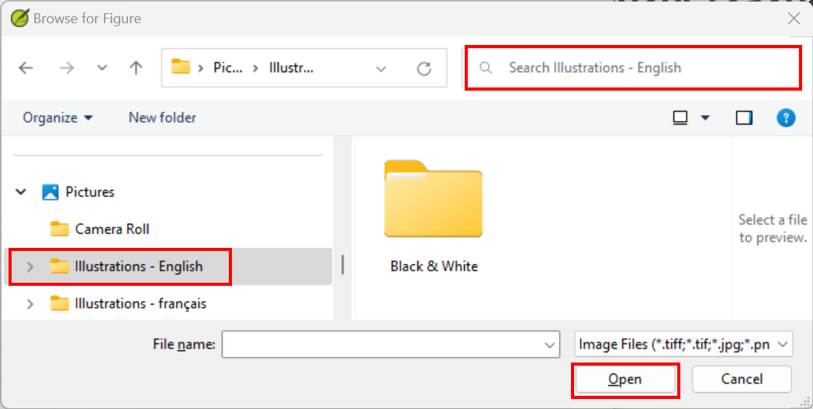

**Introdução**  
Este módulo aborda a variedade de tarefas necessárias para finalizar o texto para publicação.

**What you will do**

- Adicionar **ilustrações** e legendas
- Identificar nomes para os mapas
- Esboçar a Introdução para o NT/Bíblia
- Verificar passagens paralelas
- Verificar se todas as verificações foram concluídas
- Verificação final de Nomes Próprios
- Verificação de números, dinheiro, pesos e medidas
- Verificação de formatação.

## 24.1 Escolhendo ilustrações e legendas {#f380fb1fc81e4cbbb72d511558a49bb6}

Existem mais de 2800 imagens disponíveis, então pode ser difícil escolher as ilustrações. Felizmente, agora é possível buscar imagens por referência de capítulo e por palavras-chave em francês. Observe que qualquer ilustração que você inserir no Paratext aumentará o tamanho do seu projeto. Adicione apenas esses pequenos arquivos JPG (ou, alternativamente, apenas o nome do arquivo). Quando estiver compondo, eles serão substituídos por imagens maiores de alta resolução.

**Create a folder of images to search**

Primeira vez:

1. Abra o link https://tiny.cc/sampleimages na internet
2. Clique com o botão direito na pasta **Illustrations - English**,
3. Selecione **Download**
    - *Será feito o download de aproximadamente 121 MB*.
4. Procure e abra o arquivo **zip** baixado.
5. Extraia a única pasta do arquivo: **Illustrations - English** e coloque-a na sua pasta **Images**
    - _(O Windows começará a indexar o conteúdo das imagens...)_

**Try various searches**

Quando suas imagens estiverem indexadas, você pode fazer diferentes buscas.

1. Abra esta nova pasta no **Explorador de Arquivos**.

    

2. Digite no campo de busca:
3. Uma **palavra-chave**, como cruz, ovelha, casa, etc.
4. Uma **referência bíblica**, como MAT27, ACT03, etc. (usando pelo menos 2 dígitos para o capítulo).
5. Adicione **preto** ou **-color** para exibir apenas imagens em preto e branco.

## 24.2 Adicionando ilustrações e legendas {#b8896167ea3a4f46945fbab4670e0e58}

1. No seu projeto, navegue até o versículo desejado.
2. No menu do Projeto, em **Inserir**, escolha **Figura**

    

3. Insira uma **legenda** a ser impressa com a imagem (no seu idioma)[1].
4. Insira uma **descrição** a ser impressa com a imagem (no seu idioma) [2].
5. Indique se a imagem deve preencher a largura de uma coluna ou de uma página. [3]
6. Se aplicável, digite um intervalo de versículos como localização aceitável. \[\*\] \[Opcional\]
7. Insira as informações de direitos autorais necessárias sobre a imagem [4]
8. O Paratext preencherá a referência do capítulo e versículo que se refere à imagem. [5]

**Browse to find the image file**

1. Clique em **Procurar**... para buscar o arquivo de imagem. [7]
    - *Uma caixa de diálogo é exibida*.
2. Na caixa de diálogo, selecione a pasta **Pictures \> Illustrations - English** à esquerda

    

3. Clique no campo de **Pesquisa** (canto superior direito) e digite para filtrar as imagens (como acima)
4. Clique na imagem desejada e clique no botão **Abrir**.
5. Clique em **OK**.

:::caution

Para facilitar a busca, clique duas vezes na barra de título para **aumentar a janela**, **Visualizar** os ícones extragrandes e **Ocultar** o painel de visualização**.

:::

## 24.3 Nomes dos mapas {#e649bd9a447840cf8dcc7737ef3ba118}

:::caution

A lista de Termos Bíblicos dos Mapas do NT Combinados não é uma lista padrão no Paratext 9. Ela está [**disponível aqui**](pathname:///img/CombinedNTMapBiblicalTerms.xml): e, uma vez baixado, o arquivo deve ser copiado para "Meus Projetos do Paratexto 9"
:::

:::

1. Clique no seu projeto.
2. **≡ Aba**, em **Ferramentas** \> **Termos Bíblicos**
3. **≡ Aba**, em **Termos Bíblicos** \> **Selecionar Lista de Termos Bíblicos**
4. Escolha NT MapBiblicalTerms
5. Adicione traduções para todos os termos
6. **≡ Aba**, em **Termos Bíblicos** \> **Exportar como HTML**
7. Digite um nome para o arquivo
8. Clique em **Salvar**.

### 24.4 Esboço da Introdução para o NT/Bíblia {#8dbe5d1eded645b4b7399b7445e87c9b}

1. Mude para o livro INT
2. Verifique se há uma linha \\h
3. Digite sua introdução usando os seguintes marcadores:
    - \mt1
    - \is
    - \ip
4. Digite a introdução geral para a Bíblia/NT no livro **INT**

## 24.5 Verificar passagens paralelas {#41283e7f0e9e4ad0b0cc096515eaea02}

- Consulte o módulo [Comparar passagens paralelas (PP)](23.PP.md)

## 24.6 Verificar se todas as verificações foram concluídas {#bad57bb5b1164152978a284244e46078}

**Livro atual**

1. Abra o plano do projeto.
2. Confirme se não há problemas em nenhuma das verificações.

**Vários livros**

1. Refaça os inventários.
2. **≡ Aba**, em **Ferramentas** \> **Executar verificações básicas**.
3. Verifique se todas as verificações estão marcadas.
4. Verifique se todos os livros a serem publicados estão selecionados.
5. Clique em **OK**.
6. Corrija quaisquer erros.

**Verificações da lista de palavras**

A partir da lista de palavras, faça as seguintes verificações:

1. **≡ Aba**, em **Ferramentas** \> **Verificação ortográfica** \> **Todas as verificações**
2. **≡ Aba**, em **Ferramentas** \> **Encontrar palavras semelhantes**
3. **≡ Aba**, em **Ferramentas** \> **Encontrar palavras incorretamente unidas ou separadas**

## 24.7 Verificação final de Nomes Próprios {#9848258611574d89b055afe4eb493920}

1. **≡ Aba**, em **Ferramentas** \> **Termos Bíblicos**
2. **≡ Aba**, em **Termos Bíblicos** \> **Selecionar lista de Termos Bíblicos** e escolha a lista de **Principais Termos Bíblicos**
3. Filtrar por nomes com traduções ausentes
4. Verifique se todos os nomes têm uma tradução (adicione, se necessário).

## 24.8 Números, dinheiro, pesos e medidas {#1ab8c0f85ac14e36ba936d5d546c8dbd}

1. Clique no seu projeto.
2. **≡ Aba**, em **Ferramentas** \> **Termos Bíblicos**
3. **≡ Aba**, em **Termos Bíblicos** \> **Selecionar lista de Termos Bíblicos**
4. Escolha a lista apropriada.
5. Add renderings as usual.

## 24.9 Verificações de formatação {#6468aa6cc0bb4ed7bc531a2111ee63ee}

1. Refaça o módulo FC: Verificações de formatação.
2. **≡ Aba**, em **Ferramentas** \> **Listas de Verificação** \> **Versículos longos/curtos**
3. **≡ Aba**, em **Ferramentas** \> **Listas de Verificação** \> **Palavra ou frase**
4. **≡ Aba**, em **Ferramentas** \> **Listas de Verificação** \> **Títulos de seção**
5. **≡ Aba**, em **Ferramentas** \> **Listas de Verificação** \> **Títulos de livro**
6. **≡ Aba**, em **Ferramentas** \> **Listas de Verificação** \> **Referências**
7. **≡ Aba**, em **Ferramentas** \> **Listas de Verificação** \> **Notas de rodapé**
